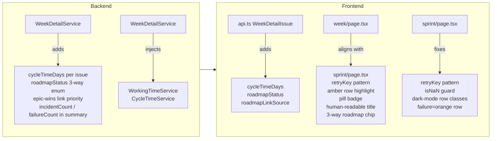

# 0042 — Kanban Week View Consistency with Sprint View

**Date:** 2026-05-05
**Status:** Accepted
**Author:** Architect Agent
**Related ADRs:** ADR 0044 (roadmap coverage via issue links — already accepted)

---

## Problem Statement

The kanban week detail view (`/week/[boardId]/[week]`) and the sprint detail view
(`/sprint/[boardId]/[sprintId]`) share the same purpose — show which issues were worked
on in a given period and how they relate to roadmap commitments — but have diverged
significantly in data richness, visual treatment, and code quality. Twenty discrete gaps
were identified in an audit. This proposal addresses the subset where no legitimate
domain difference exists between kanban and scrum, grouping changes into five areas:
backend data additions, roadmap status alignment, frontend visual consistency, sprint-page
code quality fixes, and cosmetic label alignment.

---

## Proposed Solution

### Overview



### Area 1 — Backend: `WeekDetailService` data additions

**1a. Roadmap status — 3-way enum with target-date timing**

Replace the current `linkedToRoadmap: boolean` + `roadmapLinkSource` pair with the same
`roadmapStatus: 'in-scope' | 'linked' | 'none'` + `roadmapLinkSource` pair used by
`SprintDetailService`.

The timing rule for kanban is simpler than for scrum — there is no sprint `state` to
check. The classification becomes:

- `in-scope` (green): issue is linked to a JPD idea AND completed on or before
  `idea.targetDate` (end of day UTC), i.e. Condition A only.
- `linked` (amber): issue is linked to a JPD idea but not yet completed on time
  (targetDate not yet lapsed counts as linked, not in-scope, since there is no active
  sprint state to use as Condition B).
- `none`: no roadmap link, or issue is in a cancelled status.

`cancelledStatusNames` will be read from `BoardConfig` (same as sprint service; default
`['Cancelled', "Won't Do"]`).

**1b. Roadmap link source priority — epic wins over direct**

Align week service with sprint service: epic link takes priority; direct link is the
fallback. Currently week gives direct priority (inconsistency identified as G14).

Change:
```ts
// Before (week — direct wins)
const roadmapLinkSource = linkedViaDirect ? 'direct' : linkedViaEpic ? 'epic' : null

// After (matches sprint — epic wins)
const epicIdea = issue.epicKey !== null ? epicIdeaMap.get(issue.epicKey) : undefined
const directIdea = directLinkIdeaMap.get(issue.key)
const idea = epicIdea ?? directIdea
roadmapLinkSource = epicIdea ? 'epic' : directIdea ? 'direct' : null
```

The `coveredEpicKeys` set used for the boolean check is replaced by the `epicIdeaMap`
(identical structure to sprint service) so that `targetDate` is available for the
`in-scope` classification.

**1c. Cycle time per issue and summary median**

Inject `WorkingTimeService` into `WeekDetailService`. For each issue in the week window,
compute `cycleTimeDays: number | null` as the number of working days between the first
transition into an `inProgressStatusNames` status and the first transition into a
`doneStatusNames` status, using the existing `WorkingTimeService.workingDaysBetween`
method. If no `inProgress` transition is found in the changelog, `cycleTimeDays` is null.

Add `medianCycleTimeDays: number | null` to `WeekDetailSummary` as the median of all
non-null `cycleTimeDays` values in the week.

`inProgressStatusNames` defaults to `['In Progress']` (same default as
`CycleTimeService`) and will be read from `BoardConfig.inProgressStatusNames` if present.

**1d. Incident and failure aggregate counts in summary**

Add `incidentCount: number` and `failureCount: number` to `WeekDetailSummary`. Both are
simple filters over the already-computed per-issue `isIncident` / `isFailure` booleans.
No new backend computation is required.

**1e. `WeekDetailBoardConfig` — expose full config fields**

Add `cancelledStatusNames`, `inProgressStatusNames` to `WeekDetailBoardConfig` so the
response self-documents the rules used. (No frontend use today, but eliminates the
information asymmetry vs `SprintDetailBoardConfig`.)

### Area 2 — Frontend: `api.ts` type alignment

Update `WeekDetailIssue`:
- Remove `linkedToRoadmap: boolean`
- Add `roadmapStatus: 'in-scope' | 'linked' | 'none'`
- `roadmapLinkSource: 'direct' | 'epic' | null` — already present, no change

Update `WeekDetailSummary`:
- Remove `linkedToRoadmap: number`
- Add `roadmapLinkedCount: number` (rename to match sprint)
- Add `incidentCount: number`
- Add `failureCount: number`
- Add `medianCycleTimeDays: number | null`

### Area 3 — Frontend: `week/page.tsx` visual alignment

| Change | Detail |
|---|---|
| Page title | Render `formatDate(data.weekStart) + ' – ' + formatDate(data.weekEnd)` as the `<h1>` instead of the raw ISO week string `week`. The ISO string moves to a subtitle badge. |
| Summary chips | Replace `linkedToRoadmap` chip with `roadmapLinkedCount`. Add `incidentCount` chip (danger highlight if > 0). Add `failureCount` chip (danger highlight if > 0). Add `medianCycleTimeDays` chip. Adopt `sm:grid-cols-4 lg:grid-cols-8` to match sprint's chip grid. |
| `addedMidWeek` badge | Replace the bare `+` symbol with the full amber pill: `⚠ Mid-week` (matching sprint's `⚠ Mid-sprint` style). |
| `addedMidWeek` row highlight | Add `bg-amber-50` row highlight for `addedMidWeek` issues (matching sprint). |
| Roadmap column | Replace the boolean `linkedToRoadmap` column with the same `roadmapStatus` column renderer used in sprint (green for `in-scope`, amber for `linked`, dash for `none`; `Link2` / `GitBranch` icons; tooltips). |
| `rowClassName` | Align priority order and add dark-mode classes: incident/failure (red/orange) > mid-week (amber) > completed (green). Add `dark:` variants to all. |
| `retryKey` pattern | Already implemented in week view — no change needed here. |
| Breadcrumb boardId href | Add `href={/planning?board=${boardId}}` to the boardId breadcrumb segment (matching sprint). |
| `formatDate` `isNaN` guard | Already present in week — no change needed here. |
| Key column label | Change `label: 'Key'` to `label: 'Issue'` (matching sprint). |
| WEEK_HELP | Add a `medianCycleTime` entry to the help definitions. Remove the existing "Cycle Time" stub or replace it with a real description. |

### Area 4 — Frontend: `sprint/page.tsx` code quality fixes

| Change | Detail |
|---|---|
| Retry mechanism | Replace the inline duplicated `onClick` handler in the error state with the `retryKey` + `reload` callback pattern (matching week view). |
| `formatDate` `isNaN` guard | Add `if (isNaN(d.getTime())) return '—'` to `formatDate` in sprint page. |
| Dark-mode row classes | Add `dark:bg-red-950/20`, `dark:bg-amber-950/20`, `dark:bg-green-950/20` to `rowClassName`. |
| Failure row colour | Change failure-only rows from `bg-red-50` to `bg-orange-50` (matching week; incident stays red). |

### Area 5 — Backend: `QuarterDetailService` parallel alignment

`QuarterDetailService` has the same `linkedToRoadmap: boolean` design as `WeekDetailService`.
Apply the same roadmap-status promotion (Area 1a–1b), link-priority fix (1b), and
`incidentCount`/`failureCount` additions (1d) to `QuarterDetailService` and its
corresponding `api.ts` types and `quarter/page.tsx` renderer. Cycle time is **not** added
to the quarter view (the quarter window is too long for cycle time to be meaningful as a
weekly operational metric).

---

## Alternatives Considered

### Alternative A — Promote boolean to 3-way enum in frontend only
Compute `roadmapStatus` from `linkedToRoadmap` + a separate `targetDate` field returned
by the backend. Rejected: it moves business logic into the frontend and requires an
additional field; the backend already has all the data.

### Alternative B — Unify sprint and week behind a single detail endpoint
A single `/api/detail/:boardId/:periodId` endpoint that returns a unified response shape.
Rejected: the two period types have fundamentally different data (sprint membership
reconstruction vs board-entry date), and unifying them would produce a large optional-field
response shape that is harder to type and document. Separate endpoints are cleaner.

---

## Impact Assessment

| Area | Impact | Notes |
|---|---|---|
| Database | None | No new entities or migrations; all data already exists in JiraChangelog and JiraIssue |
| API contract | Additive | `WeekDetailIssue` gains `roadmapStatus`, `cycleTimeDays`; `WeekDetailSummary` gains `incidentCount`, `failureCount`, `medianCycleTimeDays`, renames `linkedToRoadmap` → `roadmapLinkedCount`. `QuarterDetailIssue` gains `roadmapStatus`. Breaking rename mitigated by internal-only API. |
| Frontend | Component changes | `week/page.tsx`, `quarter/page.tsx`, `sprint/page.tsx` updated; `api.ts` types updated |
| Tests | New unit tests | Week service: tests for `roadmapStatus` 3-way classification, `cycleTimeDays`, `medianCycleTimeDays`, `incidentCount`, `failureCount`, link-priority fix. Quarter service: tests for `roadmapStatus`, `incidentCount`, `failureCount`. Sprint service: `retryKey` pattern has no backend test impact. |
| External API | No new calls | All data already fetched during sync |
| Infrastructure | None | No new resources |
| Observability | None | No new log fields required |
| Security / Compliance | None | Internal operational data only; no new attack surface |

---

## Open Questions

None.

---

## Acceptance Criteria

- **AC1** — `GET /api/week/:boardId/:week` returns `roadmapStatus: 'in-scope' | 'linked' | 'none'` on each issue (no `linkedToRoadmap` boolean).
- **AC2** — `roadmapStatus` is `'in-scope'` when the issue is linked to a JPD idea and was completed on or before `idea.targetDate`; `'linked'` when linked but not completed on time; `'none'` when not linked or status is cancelled.
- **AC3** — `roadmapLinkSource` gives epic priority over direct link (epic present → `'epic'` even if a direct link also exists).
- **AC4** — `WeekDetailSummary` includes `incidentCount`, `failureCount`, `medianCycleTimeDays`, `roadmapLinkedCount` (no `linkedToRoadmap`).
- **AC5** — `cycleTimeDays` is computed per issue as working days from first `inProgress` transition to first `done` transition; null when no `inProgress` transition exists.
- **AC6** — `medianCycleTimeDays` is the median of non-null `cycleTimeDays` values; null when no completed issues.
- **AC7** — Week view page title displays the human-readable date range (e.g. "4 May – 10 May 2026"), not the ISO week string.
- **AC8** — Week view summary chip bar includes `incidentCount` and `failureCount` chips with `danger` highlight when > 0, and a `medianCycleTimeDays` chip.
- **AC9** — `addedMidWeek` column renders an amber pill badge "⚠ Mid-week" matching sprint's "⚠ Mid-sprint" style.
- **AC10** — `addedMidWeek` rows receive `bg-amber-50` row highlight in the week view table.
- **AC11** — Week view Roadmap column renders the 3-state `roadmapStatus` with the same icon and colour logic as sprint view.
- **AC12** — Quarter view receives the same roadmap status promotion and incident/failure count additions (not cycle time).
- **AC13** — Sprint view `rowClassName` function includes dark-mode classes and uses `bg-orange-50` for failure-only rows.
- **AC14** — Sprint view error-state retry uses the `retryKey` + `reload` callback pattern; no duplicated error-handling logic in the `onClick` handler.
- **AC15** — All 737 backend tests pass; all 115 frontend tests pass; new tests cover each new computation in `WeekDetailService` and `QuarterDetailService`.
