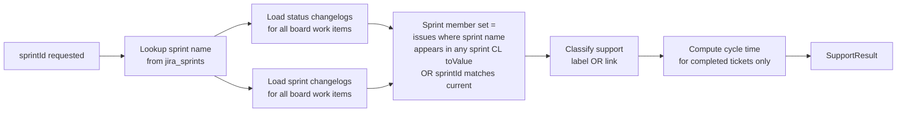
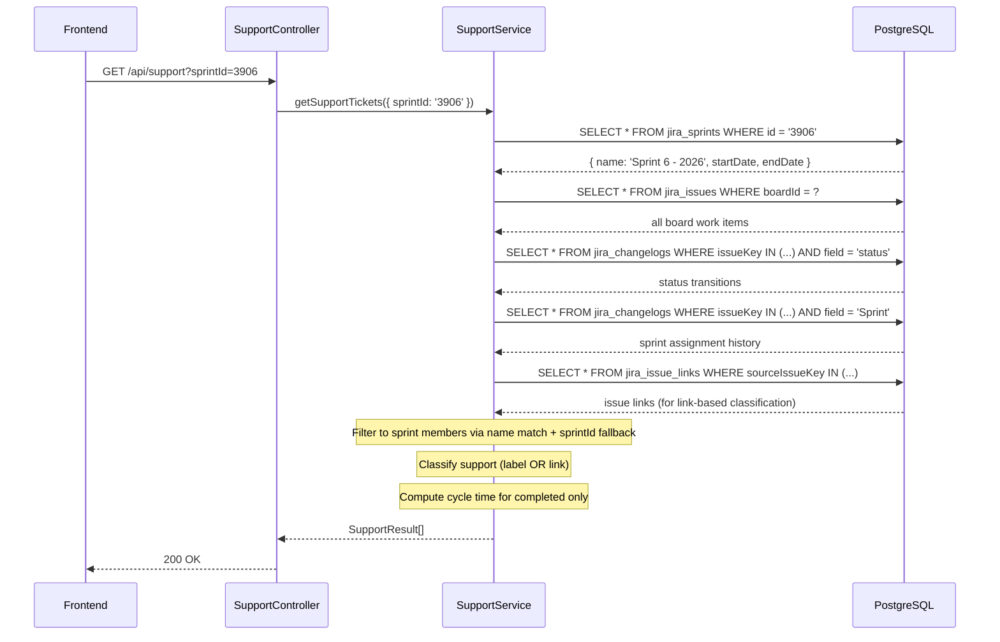

# 0044 — Support Report: Sprint-Membership Issue Scope

**Date:** 2026-05-06
**Status:** Accepted
**Author:** Architect Agent
**Related ADRs:** Will produce ADR 0046 on acceptance.
**Supersedes section:** Replaces the issue-scoping rule in Proposal 0043 §2.1 for the sprint period mode only.

---

## Problem Statement

The current `SupportService` scopes all period modes through a single "completed in
period" gate: an issue is only counted if it has a done-status transition (or
fix-version release date) falling inside `[startDate, endDate]`. This is correct for
quarters but wrong for sprints.

For a sprint the team wants to know: **of all the work that touched this sprint, how
much was support?** An issue still `In Progress` at the time of viewing is part of
that sprint's support burden. Equally, a carry-over issue that was active in Sprint 5
*and* Sprint 6 should appear in both sprints' support load — work happened in both.
Relying solely on `jira_issues.sprintId` (current assignment) would miss Sprint 5 for
that carry-over.

The previous session confirmed this with live data: `SPS-515` has a `clones → TTB-4421`
link matching SPS board config and is assigned to the active sprint, yet it is invisible
in the sprint support view because it has no done-status transition. `SPS-498` is a
confirmed carry-over: it was in Sprint 5, carried into Sprint 6, and completed in
Sprint 6 — it should count against both sprints.

---

## Proposed Solution

### Core rule change

Introduce a **period mode** distinction inside `getSupportResultForBoard`:

| Mode | Population | `totalIssues` denominator |
|---|---|---|
| **Quarter** | Issues with a done-transition or fix-version release within the quarter window | Issues that completed in the quarter (unchanged) |
| **Sprint** | Issues whose sprint changelog includes this sprint's name at any point | All sprint-touching issues regardless of completion status |

### How sprint membership is determined

The Jira sync layer captures `field = 'Sprint'` changelog entries for every issue. The
`toValue` field stores a comma-separated list of sprint names at the time of the
transition (e.g. `"Sprint 5 - 2026, Sprint 6 - 2026"`). An issue **belongs to a sprint**
for the purposes of this report if the target sprint's name appears in the `toValue` of
any sprint changelog entry for that issue, OR if `jira_issues.sprintId` currently points
to that sprint (catches issues added mid-sprint with no prior sprint history).

Sprint name is resolved from `jira_sprints.name` using the requested `sprintId`.



### Sprint mode behaviour detail

1. **Population query**: load all work items for the board (`boardId`). From their sprint
   changelogs, retain only those where the target sprint name appears in any `toValue`,
   OR whose current `jira_issues.sprintId` matches. This is the sprint member set.

2. **`totalIssues`**: count of all sprint-member work items (passing `isWorkItem`) —
   no completion gate.

3. **Cycle time**: computed only for sprint-member issues that have a done-status
   transition within `[sprint.startDate, sprint.endDate]`. Issues still in progress
   get `cycleTimeDays = null`, `completedAt = null`, `band = null` but still appear
   in the ticket table.

4. **`supportPercentage`**: `supportIssues / totalSprintMembers * 100` — carries
   in-progress support tickets in the numerator.

5. **p50/p95**: computed only over support tickets with non-null `cycleTimeDays`.
   The UI labels these "completed tickets only".

6. **Carry-overs count in both sprints**: an issue with sprint changelog entries for
   Sprint 5 and Sprint 6 appears in both sprint views. This is the desired behaviour —
   work happened in both.

### Data flow



### Quarter mode — no change

Quarter mode retains the current "completed in period" semantics exactly. The
denominator is issues that completed in the quarter. All 16 existing unit tests remain
valid and unchanged.

### Interface changes

`resolvePeriod` return type gains an `isSprint` flag and optionally the sprint name:

```typescript
private async resolvePeriod(
  query: SupportQueryDto,
): Promise<{ startDate: Date; endDate: Date; isSprint: boolean; sprintName?: string }>
```

`getSupportResultForBoard` gains `isSprint` and `sprintName`:

```typescript
private async getSupportResultForBoard(
  boardId: string,
  startDate: Date,
  endDate: Date,
  isSprint: boolean,
  sprintName?: string,
): Promise<SupportResult>
```

No changes to the public `SupportResult`, `SupportTicketDto`, or `SupportSummaryDto`
DTO shapes. The frontend already handles `cycleTimeDays: null`, `completedAt: null`,
`band: null` on ticket rows.

### Frontend — minimal change

The sprint selector and data-fetch plumbing are already in place. One small UI addition:
a note beneath the p50/p95 cards when in sprint mode:

> "Cycle time shown for completed tickets only."

This is a single conditional `<p>` element, not a new component.

---

## Alternatives Considered

### Alternative A — `sprintId` current assignment only (no changelog)

Use only `jira_issues.sprintId = :sprintId` as the population. Simple, no changelog
join needed. Rejected: carry-overs that were moved to the next sprint lose their
membership in the previous sprint. The user explicitly requires carry-overs to count
in both sprints.

### Alternative B — status transitions within sprint window as the signal

Include any issue that had a status transition between `sprint.startDate` and
`sprint.endDate`. Rejected: this misses issues that were in the sprint but had no
status movement (e.g. groomed and accepted but not started). It also incorrectly
includes issues from other boards that happened to transition during the sprint dates.
Sprint changelog membership is the correct and explicit signal.

### Alternative C — changelog reconstruction (ADR 0006 pattern)

Reconstruct sprint membership from changelog the same way planning accuracy does for
start-of-sprint commitment. Rejected for this use case: planning accuracy needs to know
what was *committed at sprint start* specifically. Support load needs to know what
*touched the sprint at any point* — a simpler and broader membership test that does not
require the full reconstruction logic.

### Alternative D — separate endpoints `/api/support/sprint` and `/api/support/quarter`

Split the two modes into dedicated endpoints. Rejected: the period mode is already a
query parameter concern. Splitting endpoints doubles the controller surface, requires
separate MCP tool registrations, and complicates the frontend fetch logic. A single
`isSprint` branch inside the service is the right boundary.

---

## Impact Assessment

| Area | Impact | Notes |
|---|---|---|
| Database | None | No schema change. `jira_changelogs` `field='Sprint'` rows already populated by sync. |
| API contract | None / Additive | DTO shapes unchanged. Behavioural change is transparent to callers. |
| Frontend | Minor | Conditional "completed tickets only" qualifier beneath p50/p95 in sprint mode. |
| Tests | New + updated unit tests | Quarter-mode tests unchanged. New tests for sprint-membership population and carry-over. |
| External API | None | No new Jira API calls. |
| Infrastructure | None | No new resources. |
| Observability | None | No new log fields required. |
| Security / Compliance | None | No new data class or attack surface. |

---

## Open Questions

None. The carry-over behaviour ("count in both sprints") was confirmed by the product
owner. Future-sprint handling is not reachable via the UI (sprint selector already
filters to `active` and `closed` only).

---

## Acceptance Criteria

- [ ] In **sprint mode**, the issue population is determined by sprint changelog
      membership (sprint name appears in any `jira_changelogs.toValue` for `field='Sprint'`)
      OR current `jira_issues.sprintId` match — not by completion date.
- [ ] In **sprint mode**, `totalIssues` equals the count of all work items (passing
      `isWorkItem`) that touched the sprint, regardless of current status.
- [ ] In **sprint mode**, in-progress support tickets appear in the ticket table with
      `cycleTimeDays = null`, `completedAt = null`, `band = null`.
- [ ] In **sprint mode**, a carry-over issue (sprint changelog contains both sprint N
      and sprint N+1 names) appears in the support results for **both** sprints.
- [ ] In **sprint mode**, `supportPercentage` = `supportIssues / totalSprintMembers * 100`.
- [ ] In **sprint mode**, p50/p95 are computed only over support tickets with non-null
      `cycleTimeDays` (completed within the sprint window).
- [ ] `SPS-515` (in-progress, `clones → TTB-4421`) appears in Sprint 6 support results.
- [ ] In **quarter mode**, all existing behaviour is unchanged — completed-in-period gate
      still applies and all 16 existing backend unit tests pass without modification.
- [ ] Unit test: sprint mode returns in-progress issues (no completion gate).
- [ ] Unit test: sprint mode `totalIssues` includes in-progress issues.
- [ ] Unit test: carry-over issue appears in both Sprint N and Sprint N+1 results.
- [ ] Unit test: quarter mode `totalIssues` still counts only completed issues (regression guard).
- [ ] Frontend: sprint mode p50/p95 cards display a "completed tickets only" qualifier.
