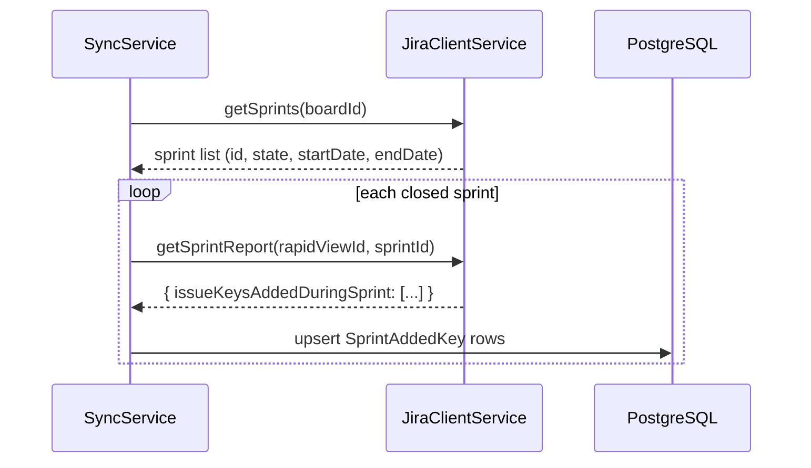
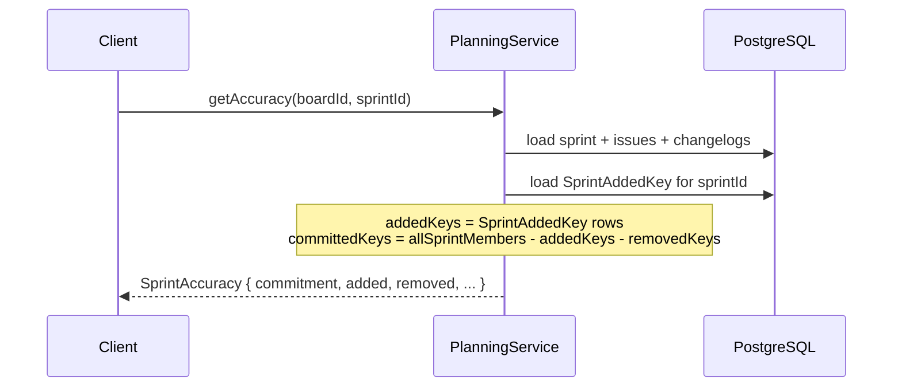
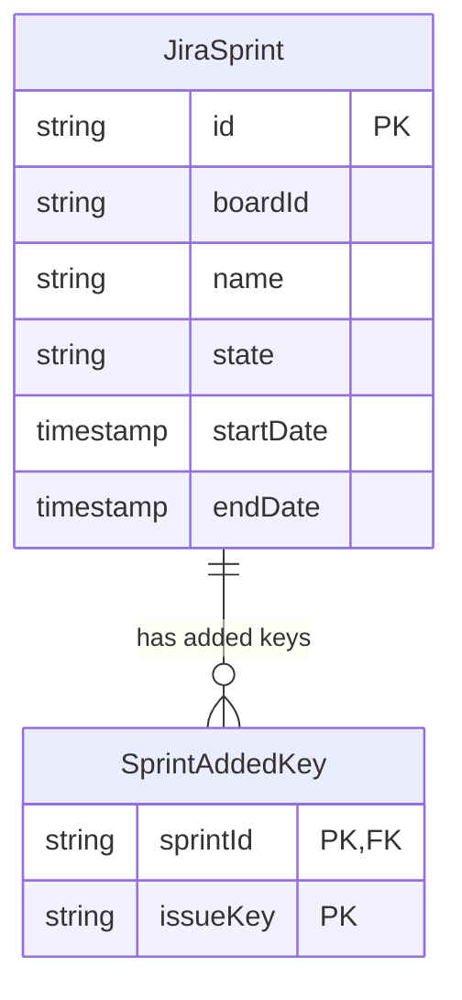
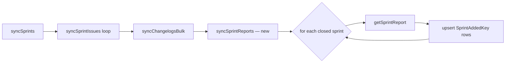

# 0046 — Jira Sprint Report API as Authoritative Source for Planning Accuracy

**Date:** 2026-05-06
**Status:** Rejected
**Author:** Architect Agent
**Related ADRs:** Supersedes amendment to [ADR 0039](../decisions/0039-carry-over-sprint-issue-classification.md); amends [ADR 0006](../decisions/0006-sprint-membership-reconstructed-from-changelog.md)
**Superseded by:** [Proposal 0047](0047-sync-cancelled-issues-and-multi-sprint-membership.md)

## Rejection Note (2026-05-06)

Rejected in favour of [Proposal 0047](0047-sync-cancelled-issues-and-multi-sprint-membership.md), which fixes the underlying sync bugs (cancelled / resolved issues are excluded from the agile sprint-issue endpoint and therefore never have their changelogs refreshed; `JiraIssue.sprintId` is single-valued despite Jira issues belonging to multiple sprints). Once those bugs are fixed, changelog reconstruction (per ADR 0006) is sufficient and the Greenhopper sprint report dependency is unnecessary. Avoiding the undocumented Greenhopper API also removes the deprecation risk flagged in this proposal's Open Questions.

## Problem Statement

The changelog-reconstruction approach (ADR 0006) for determining sprint start membership
is fundamentally incomplete for boards that use Jira's "Complete Sprint → stage in grooming
sprint" workflow (confirmed on ACC and SPS boards). When Jira completes a sprint using this
flow, carry-over issues are recorded as `Sprint 1 → Sprint 1, Ready to estimate 2` in the
changelog. Jira then silently assigns those issues to Sprint 2 at sprint start time with
**no further changelog entry**. The sprint name `Sprint 2` never appears in any `toValue`
for these issues — it only appears later in `fromValue` when Sprint 3 starts. The
information required to reconstruct the committed set was never written to the changelog.

The amendment to ADR 0039 (which requires `fromValue` to contain a **closed** sprint name)
correctly prevents false carry-over classification from grooming sprints, but as a result
Sprint 2 on ACC and SPS boards shows 0 committed issues, which is factually wrong. 17 issues
were committed to ACC Sprint 2 at start per Jira's own burn-up report. No changelog-based
fix can recover this data because it was never recorded.

Jira's own burn-up and sprint report features are powered by the **Greenhopper sprint report
API** (`/rest/greenhopper/1.0/rapid/charts/sprintreport`), which explicitly returns the
committed set, mid-sprint additions, and removals as distinct lists. This is the authoritative
source Jira itself uses — and it is not affected by changelog gaps.

## Proposed Solution

Fetch the Jira Greenhopper sprint report for each **closed** sprint during sync and persist
the `issueKeysAddedDuringSprint` set to a new `sprint_added_keys` table. The planning
service then uses this persisted set as the authoritative classification signal rather than
reconstructing from changelogs.

### Data flow





### New entity: `SprintAddedKey`

Stores the set of issue keys that Jira's sprint report identifies as added mid-sprint (i.e.
added **after** the sprint started). One row per issue key per sprint.



### New `JiraClientService` method

```typescript
getSprintReport(rapidViewId: string, sprintId: string): Promise<JiraSprintReportResponse>
```

Calls `GET /rest/greenhopper/1.0/rapid/charts/sprintreport?rapidViewId={rapidViewId}&sprintId={sprintId}`.

The response shape relevant to this feature:

```typescript
interface JiraSprintReportResponse {
  contents: {
    issueKeysAddedDuringSprint: Record<string, true>;
    // also present but not required here:
    // completedIssues, incompletedIssues, puntedIssues, etc.
  };
}
```

`issueKeysAddedDuringSprint` is a map of issue key → `true` for every issue added after
sprint start.

### `rapidViewId` mapping

The Greenhopper API requires a `rapidViewId` (a numeric board ID). This is the same
numeric board ID already used in `getSprintIssues` (the agile API's board ID parameter).
Each `BoardConfig` already carries the numeric board ID via YAML config; no new config is
required.

### Sync changes

In `SyncService.syncScrum()`, after syncing sprints and issues, iterate over **closed**
sprints only and call `getSprintReport` for each. Upsert the resulting issue keys into
`SprintAddedKey`. Active and future sprints are excluded — the sprint report is only
authoritative for completed sprints.



### Planning service changes

Replace the changelog-based `wasAddedDuringSprint` and `isCarryOverFromSprint` logic with
a lookup against `SprintAddedKey`:

- **Added:** issue key is present in `SprintAddedKey` for this sprint
- **Committed:** issue was in the sprint at any point AND is NOT in `SprintAddedKey`
- **Removed:** issue was in the sprint at some point AND was not present at sprint end
  (changelog still used for removal detection — changelogs are complete for removals)

The `closedSprintNames` / `carryOverSprintNames` machinery and `isCarryOverFromSprint`
helper are removed entirely from `PlanningService`. The same simplification applies to
`SprintDetailService`.

The `wasInSprintAtDate` / grace-period logic is retained for **active** sprints only,
where no sprint report yet exists and changelog reconstruction remains the only option.

### Handling missing sprint reports

If `getSprintReport` returns an error (e.g. the board's rapidViewId is wrong, or the
sprint predates Greenhopper availability), log a warning and fall back to the existing
changelog reconstruction. This ensures no regression for boards or sprints where the
Greenhopper API is unavailable.

### `SprintDetailService`

Apply the same `SprintAddedKey` lookup to replace changelog-based carry-over detection in
`SprintDetailService.getDetail()`. This unifies the classification logic across both
planning accuracy and sprint detail views.

## Alternatives Considered

### Alternative A — Extend `isCarryOverFromSprint` to include grooming (future) sprints

Treat issues moved from a future sprint with no `startDate` (i.e. `Ready to estimate`) as
carry-overs rather than additions. The amendment to ADR 0039 explicitly ruled this out
because it is imprecise — not all future sprints are grooming staging areas, and the pattern
is not consistent across boards. This alternative was investigated and rejected.

### Alternative B — Widen the grace period

Increase `SPRINT_GRACE_PERIOD_MS` to cover the window between sprint completion and sprint
start. Ruled out in ADR 0039 original analysis — a fixed window is an imprecise heuristic
that will produce false positives (classifying genuine early additions as committed).

### Alternative C — Store sprint membership snapshot during sync

At sync time, store the full issue list returned by `getSprintIssues` for each sprint
(not just upsert into `jira_issues`). The first sync of a sprint would capture the committed
set; subsequent syncs would detect additions and removals.

**Ruled out:** This requires tracking the "first sync" vs "subsequent sync" for each sprint,
introduces sync ordering dependencies, and produces incorrect data if the first sync happens
after mid-sprint additions have already occurred. It is also operationally fragile — a missed
sync window silently corrupts historical data.

### Alternative D — Supersede ADR 0006 entirely with sprint report API

Remove changelog reconstruction entirely and use the Greenhopper sprint report as the
sole source of truth for all sprint membership history.

**Ruled out:** The sprint report API is not available for active sprints (the sprint must
be closed for the report to be final). Changelog reconstruction remains necessary for active
sprint planning views and sprint detail. A hybrid approach (sprint report for closed,
changelog for active) is the correct model.

## Impact Assessment

| Area | Impact | Notes |
|---|---|---|
| Database | New entity + migration | `sprint_added_keys` table; composite PK `(sprintId, issueKey)`; no FK to `jira_issues` (issue may not exist on board if removed) |
| API contract | None | `SprintAccuracy` response shape unchanged; classification values improve in accuracy |
| Frontend | None | No frontend changes required |
| Tests | New unit tests + updated integration tests | `sync.service.spec.ts` for `syncSprintReports`; `planning.service.spec.ts` carry-over tests updated to use `SprintAddedKey` fixture; `sprint-detail.service.spec.ts` similarly |
| External API | New Greenhopper endpoint | One call per closed sprint per sync; Greenhopper API is a private/undocumented Atlassian API — see Open Questions |
| Infrastructure | None | No new cloud resources |
| Observability | Warning log on Greenhopper API failure | Fallback path logged at WARN level |
| Security / Compliance | None | No new data class; internal Jira data only |

## Open Questions

1. **Greenhopper API stability:** The `/rest/greenhopper/1.0/rapid/charts/sprintreport`
   endpoint is an internal Atlassian API, not part of the documented Jira Cloud REST API.
   It is widely used by third-party tools and has been stable for years, but Atlassian
   could deprecate it without notice. Is this an acceptable dependency risk, or should we
   prefer a documented alternative if one exists?

2. **Rate limit impact:** Each closed sprint requires one additional API call. Boards with
   many closed sprints (e.g. DATA with 20+) will add 20+ Greenhopper calls per sync run.
   This should be acceptable given the existing rate-limit handling (max 5 concurrent, 100ms
   interval, exponential backoff), but should be validated against the Jira Cloud rate limits
   for this endpoint.

3. **`rapidViewId` vs board `id`:** The Greenhopper `rapidViewId` is typically the same
   numeric value as the Agile API `board.id`. This should be confirmed empirically before
   implementation — if they differ, a mapping will be needed in `BoardConfig` or YAML config.

## Acceptance Criteria

- [ ] A new `sprint_added_keys` table exists with a migration implementing both `up()` and
      `down()`.
- [ ] `JiraClientService` has a `getSprintReport(rapidViewId, sprintId)` method that calls
      the Greenhopper sprint report endpoint and returns typed data.
- [ ] `SyncService` calls `getSprintReport` for each closed sprint during a scrum board sync
      and upserts the `issueKeysAddedDuringSprint` set into `SprintAddedKey`.
- [ ] `PlanningService.calculateSprintAccuracy()` classifies an issue as `added` if and only
      if its key is present in `SprintAddedKey` for that sprint (for closed sprints).
- [ ] `SprintDetailService.getDetail()` applies the same `SprintAddedKey` classification.
- [ ] ACC Sprint 2 shows 17 committed issues matching the Jira burn-up report, with 0
      incorrectly classified as `added`.
- [ ] Active sprint planning accuracy continues to use changelog reconstruction (no
      regression).
- [ ] If `getSprintReport` fails for a sprint, the sync logs a warning and falls back to
      changelog reconstruction for that sprint; the sync does not fail.
- [ ] Unit tests cover: `SprintAddedKey` present → `added`; `SprintAddedKey` absent →
      `committed`; fallback path when no `SprintAddedKey` rows exist for a sprint.
- [ ] The `isCarryOverFromSprint` helper and `closedSprintNames` machinery are removed from
      `PlanningService` and `SprintDetailService` (dead code elimination).
