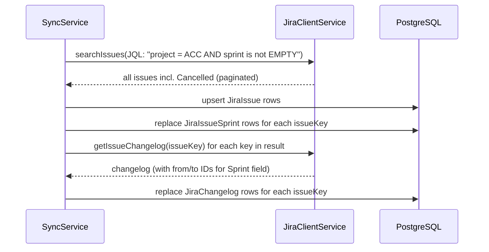
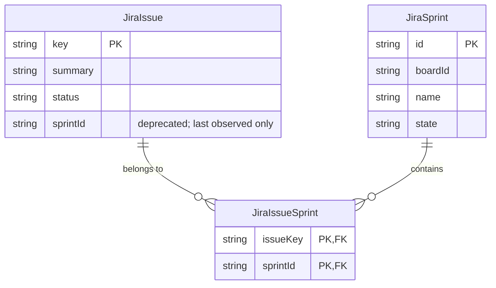

# 0047 — Sync: Include Cancelled Issues and Persist Multi-Sprint Membership

**Date:** 2026-05-06
**Status:** Accepted
**Author:** Architect Agent
**Related ADRs:** Strengthens [ADR 0006](../decisions/0006-sprint-membership-reconstructed-from-changelog.md); supersedes [Proposal 0046](0046-jira-sprint-report-api-for-planning-accuracy.md)

## Problem Statement

`SyncService` for scrum boards fetches issues per sprint via Jira's agile endpoint
`GET /rest/agile/1.0/board/{boardId}/sprint/{sprintId}/issue`. This endpoint applies the
**board's saved JQL filter**, which on every observed board (ACC, BPT, SPS, OCS, DATA)
includes a `resolution = Unresolved` (or equivalent) clause. As a result, issues with a
resolved status (`Done`, `Closed`, `Cancelled`, `Released`) are **never returned by the
agile sprint-issue endpoint** and are never added to `allIssueKeys`. Their changelogs
therefore are never refreshed by `syncChangelogsBulk`, leaving stale data — most importantly
`fromId` / `toId` columns remain `NULL` for any sprint event that occurred before the IDs
were being captured, so the planning accuracy calculation cannot identify those issues by
sprint ID.

A second, related problem: `JiraIssue.sprintId` is a single scalar column, but Jira issues
can belong to multiple sprints simultaneously (verified: `ACC-45` is currently in sprints
`3947`, `3903`, `3941`). Each sync upserts a single arbitrary sprint ID, silently
discarding the other memberships. This means we cannot use `JiraIssue.sprintId` as a
reliable signal that an issue belongs to a given sprint, and any code that does so
(e.g. fallbacks for missing changelog entries) produces incorrect results.

The two bugs together explain why ACC Sprint 2 reports `committed = 16` instead of the
expected `17`: `ACC-45` is `Cancelled`, never resynced, has `NULL` sprint IDs in its
changelog, and the planning service cannot match its name-only changelog row to sprint
`3941` (which was renamed from `Ready to estimate 2` to `Sprint 2`).

## Proposed Solution

Two narrowly-scoped sync changes:

1. **Replace the agile per-sprint issue endpoint with a JQL-based fetch** that returns all
   issues on the board regardless of resolution. The single JQL `project = {projectKey} AND
   sprint in openSprints() OR sprint in closedSprints() OR sprint in futureSprints()` (or
   equivalently `sprint is not EMPTY`) returns all issues that have ever belonged to any
   sprint on the board, including resolved/cancelled ones. The result feeds both the
   `JiraIssue` upsert loop and `allIssueKeys` for changelog backfill.

2. **Persist multi-sprint membership** by adding a new join entity `JiraIssueSprint`
   (`issueKey`, `sprintId`) populated from the issue's `customfield_10020` array. The
   existing scalar `JiraIssue.sprintId` column is **removed** in the same migration —
   no backwards-compatibility shim is kept. A full resync is the supported upgrade path.

### Data flow

### Schema change

### Sync changes (`backend/src/sync/sync.service.ts`)

In `syncBoard()`, for `boardType === 'scrum'`:

- Replace the `for (const sprint of sprints) syncSprintIssues(...)` loop with a single
  `syncScrumIssuesByJql(boardId, projectKey, extraFields, resolvedFieldConfig)` call that:
  - Issues `searchIssues` against `/rest/api/3/search` with JQL
    `project = "{projectKey}" AND sprint is not EMPTY`, paginating until exhausted
  - Upserts each issue into `JiraIssue`
  - Reads the sprint field array (`customfield_10020`) and replaces `JiraIssueSprint`
    rows for that issue key (delete-then-insert per issue, inside a transaction)
- Pass the resulting `allIssueKeys` into the existing `syncChangelogsBulk(allIssueKeys)`
  unchanged — this immediately fixes the missing-changelog problem.
- The existing per-sprint sync of `JiraSprint` metadata (`syncSprints`) is retained.

### Planning / sprint-detail changes

`PlanningService.calculateSprintAccuracy` and `SprintDetailService.getDetail` switch from
`JiraIssue.sprintId === sprintId` to a join against `JiraIssueSprint`. The shared
sprint-membership utility (already in scope per the in-flight refactor) becomes the only
reader of these tables.

### Backwards compatibility

None preserved. The `JiraIssue.sprintId` column is dropped in the same migration that
introduces `JiraIssueSprint`. The deployment requires a **full resync** (`POST /api/sync`)
immediately after the migration runs; until that completes, planning and sprint-detail
endpoints will return empty membership for every issue. This is acceptable per the user
brief — the dashboard is internal, the resync window is short (minutes), and avoiding a
deprecated-column shim keeps the read path simple and avoids a future deletion migration.

### Memory & throughput

The backend runs on an ECS Fargate task with **2048 MB** of memory; the post-sync DORA
snapshot computation runs in a Lambda with **3008 MB**. The current sync (which already
fetches per-sprint via the agile endpoint and bulk-fetches changelogs) operates well
within these limits, but the new JQL-based fetch returns a strictly larger set (now
including resolved/cancelled issues), so the design must avoid increasing peak memory.

Memory budget rules for this change:

- **Stream, don't accumulate.** The JQL search loop must process and persist each page
  of issues before requesting the next page. Do **not** build an `allIssues: JiraIssue[]`
  in-memory list across all pages. Per-page upsert into Postgres + push only the issue
  keys (small strings) into `allIssueKeys` for the changelog phase. Maximum in-flight
  payload is one page (≤ 100 issues) plus the cumulative `allIssueKeys: string[]`
  (~10 bytes per key, negligible at expected scale of ≤ 50k issues per board).
- **Same streaming model for `JiraIssueSprint` upserts.** Replace rows for one issue at
  a time inside the per-page loop, in a per-issue transaction. Do not collect the full
  cross-product into a single insert.
- **Changelog phase already streams.** `syncChangelogsBulk` already iterates issues with
  bounded concurrency (max 5 in-flight via `JiraClientService`); no change required, but
  the same per-issue replace-then-insert pattern applies.
- **No change to snapshot Lambda memory profile.** The Lambda reads aggregated metrics,
  not raw issue lists; this proposal does not increase the data volume it processes
  (only its accuracy).

These rules are enforceable in code review by inspecting the JQL loop body — if any
collection grows across iterations, the change is rejected.

## Alternatives Considered

### Alternative A — Use Greenhopper sprint report API (Proposal 0046)

Rejected. Adds a dependency on an undocumented Atlassian API, requires a new entity to
shadow data Jira already exposes via documented endpoints, and introduces N additional
HTTP calls per sync (one per closed sprint). Most importantly it does not address the
underlying sync gap: any code path that depends on a complete `JiraIssue` table (not just
planning) remains broken for cancelled issues.

### Alternative B — Pass `validateQuery=false` and a JQL override to the agile endpoint

The agile sprint-issue endpoint accepts a `jql` query parameter that can override the
board filter. This was investigated; the override only narrows the result, it cannot
relax the board filter. Ruled out.

### Alternative C — Periodically resync just the issues with `NULL` `fromId` / `toId`

A targeted backfill job that finds rows with `field = 'Sprint' AND fromId IS NULL` and
re-fetches their changelogs. Ruled out: it treats the symptom not the cause; new
cancelled issues will keep entering the broken state on every sync.

### Alternative D — Store the multi-sprint membership as a JSON array on `JiraIssue`

Add a `sprintIds: string[]` JSON column instead of a join table. Ruled out: query patterns
in `PlanningService` need to join against `JiraSprint` (for date filtering) and against
multiple issues at once; a relational join table makes those queries straightforward and
indexable, while a JSON array forces in-application filtering.

## Impact Assessment

| Area | Impact | Notes |
|---|---|---|
| Database | New entity + dropped column | New `jira_issue_sprints` table (composite PK `(issueKey, sprintId)`, FKs to `jira_issues.key` and `jira_sprints.id`); `jira_issues.sprintId` column dropped in same migration. Full resync required post-deploy. |
| API contract | None | All response shapes unchanged |
| Frontend | None | No frontend changes |
| Tests | New unit tests + updated integration tests | `sync.service.spec.ts` for JQL path + `JiraIssueSprint` upsert; `planning.service.spec.ts` and `sprint-detail.service.spec.ts` updated to use `JiraIssueSprint` fixtures; integration test asserting ACC Sprint 2 commitment = 17 |
| External API | Endpoint change | One JQL `/rest/api/3/search` per scrum board per sync run, replacing N per-sprint agile calls. Net reduction in API calls. |
| Infrastructure | None | No new cloud resources |
| Observability | New error log on JQL failure | Sync fails loudly; no silent fallback |
| Security / Compliance | None | Same data class (internal Jira mirror); no new credentials |

## Open Questions

1. **JQL pagination limit:** Jira Cloud's `/rest/api/3/search` endpoint enforces a
   `maxResults` cap (typically 100) and may impose a token-based pagination model
   (`nextPageToken`) on newer instances. The implementation must follow whichever paging
   scheme the live endpoint returns; verify with a probe call before coding.

2. **`sprint is not EMPTY` JQL semantics:** Confirm this clause matches issues currently
   in any sprint **and** issues that were ever in a sprint but are no longer (e.g. removed
   then re-added historically). The expected semantics are "any issue that has ever
   touched a sprint on the board"; if not, the JQL needs to be `sprint in
   (openSprints(), closedSprints(), futureSprints())`.

3. **`customfield_10020` field ID:** Per ADR 0021, Jira field IDs are externalised to
   YAML config. The sprint field ID is already available via `JiraFieldConfig`; no new
   config entry is required, but the JQL-based sync must read the configured field ID
   when extracting the sprint array from the issue payload.

4. **Per-page transaction granularity:** Per-issue transactions for `JiraIssueSprint`
   replacement are explicit in the design for memory bounding, but they raise the
   transaction count. With ≤ 50k issues per board this is acceptable on PostgreSQL 16,
   but the sync's existing single-board duration metric should be re-baselined after
   deployment to confirm no regression.

## Acceptance Criteria

- [ ] A new `jira_issue_sprints` table exists with a TypeORM migration implementing both
      `up()` and `down()`. The same migration drops `jira_issues.sprintId`.
- [ ] `SyncService` uses a JQL `/rest/api/3/search` query to fetch all issues on a scrum
      board (including issues with `Cancelled`, `Done`, `Closed`, or `Released` status)
      and upserts them into `JiraIssue`.
- [ ] The JQL fetch loop **streams** results page-by-page: each page is upserted into
      `JiraIssue` and `JiraIssueSprint` and only its issue keys are retained for the
      changelog phase. No `JiraIssue[]` collection accumulates across pages.
- [ ] For each issue returned by the JQL search, `JiraIssueSprint` rows are replaced
      (delete-then-insert in a per-issue transaction) to reflect the current full
      multi-sprint membership from `customfield_10020`.
- [ ] `allIssueKeys` passed to `syncChangelogsBulk` includes every issue returned by the
      JQL search (including cancelled / resolved issues).
- [ ] After a fresh sync of the ACC board, `JiraChangelog` rows for `ACC-45` have
      non-`NULL` `fromId` and `toId` for `field = 'Sprint'` events.
- [ ] After a fresh sync of the ACC board, `GET /api/planning/accuracy?boardId=ACC&sprintId=3941`
      returns `commitment = 17`.
- [ ] `PlanningService.calculateSprintAccuracy()` reads sprint membership from
      `JiraIssueSprint`. The `JiraIssue.sprintId` reference is removed from the codebase.
- [ ] `SprintDetailService.getDetail()` reads sprint membership from `JiraIssueSprint`.
- [ ] Unit tests cover: JQL path returns cancelled issues; `JiraIssueSprint` upsert
      replaces existing rows on resync; planning service reads multi-sprint membership
      via the join table; sync streams pages without accumulation (assert that the
      service does not retain a full issues array between pages).
- [ ] If the JQL search fails for a board, sync logs an `ERROR` and the sync run for
      that board fails (no silent fallback to the agile endpoint).
- [ ] No code path other than the JQL fetch writes to `JiraIssueSprint`.
- [ ] Peak resident memory of the sync container during a full sync of all configured
      boards remains under the existing 2048 MB Fargate task limit (verified by
      observing `MemoryUtilization` in CloudWatch on the first post-deploy sync run).
