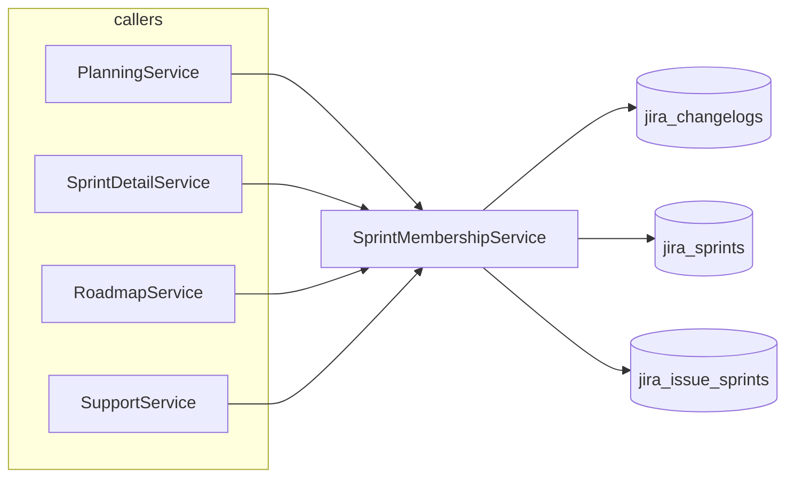
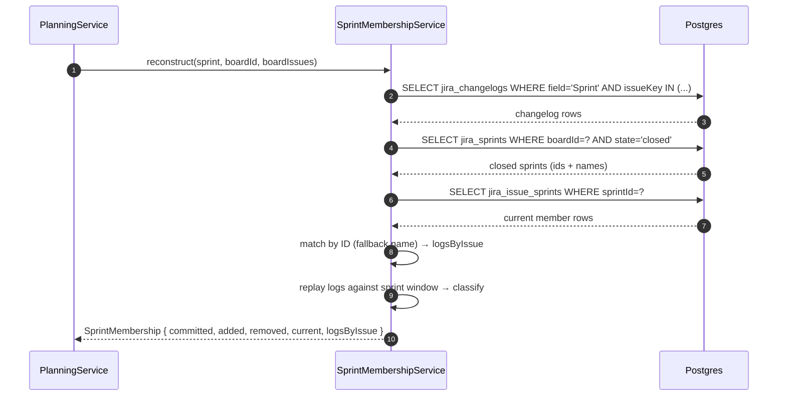

# 0048 — SprintMembershipService: Single Source of Truth for Sprint Membership Reconstruction

**Date:** 2026-05-06
**Status:** Accepted
**Author:** Architect Agent
**Related ADRs:** ADR 0049; builds on ADR 0048 (sync-cancelled-issues-and-multi-sprint-membership)

## Problem Statement

Four services — `PlanningService`, `SprintDetailService`, `RoadmapService`, and `SupportService` —
each independently reconstruct sprint membership from `JiraChangelog` rows plus the
`JiraIssueSprint` join table. The implementations have **diverged**: `PlanningService` matches
sprint changelogs primarily by sprint **ID** (`fromId`/`toId`), falling back to name; the other
three match only by **name**.

ACC Sprint 2 (`id=3941`) demonstrates the consequence in production today:

| View | Reported issue count | Algorithm |
|---|---|---|
| `/api/planning/accuracy?sprintId=3941` | committed=17, total=30 | ID-based (correct) |
| `/api/sprints/ACC/3941/detail` | committed=0, total=13 | Name-based (broken) |
| `/api/roadmap?board=ACC` | 13 | Name-based (broken) |

The Jira sprint was renamed during its lifetime (changelog rows reference both
`Ready to estimate 2` and `Sprint 2`). Name-based reconstruction misses the entries written
under the old name; ID-based reconstruction sees them all. Issue ACC-48's changelog is the
canonical example.

Three callers reproducing the same algorithm guarantees future drift. The fix is to extract
the canonical algorithm into a single service that all callers depend on.

## Proposed Solution

Create a new `SprintMembershipModule` in `backend/src/sprint-membership/` exporting a
`SprintMembershipService` whose sole responsibility is reconstructing per-sprint issue
membership. All four current callers are refactored to depend on it; their inline
membership logic is deleted.

### Public surface

```typescript
export interface SprintMembership {
  /** Issues that were in the sprint at the moment `sprint.startDate` + grace period elapsed. */
  committedKeys: Set<string>;
  /** Issues added to the sprint after start (mid-sprint additions, not carry-overs). */
  addedKeys: Set<string>;
  /** Issues removed from the sprint before its end. */
  removedKeys: Set<string>;
  /** Issues currently in the sprint per the JiraIssueSprint join table. */
  currentMemberKeys: Set<string>;
  /** Per-issue Sprint-field changelog rows scoped to this sprint (ordered by changedAt ASC). */
  logsByIssue: Map<string, JiraChangelog[]>;
}

@Injectable()
export class SprintMembershipService {
  /**
   * Reconstruct sprint membership for a single sprint using the canonical algorithm:
   *   1. Match changelog rows by sprint ID (fromId/toId) when present, falling back
   *      to sprint name when the row predates the fromId/toId columns.
   *   2. Treat issues with no sprint-field changelog as direct creations into the
   *      sprint identified by the JiraIssueSprint join table.
   *   3. Classify each issue as committed / added / removed against the sprint window
   *      [startDate + grace, endDate], using closed-sprint IDs to detect carry-overs.
   */
  async reconstruct(input: {
    sprint: JiraSprint;
    boardId: string;
    /** All non-Epic, non-Sub-task issues for the board (caller pre-filters). */
    boardIssues: JiraIssue[];
  }): Promise<SprintMembership>;
}
```

The service owns the queries against `JiraChangelog`, `JiraSprint` (closed sprint
lookup), and `JiraIssueSprint`. Callers pass the sprint and board issues; everything
else is fetched internally.

### Module wiring

`SprintMembershipModule` imports the three relevant TypeORM repositories and exports
`SprintMembershipService`. `PlanningModule`, `SprintModule`, `RoadmapModule`, and
`SupportModule` import `SprintMembershipModule` and remove their own duplicated logic
plus the `JiraChangelog`/`JiraIssueSprint` repository injections that are now exclusively
used for membership reconstruction (some callers still need them for unrelated queries).

### Migration of callers

| Caller | Replaces | Net effect |
|---|---|---|
| `PlanningService.calculateSprintAccuracy` | `sprintIdContains` + `sprintValueContains` matching loop, `currentIssues` join-table fallback, classification loop (~150 lines) | calls `SprintMembershipService.reconstruct(...)` and consumes `committedKeys`, `addedKeys`, `removedKeys` directly |
| `SprintDetailService.getDetail` | name-only matching loop, classification loop (~110 lines) | same |
| `RoadmapService.getAccuracy` | name-only matching, two `membersBySprintId` blocks (~80 lines) | same — invoked once per sprint in scope |
| `SupportService.getSupportTickets` | sprint-membership filter (~40 lines) | uses `currentMemberKeys` from the result |

### Constants

`SPRINT_GRACE_PERIOD_MS` and the carry-over detection helper move into the new module
as the single canonical source. The duplicated copies in the four caller files are deleted.

### Tests

- New `sprint-membership.service.spec.ts`: covers ID-based matching, name-based fallback,
  rename scenario (the ACC-48 case), carry-over detection from closed sprint, mid-sprint
  addition, removal before end, no-changelog direct creation via `JiraIssueSprint`.
- Existing `planning.service.spec.ts`, `sprint-detail.service.spec.ts`,
  `roadmap.service.spec.ts`, `support.service.spec.ts` are updated to mock
  `SprintMembershipService` rather than the underlying repositories. The mocks return
  pre-computed `SprintMembership` objects, sharply reducing per-test fixture noise.





## Alternatives Considered

### Alternative A — Patch each service in place (port the ID-based matching to the three broken callers)

Smallest diff. Fixes the immediate ACC Sprint 2 bug. **Rejected** because it leaves four
copies of the same algorithm in the codebase. The next change (e.g. supporting Jira's new
`activatedDate` field, or handling sprints in flight across boards) will need to touch four
files and risk re-divergence. The root cause here is duplicated logic, not the algorithm
itself.

### Alternative B — Pure utility function rather than a service

Move the algorithm into `backend/src/lib/sprint-membership.ts` as pure functions; callers
pass in pre-fetched changelog/sprint/member arrays. **Rejected** because every caller
fetches the same three datasets with subtly different filters, so the duplication just
moves up the stack. Encapsulating the queries inside the service produces a smaller and
more testable surface.

### Alternative C — Shared algorithm, distinct query strategies per caller

Keep the queries in each caller but extract only the in-memory classification. **Rejected**
because the bug is in the query interpretation (which `fromId/toId` rows count for this
sprint), not the classification loop. Separating them leaves the bug-prone half duplicated.

## Impact Assessment

| Area | Impact | Notes |
|---|---|---|
| Database | None | Reuses existing `jira_changelogs`, `jira_sprints`, `jira_issue_sprints` schemas |
| API contract | None | Endpoint shapes unchanged |
| Frontend | None | Behaviour change: sprint detail and roadmap will return correct counts (consistent with planning) |
| Tests | New unit suite for `SprintMembershipService`; four existing service specs simplified to mock the new dependency | Net reduction in test code expected (~200 lines of fixture removal) |
| External API | No new calls | Pure refactor of post-sync logic |
| Infrastructure | None | No new modules deployed; same Docker image |
| Observability | Add `SprintMembershipService` log line at debug level when fallback to name-based matching is used | Helps detect any remaining pre-`fromId` data |
| Security / Compliance | None | No new data class, no new external surface |

## Open Questions

None.

## Acceptance Criteria

- [ ] `backend/src/sprint-membership/sprint-membership.service.ts` exists and exports `SprintMembershipService` with the `reconstruct()` signature defined above.
- [ ] `SprintMembershipModule` exports `SprintMembershipService` and is imported by `PlanningModule`, `SprintModule`, `RoadmapModule`, and `SupportModule`.
- [ ] `PlanningService`, `SprintDetailService`, `RoadmapService`, and `SupportService` no longer contain inline sprint-membership reconstruction logic. They each contain at most one call to `SprintMembershipService.reconstruct(...)` per sprint they process.
- [ ] The helpers `sprintValueContains`, `sprintIdContains`, `wasInSprintAtDate`, `isCarryOverFromSprint`, and the `SPRINT_GRACE_PERIOD_MS` constant exist exactly once in the codebase, inside the `sprint-membership` module.
- [ ] `GET /api/planning/accuracy?boardId=ACC&sprintId=3941` returns `commitment=17`, `added=13`, `completed=21` (current behaviour, must not regress).
- [ ] `GET /api/sprints/ACC/3941/detail` returns `summary.committedCount=17`, `summary.addedMidSprintCount=13` (matching planning).
- [ ] `GET /api/roadmap?board=ACC` shows the same Sprint 2 issue count as the sprint detail view for sprint 3941 (consistency check).
- [ ] New `sprint-membership.service.spec.ts` covers: ID-based match, name-based fallback when `fromId`/`toId` are null, rename mid-sprint (ACC-48 case), carry-over from closed sprint, mid-sprint addition, removal before end, direct creation with no changelog via `JiraIssueSprint`.
- [ ] All existing tests (`npx jest --no-coverage`) pass — current count 807, expected to remain 807 +/- the new suite size.
- [ ] No call site of `JiraChangelog` repository remains that filters `field = 'Sprint'` outside `SprintMembershipService` (verified by ripgrep).
