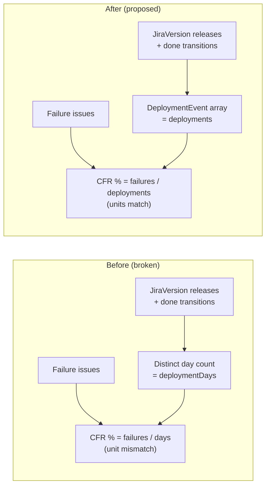

# 0049 — CFR Denominator Semantics: Failures Per Deployment vs Failures Per Deployment-Day

**Date:** 2026-05-06
**Status:** Draft
**Author:** Architect Agent
**Related ADRs:** ADR 0001 (fixVersion as primary deployment signal), ADR 0021 (DORA Metrics Calculation Reference — proposal 0021)
**Related Proposals:** [0017](0017-metric-calculation-audit.md), [0018](0018-metric-calculation-fixes.md), [0021](0021-dora-metrics-calculation-reference.md), [0030](0030-metrics-correctness-second-audit-fixes.md)

---

## Problem Statement

`backend/src/metrics/cfr.service.ts` computes Change Failure Rate as
`failureCount / totalDeployments * 100`, where:

- `failureCount` is the **number of issues** in the period that match the board's
  failure rules (issue types, link types, labels) — units: *issues*.
- `totalDeployments` is the **number of distinct days** in the period on which
  *something* was released (release-day count from `JiraVersion.releaseDate`)
  plus distinct days on which a non-version issue transitioned to a done status —
  units: *days*.

The two values have **different units**. The resulting percentage is meaningful
only in the degenerate case where each deployment day contains exactly one
deployable change. For any board that ships multiple PRs per release, or
batches releases weekly, the reported CFR is systematically wrong — and the
direction of the error depends on team behaviour, not signal.

This is the single largest correctness defect surfaced in the May 2026 audit
and propagates from per-board CFR through `metrics.service.ts` org-level
aggregation (`buildOrgDoraResult` line 634, `buildOrgDoraResultFromData` line
754) into the headline DORA banner, all DORA charts, the sprint report
composite score, and DORA snapshots.

---

## Proposed Solution

Pick one canonical definition of *deployment* and apply it consistently as
both the numerator's reference event and the denominator's count.

### Recommendation — Definition C: deployments-as-release-events

A deployment is **one fixVersion release** (primary signal) or **one issue
transitioning to a done status** when no fixVersion is associated (fallback,
per ADR 0001). The CFR denominator becomes a count of these events, not a
count of distinct days. The numerator counts failure issues whose
`createdAt` (or `causedBy` link target's `releaseDate`) falls within the
release event's attribution window.

This aligns with the DORA team's published definition ("the percentage of
deployments to production that result in degraded service") and matches
how `change-failure-rate` is defined in the Google `four-keys` reference
implementation.

### Affected modules

- `backend/src/metrics/deployment-frequency.service.ts` — already counts
  release events and done-transitions; expose them as a single
  `DeploymentEvent[]` rather than collapsing to a day count.
- `backend/src/metrics/cfr.service.ts` — consume `DeploymentEvent[]` and
  compute `failureCount / events.length * 100`.
- `backend/src/metrics/metrics.service.ts` — `buildOrgDoraResult` already
  uses ratio-of-sums; once per-board CFR is correct, org CFR is correct.
- `backend/src/sprint-report/sprint-report.service.ts` — no change beyond
  consuming the corrected CFR value.
- `frontend/src/lib/dora-bands.ts` and `frontend/src/app/dora/*` — no change;
  band thresholds remain `≤5%`, `≤10%`, `≤15%`.

### Data flow

### Migration & rollout

- Pure compute change — no schema migration required.
- All `DoraSnapshot` rows produced before the fix will be invalidated. Either
  truncate `dora_snapshot` and let the post-sync Lambda repopulate, or bump a
  `snapshotVersion` column and read only matching versions until the next
  sync.
- Fix is breaking for headline numbers — communicate to dashboard users
  before deploying, since CFR will jump (likely upward, as most boards
  release multiple changes per day).

---

## Alternatives Considered

### Alternative A — Definition A: failures-per-deployment-day

Keep the day-count denominator and **change the numerator** to "did at least
one failure occur on that day → 1; else 0", giving a true ratio of "bad
days / total deployment days".

Ruled out because:
- Loses information — a day with 10 failures and a day with 1 are equivalent.
- Diverges from the published DORA definition; teams comparing to industry
  benchmarks would get systematically lower CFR than peers.
- Breaks the Sprint Report's "failureCount" chart (which currently shows
  per-failure granularity).

### Alternative B — Definition B: failures-per-day, denominator unchanged

Keep day-count denominator, **redefine numerator** as "distinct days on which
any failure was created" — both numerator and denominator now in days.

Ruled out for the same information-loss reason as A, and because it makes
the Lead Time fixVersion signal (which counts events, not days) inconsistent
with CFR.

### Alternative C — Definition C: failures-per-deployment-event (recommended)

See Proposed Solution. Selected because it matches the published DORA
definition, preserves per-failure granularity, and unifies CFR's
denominator with Deployment Frequency's underlying signal.

### Alternative D — Configurable per board

Add a `BoardConfig.cfrDenominatorMode = 'event' | 'day'` flag.

Ruled out because:
- DORA bands have fixed thresholds. Letting one board report 5% under
  definition A and another report 12% under definition C, with both
  classified by the same band table, is misleading.
- Adds permanent complexity for what should be one decision made once.

---

## Impact Assessment

| Area | Impact | Notes |
|---|---|---|
| Database | None | `DoraSnapshot` rows become stale; truncate or version-bump |
| API contract | Additive | `DeploymentEvent[]` may be exposed for debug/inspection; existing CFR field shape unchanged |
| Frontend | None | Bands unchanged; only the underlying number moves |
| Tests | Significant | All `cfr.service.spec.ts` fixtures need denominator semantics review; `metrics.service.spec.ts` org aggregation tests need updating |
| External API | None | No new Jira calls |
| Infrastructure | None | Lambda snapshot handler picks up the new logic on next deploy |
| Observability | New log field | Log `deploymentEventCount` and `deploymentDayCount` side by side for one release cycle to make the size of the change visible |
| Security / Compliance | None | |

## Open Questions

- **Snapshot invalidation strategy:** truncate `dora_snapshot` on deploy, or
  introduce a `cfr_definition_version` column and let the next scheduled
  sync repopulate? Truncate is simpler; column is safer if other consumers
  read snapshots directly.
- **User communication:** do we want a one-time banner on the DORA page
  flagging "CFR calculation updated on YYYY-MM-DD — historical numbers may
  not be comparable"? Recommended, but out of scope for this proposal.

## Acceptance Criteria

- `backend/src/metrics/cfr.service.ts` computes
  `failureCount / deploymentEvents.length * 100`, where `deploymentEvents`
  is the same event list produced by `deployment-frequency.service.ts`
  (one entry per fixVersion release; one entry per done-transition where
  fixVersion is absent).
- A unit test in `cfr.service.spec.ts` constructs a board with 10 release
  events and 3 failure issues, asserts CFR = 30.0, and asserts that
  pre-fix logic (10 events on 5 distinct days, denominator = 5) is no
  longer reachable.
- Org-level CFR in `buildOrgDoraResult` (metrics.service.ts:634) sums
  events and failures across boards, returning `(Σ failures) / (Σ events)`.
  Existing org-aggregation tests pass with updated fixtures.
- DORA snapshot Lambda regenerates all snapshots within one sync cycle of
  deployment. `SyncLog` records snapshot generation success.
- ADR 0050 (to be created on acceptance) documents the chosen definition
  and supersedes any earlier informal documentation in proposal 0021.
