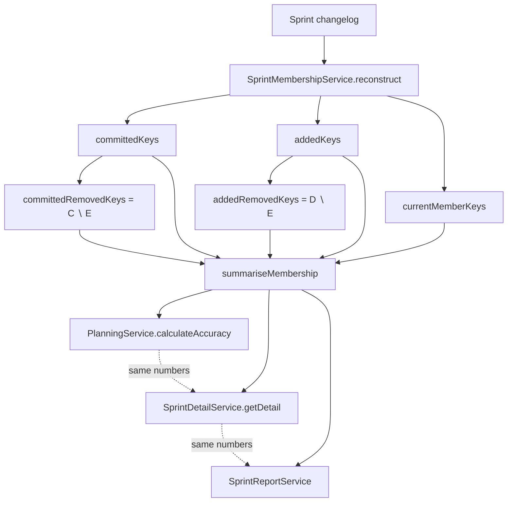

# 0050 — Removed-Set Semantics in Planning Accuracy

**Date:** 2026-05-06
**Status:** Accepted
**Author:** Architect Agent
**Related ADRs:** ADR 0049 (SprintMembershipService)
**Related Proposals:** [0013](0013-planning-accuracy-and-gaps-report.md), [0038](0038-carry-over-sprint-issue-classification.md), [0048](0048-sprint-membership-service.md)

---

## Problem Statement

`backend/src/sprint-membership/sprint-membership.service.ts` returns four
canonical sets per ADR 0049: `committedKeys`, `addedKeys`, `removedKeys`,
`currentMemberKeys`. The current implementation (lines 310–316) populates
`removedKeys` with **every issue that left the sprint after start**, which
includes both:

1. **Committed-then-removed** — present at sprint start, removed mid-sprint.
2. **Added-then-removed** — added after start, then removed before end.

`backend/src/planning/planning.service.ts` then uses
`removed = removedKeys.size` in two formulas:

- `scopeChange% = (added + removed) / commitment * 100` (line 241)
- `completionRate = completed / (commitment + added - removed) * 100`
  (line 244)

The first formula **double-counts** added-then-removed issues — they appear
in both `added` and `removed` numerators. The second formula correctly
excludes any-direction-removed work from the divisor but, because `removed`
includes added-then-removed, the divisor reduces to less than the actual
final-sprint set when the team adds-then-removes scope.

Additionally, `sprint-detail.service.ts:566` reports a different
`commitment` count than `planning.service.ts:235` for the same sprint —
the former excludes committed-then-removed, the latter includes them. This
is the visible symptom that brought the issue to attention: two pages show
two different "committed" numbers for the same sprint.

---

## Proposed Solution

Split `removedKeys` into two disjoint sets in `SprintMembershipService` and
make every consumer pick the semantic that matches its formula.

### New `SprintMembership` shape

```typescript
interface SprintMembership {
  committedKeys: Set<string>;       // present at sprint start (unchanged)
  addedKeys: Set<string>;           // joined after sprint start (unchanged)
  currentMemberKeys: Set<string>;   // in sprint at sprint end (unchanged)

  // NEW — replaces removedKeys
  committedRemovedKeys: Set<string>;  // committedKeys ∖ currentMemberKeys
  addedRemovedKeys: Set<string>;      // addedKeys ∖ currentMemberKeys
}
```

`removedKeys` is removed in the same commit (clean break). Internal-only
type; all callsites — `PlanningService`, `SprintDetailService`,
`SupportService`, and spec mocks — are migrated together.

### Canonical formulas (post-fix)

Define helper accessors on the membership object:

| Quantity | Formula |
|---|---|
| `commitment` | `committedKeys.size` |
| `added` (net) | `addedKeys.size − addedRemovedKeys.size` |
| `removed` (net) | `committedRemovedKeys.size` |
| `completed` | issues in `currentMemberKeys` whose status is `done` at sprint end |
| `scopeChange%` | `(addedKeys.size + committedRemovedKeys.size) / commitment * 100` |
| `completionRate%` | `completed / (commitment − committedRemovedKeys.size + (addedKeys.size − addedRemovedKeys.size)) * 100` |

The divisor of `completionRate` simplifies to `currentMemberKeys.size`
(the set of issues actually present at sprint end). This is the
mathematically correct denominator and removes the double-counting.

### Single shared `summariseMembership(membership)` helper

Add a pure function in `sprint-membership.service.ts`:

```typescript
export interface MembershipSummary {
  commitmentCount: number;       // committedKeys.size
  addedCount: number;            // addedKeys.size (gross)
  netAddedCount: number;         // addedKeys.size − addedRemovedKeys.size
  removedCount: number;          // committedRemovedKeys.size (committed-only)
  finalSetSize: number;          // currentMemberKeys.size
  scopeChangePercent: number;
}
export function summariseMembership(m: MembershipResult): MembershipSummary;
```

Both `planning.service.ts` and `sprint-detail.service.ts` consume this
helper. The two pages can no longer disagree.

### Data flow



---

## Alternatives Considered

### Alternative A — Keep `removedKeys` as union, fix formulas only

Leave `SprintMembershipService` unchanged; update `planning.service.ts` to
recompute the disjoint sets inline.

Ruled out because:
- The disjoint sets are derived from membership state — they belong with the
  membership service, not at every call site.
- Any new consumer of membership would have to re-derive the sets and risks
  introducing the same double-count bug again.

### Alternative B — Always use net counts (added − added-removed, etc.)

Define `added` to mean "still in sprint at end that wasn't there at start"
and `removed` to mean "was in at start but not at end". Mid-sprint
add-then-remove churn becomes invisible.

Ruled out because:
- The audit-trail value of seeing churn is real — teams that add 10 and
  remove 10 are doing different work than teams that add 0 and remove 0,
  even if net = 0.
- ADR 0049 explicitly committed to surfacing churn; this would silently
  reverse that decision.

### Alternative C (recommended) — Split the set, share a summary helper

See Proposed Solution.

---

## Impact Assessment

| Area | Impact | Notes |
|---|---|---|
| Database | None | All sets are reconstructed from changelog |
| API contract | Additive | `committedRemovedKeys` and `addedRemovedKeys` may be exposed in detail endpoints; `removedKeys` retained as deprecated |
| Frontend | Minor | Sprint detail and planning pages start showing the same `commitment` number; UI labels unchanged |
| Tests | Significant | All `sprint-membership.service.spec.ts` fixtures need new assertions; `planning.service.spec.ts` needs updated expected values for sprints with mid-sprint churn |
| External API | None | |
| Infrastructure | None | |
| Observability | None | |
| Security / Compliance | None | |

## Open Questions

- ~~**Backward-compat window length:**~~ **Resolved 2026-05-07:** clean
  break — `removedKeys` is removed in the same commit. Internal-only type;
  no external consumers exist.
- **Should the API expose all five sets or only summary counts?**
  **Resolved 2026-05-07:** API surface unchanged. Existing
  `commitment`/`added`/`removed` fields keep their names but the `removed`
  field now means "committed-then-removed" (the corrected, non-double-counted
  value). No new API fields. Detail views that need the disjoint key sets
  can call `sprint-detail` for the full membership object.

## Acceptance Criteria

- `MembershipResult` exposes `committedRemovedKeys` and `addedRemovedKeys`
  as disjoint sets; their union equals the legacy `removedKeys`.
- `summariseMembership(m)` is exported from
  `sprint-membership.service.ts` and is the **only** way
  `planning.service.ts` and `sprint-detail.service.ts` derive
  `commitmentCount`, `addedCount`, `removedCount`, `scopeChangePercent`.
- A property test in `sprint-membership.service.spec.ts` asserts:
  for any input changelog, `committedRemovedKeys ∩ addedRemovedKeys = ∅`
  and `committedRemovedKeys ∪ addedRemovedKeys = removedKeys`.
- A test in `planning.service.spec.ts` constructs a sprint where
  5 issues are added then removed mid-sprint and asserts that
  `scopeChangePercent` is unaffected by net-zero churn (i.e. equals
  `(committedRemovedKeys.size + addedKeys.size) / commitment * 100` —
  not the double-counted `(added + addedRemoved + committedRemoved) / commitment`).
- Sprint detail page and planning page render identical commitment counts
  for the same sprint in an integration test.
- ADR 0051 (to be created on acceptance) records the canonical formulas.
