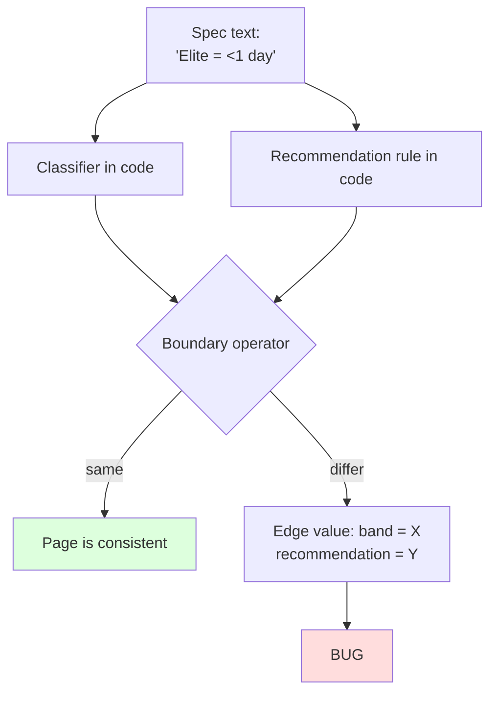

# 0052 — DORA Band Boundary Canonicalisation: `<` vs `<=`

**Date:** 2026-05-06
**Status:** Accepted
**Author:** Architect Agent
**Related ADRs:** —
**Related Proposals:** [0006](0006-dora-metrics-redesign.md), [0021](0021-dora-metrics-calculation-reference.md)

---

## Problem Statement

The DORA band classifiers in `backend/src/metrics/dora-bands.ts` and
`frontend/src/lib/dora-bands.ts` use **mixed boundary operators** across
the four metrics:

| Metric | Elite | High | Medium | Operator |
|---|---|---|---|---|
| Deployment Frequency | `≥1/day` | `≥1/week` | `≥1/month` | `>=` (lower-bound) |
| Lead Time | `<1 day` | `≤7 days` | `≤30 days` | mixed (`<` then `<=`) |
| Change Failure Rate | `≤5%` | `≤10%` | `≤15%` | `<=` |
| MTTR | `<1 hour` | `<24 hours` | `<168 hours` | `<` |

CLAUDE.md spec language is consistently `<` ("Elite = <1 hr", "Elite =
<1 day"). The code is inconsistent. Effects:

1. A Lead Time of exactly **7.0 days** is currently classified `high`.
   Per the spec ("<1 week"), it should be `medium`.
2. A Lead Time of exactly **30.0 days** is currently classified `medium`.
   Per the spec ("<1 month"), it should be `low`.
3. `recommendation.service.ts:200` rule **LT-004** fires the "elite Lead
   Time" recommendation at `medianLeadTimeDays <= 1` — but the classifier
   says `< 1`. A team with median LT = exactly 1.0 day sees the
   "you're elite!" recommendation while the band on the same page reads
   `high`. Same boundary slip is likely on other rules.

These edge cases are rare but visible — they cause "the page contradicts
itself" bug reports that are hard to reproduce because most LT/MTTR
values land far from boundaries.

---

## Proposed Solution

Adopt **`<` strictly less than** as the canonical operator for all
upper-bound bands (LT, CFR, MTTR), matching the spec wording and the
DORA team's published thresholds.

For Deployment Frequency, retain `>=` — it is a lower-bound metric and
the spec wording is `≥1/day` (the `≥` symbol appears explicitly in
CLAUDE.md).

### Updated band tables

| Metric | Elite | High | Medium | Low |
|---|---|---|---|---|
| Deployment Frequency | `≥1/day` | `≥1/week` & `<1/day` | `≥1/month` & `<1/week` | `<1/month` |
| Lead Time | `<1 day` | `<7 days` | `<30 days` | `≥30 days` |
| Change Failure Rate | `<5%` | `<10%` | `<15%` | `≥15%` |
| MTTR | `<1 hour` | `<24 hours` | `<168 hours` | `≥168 hours` |

### Single source of truth

The audit found two parallel implementations
(`backend/src/metrics/dora-bands.ts` and `frontend/src/lib/dora-bands.ts`)
that have already drifted once. Solution:

- Keep both files (frontend cannot import from backend without a shared
  package), but add a contract test in **both** test suites that
  validates a shared fixture file `docs/dora-bands-fixture.json`. The
  fixture lists ~40 boundary values; both suites assert the
  classification matches.

### Recommendation rules audit

Sweep `backend/src/sprint-report/recommendation.service.ts` for every
threshold comparison. Rules that fire on band-boundary values must use
the **same operator** as the classifier, not a comparison that crosses
the boundary in the opposite direction.

---

## Alternatives Considered

### Alternative A — Adopt `<=` everywhere

Treat the boundary value as the *better* band ("LT of exactly 7 days
is high, not medium"). This favours the team in edge cases.

Ruled out because:
- Diverges from the published DORA spec (Forsgren et al. use `<`).
- "1.0 day exactly" is essentially a measurement-precision artefact;
  classifying it as `high` rather than `medium` over-rewards a number
  that should be considered borderline.

### Alternative B — Document the inconsistency

Leave the code as-is, document each operator per metric.

Ruled out because:
- Doesn't fix the band/recommendation contradictions.
- Encodes inconsistency permanently; any future spec change has to
  remember per-metric quirks.

### Alternative C (recommended) — `<` everywhere for upper-bound bands

See Proposed Solution.

---

## Impact Assessment

| Area | Impact | Notes |
|---|---|---|
| Database | None | `DoraSnapshot.band` values will recompute on next sync |
| API contract | None | Band enum unchanged; classification of boundary values changes |
| Frontend | Minor | Boundary values flip band; pre-existing chart colours may shift for some sprints |
| Tests | Significant | Add `bands.contract.spec.ts` (backend + frontend) consuming `docs/dora-bands-fixture.json`; existing band tests need value adjustments at boundaries |
| External API | None | |
| Infrastructure | None | |
| Observability | None | Recommend ad-hoc query to log boundary values count before/after; expect handful at most |
| Security / Compliance | None | |

## Open Questions

- **Should DF also use `>` strict instead of `>=`?** Spec wording is
  `≥1/day` (with the `≥` glyph). Recommend keeping `>=` because the
  symbol is explicit and DF is a lower-bound metric where "exactly 1
  per day" is genuinely elite.
- **Communication:** A small number of sprints will reclassify on next
  snapshot. Worth adding a release note. Out of scope for this proposal.

## Acceptance Criteria

- `backend/src/metrics/dora-bands.ts` and
  `frontend/src/lib/dora-bands.ts` both use `<` for all upper-bound
  band thresholds (LT, CFR, MTTR); DF retains `>=`.
- `docs/dora-bands-fixture.json` exists with at least 40 test cases:
  exactly the boundary values, just below, and just above for every
  band on every metric.
- `backend/src/metrics/dora-bands.spec.ts` and
  `frontend/src/lib/dora-bands.test.ts` both consume the fixture and
  assert identical classifications.
- Every threshold rule in
  `backend/src/sprint-report/recommendation.service.ts` is audited
  against the classifier. Rules that previously used `<=` where the
  classifier uses `<` (e.g. LT-004) are corrected.
- ADR 0054 (to be created on acceptance) documents the operator
  convention and the cross-suite fixture pattern.
