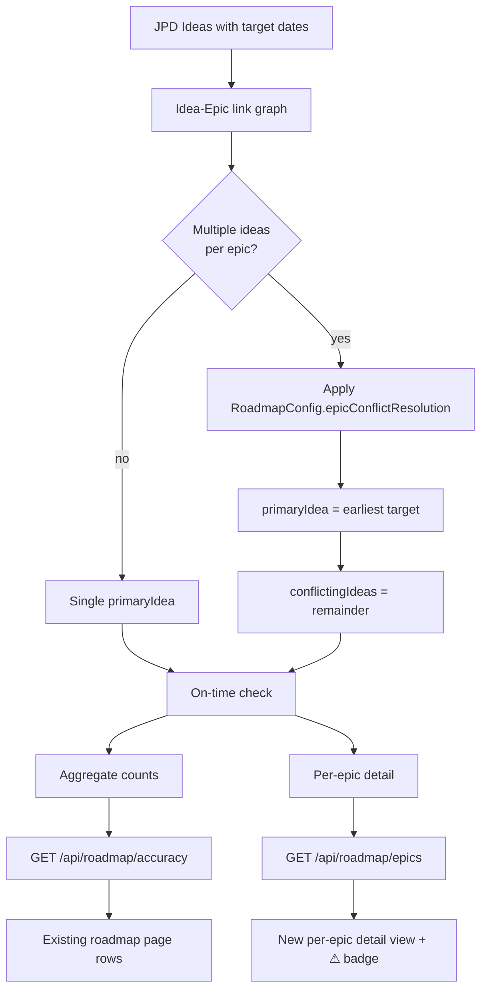
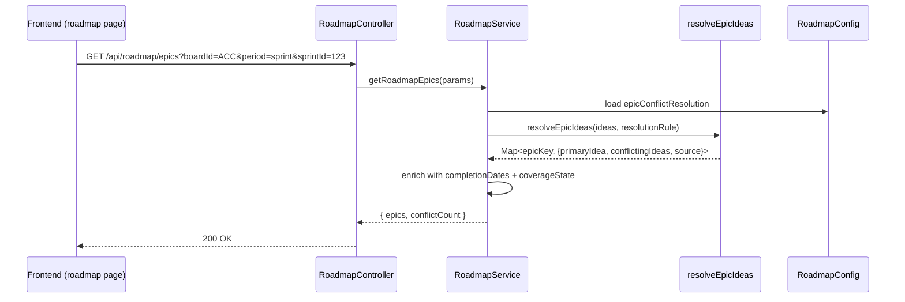

# 0053 — Roadmap Idea ↔ Epic Conflict Resolution

**Date:** 2026-05-06 (rewritten 2026-05-07)
**Status:** Accepted
**Author:** Architect Agent
**Related ADRs:** ADR 0044 (Roadmap Coverage via Direct Issue Links)
**Related Proposals:** [0012](0012-roadmap-coverage-semantics.md), [0041](0041-roadmap-coverage-via-issue-links.md)

---

## Problem Statement

`backend/src/roadmap/roadmap.service.ts:451-470` builds `epicIdeaMap` (and
`backend/src/metrics/roadmap-link-utils.ts` builds `directLinkIdeaMap`)
mapping each epic to a single linked Jira Product Discovery (JPD) idea,
even though the underlying issue-link graph allows
**many-ideas-to-one-epic**. The current resolution rule when multiple
ideas link the same epic is **"keep the idea with the later
`targetDate`"** — silently. The on-time check at lines 816–834 then uses
that later (more lenient) date.

Effects:

- A team is rated on-time against a target that another stakeholder
  may not have agreed to.
- The choice is non-deterministic from a user perspective —
  rearranging idea creation order, or editing one idea's target date,
  silently changes whether an epic is "on time".
- There is no surface (API or UI) that exposes the conflict; users
  discover it only by noticing roadmap coverage flips when an idea
  changes.

This is a **policy** decision masquerading as an implementation detail.

### Surface mismatch with original draft

The original draft of this proposal assumed the roadmap response
already exposed per-epic detail (`EpicCoverage` shape). It does not —
the current API at `GET /api/roadmap/accuracy` returns only aggregate
`RoadmapSprintAccuracy[]` rows (`backend/src/roadmap/roadmap.service.ts:30-50`),
with no per-epic breakdown. There is no per-epic frontend row to attach
a conflict badge to. This rewrite acknowledges that and adds the
required per-epic detail endpoint + page as part of scope.

---

## Proposed Solution

Make conflict resolution **explicit, deterministic, and surfaced** —
which requires both a policy change and a new API/UI surface to
expose the resolution.

### Step 1 — Default rule: earliest target date wins

Switch the default rule from "latest" to **earliest** target date in
both code paths:
- `roadmap.service.ts:451-470` (`filterIdeasForWindow`, the
  `deliveryIssueKeys` path — Conditions A/B)
- `metrics/roadmap-link-utils.ts` (`buildDirectLinkIdeaMap`, the
  direct-link path — Condition C, ADR 0044)

Both helpers must consult the same `RoadmapConfig.epicConflictResolution`
setting. A unit test pins parity between the two paths.

Rationale for `'earliest'`:

- The earliest committed target is the strictest interpretation of
  "what was promised". Slipping past the earliest date is a real miss
  even if a later idea relaxed the date.
- Symmetric to how delivery promises typically work: a team is on-time
  iff it meets *every* commitment, not the loosest one.
- Deterministic: no ordering surprises.

### Step 2 — New per-epic detail endpoint

Add `GET /api/roadmap/epics?boardId=ACC&period=sprint&sprintId=123`
(query params mirror the existing `/api/roadmap/accuracy` controller).
Response shape:

```typescript
interface EpicCoverageDetail {
  epicKey: string;
  epicSummary: string | null;
  primaryIdea: {
    ideaKey: string;
    ideaSummary: string | null;
    targetDate: string;        // ISO date — selected per epicConflictResolution
    startDate: string | null;
  } | null;                    // null when no idea links this epic
  conflictingIdeas: Array<{
    ideaKey: string;
    ideaSummary: string | null;
    targetDate: string;
    daysFromPrimary: number;   // signed; negative if earlier than primary
  }>;
  resolvedSource: 'deliveryIssueKeys' | 'directLink' | 'none';
  coverageState: 'green' | 'amber' | 'red' | 'unlinked';
  // green   = covered (delivered on time OR in-flight & on-track)
  // amber   = linked but past target without delivery
  // red     = no linked idea, but issue exists in window
  // unlinked = epic itself unlinked
}

interface RoadmapEpicsResponse {
  epics: EpicCoverageDetail[];
  conflictCount: number;       // sum of conflictingIdeas.length across epics
}
```

The endpoint reuses the existing window/sprint/quarter loading code from
`RoadmapService` — it computes the same idea-epic map but emits the
per-epic detail rather than aggregating to counts. Implementation will
extract a shared `resolveEpicIdeas(...)` helper used by both
`getRoadmapAccuracy` (existing) and `getRoadmapEpics` (new) so the
conflict resolution lives in one place.

### Step 3 — New frontend per-epic detail view

Add a "Show details" affordance on each row of the existing
`/roadmap` page that navigates to a per-period epic-detail panel
(in-page expansion is acceptable; separate route also acceptable —
implementation detail). The detail view:

- Lists each epic in the window with its `primaryIdea.targetDate`,
  `coverageState`, and `resolvedSource`.
- Shows a `⚠ N conflicts` badge inline on rows where
  `conflictingIdeas.length > 0`. Click expands a tooltip listing each
  conflicting idea with `ideaKey`, `targetDate`, and signed
  `daysFromPrimary`. Users can copy the idea key and resolve in JPD —
  outside the scope of this dashboard.
- Uses the existing `DataTable` component pattern from
  `frontend/src/app/roadmap/page.tsx:412-581`.

### Step 4 — Configurable per RoadmapConfig

Add `RoadmapConfig.epicConflictResolution: 'earliest' | 'latest'`
(default `'earliest'`). YAML loader and zod schema updated to accept
the new optional key.

This lets product change the policy later without code change, and
documents the choice in `roadmap.example.yaml`.

### Step 5 — Observability

Emit one structured log line per roadmap query at INFO level:

```
RoadmapService computed coverage:
  jpdKey=DISC, period=sprint, sprintId=123,
  epicCount=42, conflictCount=3, resolutionRule=earliest
```

This lets operators see how many epics in practice have multi-idea
links without needing to query the new endpoint.

### Data flow



### Sequence — new endpoint



---

## Alternatives Considered

### Alternative A — Keep "latest target wins" (current)
Status quo. Ruled out: silently rewards date slippage; non-deterministic
from a user perspective.

### Alternative B — Refuse to resolve; flag epic as "ambiguous"
Treat any conflict as an error state. Epic doesn't appear in coverage
metrics until resolved in JPD. Ruled out: penalises the team for a
data-quality issue outside their control; can cause coverage % to drop
without any work changing; roadmap coverage is meant to be
*informational*, not blocking.

### Alternative C — Earliest wins, no API/UI surface
Just change the rule, log conflicts, defer the per-epic endpoint to a
later proposal. Ruled out: leaves users unable to see *why* coverage
changed; the "page contradicts itself" symptom that motivates this
proposal stays partially unresolved (people can't see which idea
"won").

### Alternative D (recommended) — Earliest wins + per-epic surface + configurable
See Proposed Solution.

---

## Impact Assessment

| Area | Impact | Notes |
|---|---|---|
| Database | Migration required | `RoadmapConfig.epicConflictResolution` column added; default `'earliest'`; reversible migration |
| API contract | Additive | New `GET /api/roadmap/epics`; existing `/api/roadmap/accuracy` numerically unchanged shape, but on-time counts may flip for boards with multi-idea epics under the new default rule |
| Frontend | Significant | New per-epic detail view; new conflict badge component; new typed API wrapper |
| Tests | Significant | `roadmap.service.spec.ts`: fixtures for 1, 2, and 3 ideas-per-epic; default-rule + override tests; cross-path parity test (`filterIdeasForWindow` and `buildDirectLinkIdeaMap` resolve identically) |
| External API | None | All resolution happens on cached data |
| Infrastructure | None | |
| Observability | New log field | Per-query log line emits `epicCount`, `conflictCount`, `resolutionRule` |
| Security / Compliance | None | All data is internal; no new attack surface |

## Open Questions

- **Default value:** Locked in as `'earliest'` per user decision 2026-05-07.
- **Should the existing roadmap.yaml config files set this explicitly?**
  No. Leave them at default; document the new key in `roadmap.example.yaml`.
- **Behaviour-change communication:** A small number of sprints will
  reclassify on next render under the new default rule (boards where
  any epic has multi-idea links and the targets differ). Worth a
  release note. Out of scope for this proposal.

## Acceptance Criteria

1. `RoadmapConfig` entity has a new column
   `epicConflictResolution: 'earliest' | 'latest'` with default
   `'earliest'`. Migration is reversible (`up()` + `down()`).
2. YAML loader (`backend/src/yaml-config/yaml-config.service.ts`) and
   zod schema (`backend/src/yaml-config/schemas/roadmap-yaml.schema.ts`)
   accept the new optional key. Unknown values fail validation with a
   clear error message.
3. `roadmap.example.yaml` documents the new key and its default value.
4. A shared helper (`resolveEpicIdeas` or equivalent) is extracted such
   that **both** `filterIdeasForWindow` and `buildDirectLinkIdeaMap`
   route through one conflict-resolution implementation.
5. `roadmap.service.spec.ts` has a unit test that constructs an epic
   with three linked ideas (target dates `2026-06-01`, `2026-07-15`,
   `2026-09-01`) and asserts:
   - Default config → `primaryIdea.targetDate === '2026-06-01'` and
     `conflictingIdeas.length === 2`.
   - Override to `'latest'` → `primaryIdea.targetDate === '2026-09-01'`
     and `conflictingIdeas.length === 2`.
6. A unit test pins **parity**: an epic that is reachable both via
   `deliveryIssueKeys` and via `JiraIssueLink` direct links resolves to
   the same `primaryIdea` regardless of which path discovered it.
7. New endpoint `GET /api/roadmap/epics?boardId=...&period=...&sprintId=...`
   exists, validated by class-validator DTO, returns
   `{ epics: EpicCoverageDetail[]; conflictCount: number }`.
8. `epicCount` and `conflictCount` are emitted in a structured log line
   (NestJS Logger format is acceptable since structured logging is a
   project-wide gap).
9. Frontend per-epic detail view exists (`/roadmap` page extension or a
   sub-route — implementation choice). When `conflictingIdeas.length > 0`
   for any visible epic, a `⚠ N conflicts` badge renders inline on that
   row with a tooltip listing each conflicting idea (key, targetDate,
   signed `daysFromPrimary`).
10. Frontend Vitest tests cover the badge component in three states:
    no conflicts (badge absent), one conflict (singular wording), and
    three conflicts (plural wording with all three listed in tooltip).
11. ADR 0055 (to be created on acceptance) records:
    - `'earliest'` chosen as default rule.
    - Configurability via `RoadmapConfig.epicConflictResolution`.
    - The shared `resolveEpicIdeas` helper as the single source of
      truth.
    - Behaviour-change note for boards with multi-idea epics.
