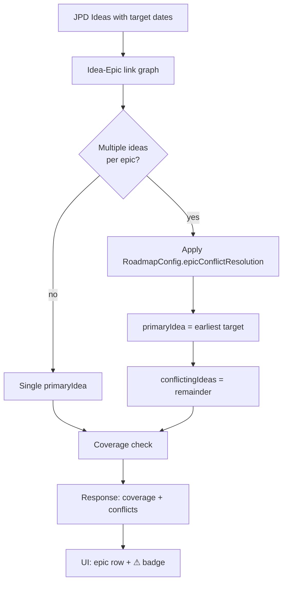

# 0053 — Roadmap Idea ↔ Epic Conflict Resolution

**Date:** 2026-05-06
**Status:** Draft
**Author:** Architect Agent
**Related ADRs:** ADR 0044 (Roadmap Coverage via Direct Issue Links)
**Related Proposals:** [0012](0012-roadmap-coverage-semantics.md), [0041](0041-roadmap-coverage-via-issue-links.md)

---

## Problem Statement

`backend/src/roadmap/roadmap.service.ts` line 786 builds an `epicIdeaMap`
that maps each epic key to a single linked Jira Product Discovery (JPD)
idea, even though the underlying issue-link graph allows
**many-ideas-to-one-epic**. The current resolution rule when multiple
ideas link the same epic is **"keep the idea with the later
`targetDate`"** — silently. The on-time check at lines 460 and 828–829
then uses that later (more lenient) date.

Effects:

- A team is rated on-time against a target that another stakeholder
  may not have agreed to.
- The choice is non-deterministic from a user perspective —
  rearranging idea creation order, or editing one idea's target date,
  silently changes whether an epic is "on time".
- There is no UI surface for the conflict; users discover it only by
  noticing roadmap coverage flips when an idea changes.

This is a **policy** decision masquerading as an implementation detail.
Picking the answer needs product input, not just engineering judgement.

---

## Proposed Solution

Make conflict resolution **explicit, deterministic, and surfaced**.

### Step 1 — Pick a deterministic default: earliest target date wins

Switch the default rule from "latest" to **earliest** target date.
Rationale:

- The earliest committed target is the strictest interpretation of
  "what was promised". Slipping past the earliest date is a real miss
  even if a later idea relaxed the date.
- Symmetric to how delivery promises typically work: a team is on-time
  iff it meets *every* commitment, not the loosest one.
- Deterministic: no ordering surprises.

### Step 2 — Surface conflicts in the API and UI

Extend the roadmap response with a `conflicts` array per epic:

```typescript
interface EpicCoverage {
  epicKey: string;
  primaryIdea: { ideaKey: string; targetDate: string };
  conflictingIdeas: Array<{
    ideaKey: string;
    targetDate: string;
    daysFromPrimary: number;
  }>;
  // ... existing fields
}
```

The frontend renders a small `⚠ 2 conflicts` badge on the epic row
linking to a tooltip listing the conflicting ideas. Users can resolve
in JPD — outside the scope of this dashboard.

### Step 3 — Make the rule configurable per RoadmapConfig

Add `RoadmapConfig.epicConflictResolution: 'earliest' | 'latest' | 'strictest'`
(default `'earliest'`). `'strictest'` is an alias for `'earliest'` —
purely cosmetic to make the policy intent explicit in YAML.

This lets product change the policy later without code change, and
documents the choice in `roadmap.example.yaml`.

### Data flow



---

## Alternatives Considered

### Alternative A — Keep "latest target wins" (current)

Status quo.

Ruled out because:
- Silently rewards date slippage. A stakeholder editing a target later
  changes the truth of an "on-time" claim.
- Non-deterministic from a user perspective.

### Alternative B — Refuse to resolve; flag epic as "ambiguous"

Treat any conflict as an error state. Epic doesn't appear in coverage
metrics until resolved in JPD.

Ruled out because:
- Penalises the team for a data-quality issue outside their control.
- Can cause coverage % to drop suddenly without any work changing.
- Roadmap coverage is meant to be *informational*, not blocking.

### Alternative C (recommended) — Earliest wins, conflicts surfaced, configurable

See Proposed Solution.

---

## Impact Assessment

| Area | Impact | Notes |
|---|---|---|
| Database | None | `RoadmapConfig` already has a JSONB column; new field is additive |
| API contract | Additive | `EpicCoverage.conflictingIdeas[]` added; `primaryIdea` shape clarified |
| Frontend | Minor | New conflict badge + tooltip on roadmap rows |
| Tests | Moderate | `roadmap.service.spec.ts` needs fixtures for 1, 2, and 3 ideas-per-epic; `RoadmapConfig` defaults test |
| External API | None | |
| Infrastructure | None | |
| Observability | New log field | Log conflict count per sync so we can see how many epics have multi-idea links in practice |
| Security / Compliance | None | |

## Open Questions

- **Default value: `'earliest'` or `'latest'`?** Recommend `'earliest'`
  on first principles; product may want to ratify via a one-line
  decision before this proposal moves to Accepted.
- **Should the existing roadmap.yaml config files set this explicitly?**
  Recommend leaving them at default and documenting the new key in
  `roadmap.example.yaml`.

## Acceptance Criteria

- `RoadmapConfig` schema includes
  `epicConflictResolution: 'earliest' | 'latest' | 'strictest'`
  (default `'earliest'`).
- `RoadmapService` selects `primaryIdea` per the configured rule and
  populates `conflictingIdeas` with all other ideas linked to the
  same epic.
- A unit test in `roadmap.service.spec.ts` constructs an epic with
  three linked ideas (target dates: 2026-06-01, 2026-07-15, 2026-09-01),
  asserts `primaryIdea.targetDate === '2026-06-01'` under default config,
  and asserts `conflictingIdeas.length === 2`.
- A unit test asserts that switching `epicConflictResolution` to
  `'latest'` reverses the selection.
- The roadmap page renders a `⚠ N conflicts` badge when
  `conflictingIdeas.length > 0`.
- `roadmap.example.yaml` documents the new key and its default value.
- ADR 0054 (to be created on acceptance) records the chosen default
  rule and the configurability mechanism.
