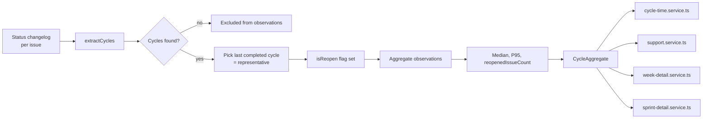

# 0054 — Cycle Time Reopen Handling: Pairing First-InProgress with Last-Done

**Date:** 2026-05-06
**Status:** Draft
**Author:** Architect Agent
**Related ADRs:** ADR 0024 (Weekend Days Excluded from Lead Time / Cycle Time)
**Related Proposals:** [0007](0007-cycle-time-report.md)

---

## Problem Statement

Cycle time across the codebase is calculated by pairing the **first**
transition into an in-progress status with the **last** transition into
a done status (within the analysis window):

- `backend/src/metrics/cycle-time.service.ts` lines 196–210
- `backend/src/support/support.service.ts` lines 333–340

For an issue whose history is
`In Progress → Done → Re-Opened → In Progress → Done`,
this combines the **first** In Progress with the **second (last)** Done,
inflating the reported cycle time by the entire duration of the closed
period plus the second active period.

Additionally:

- `backend/src/week/week-detail.service.ts` lines 399–411 uses
  **first In Progress + first Done** — opposite asymmetry. If first-Done
  predates first-In-Progress (issue went straight to Done then was later
  reopened and worked), the guard returns `null` silently with no
  anomaly counter.
- `backend/src/sprint/sprint-detail.service.ts:507–516` clamps negative
  lead time to `null` with no anomaly visibility.

The behaviour is inconsistent across the three views, and none of the
three is correct for an issue with reopens. Reopen rates vary by team
but a single reopen can shift a board's median cycle time by 2–10×.

There are no calculation reopen tests in any of the three service
specs, so the behaviour was never validated.

---

## Proposed Solution

Adopt a single canonical cycle definition and apply it everywhere.

### Canonical definition

A **cycle** is the interval from a transition **into an in-progress
status** to the **next** subsequent transition **into a done status**,
where there is no intervening transition back into a not-started
status (e.g. To Do, Backlog).

For an issue with history `IP₁ → Done₁ → Reopen → IP₂ → Done₂`:

- Cycle 1 = `IP₁ → Done₁`
- Cycle 2 = `IP₂ → Done₂`

The issue's **representative cycle** for aggregation is the **last
completed cycle** (Cycle 2) — this matches how the issue is currently
characterised by users ("how long did it take this time?").

For aggregation across many issues, use the representative cycle.
Surface a separate `reopenedIssueCount` so users can see when the
median is "after rework".

### New utility

Add `backend/src/metrics/cycle.ts`:

```typescript
export interface CycleObservation {
  issueKey: string;
  start: Date;     // transition into in-progress
  end: Date;       // matching transition into done
  isReopen: boolean;  // true if not the first cycle for this issue
}

export interface IssueCycles {
  issueKey: string;
  cycles: CycleObservation[];          // all cycles, oldest → newest
  representative: CycleObservation;    // last completed cycle
}

export function extractCycles(
  changelogs: JiraChangelog[],
  inProgressNames: Set<string>,
  doneNames: Set<string>,
  notStartedNames: Set<string>,  // resets the cycle
): IssueCycles | null;
```

All three services consume this utility. No service maintains its own
in-progress / done state machine.

### Aggregation contract

For each board:

```typescript
interface CycleAggregate {
  observations: CycleObservation[];   // representative cycles only
  medianDays: number | null;
  p95Days: number | null;
  reopenedIssueCount: number;         // issues whose representative is a reopen
  anomalyCount: number;               // negative cycles or unmatched IP transitions
}
```

The frontend shows `reopenedIssueCount` next to the median:
"Median cycle: 3.2 days (4 issues after rework)".

### Data flow



### Empty-result handling

When `observations.length === 0`, return `medianDays: null` and band:
`null` (not `classifyCycleTime(0) = 'elite'`). Frontend renders "No data".
This addresses the related defect of "no data → elite band" surfaced in
the audit.

---

## Alternatives Considered

### Alternative A — Use the first cycle (IP₁ → Done₁) as representative

Treats the first-completion as canonical; reopens are excluded from the
median.

Ruled out because:
- The first cycle is by definition the *fastest* — the team got to Done
  but it didn't stick. Median based on first cycle paints an
  unrealistically rosy picture.
- Hides rework cost entirely.

### Alternative B — Sum all cycles per issue (total active time)

Treats the issue's cycle time as the sum of all in-progress intervals.

Ruled out because:
- Definitions of "cycle time" in the DORA literature refer to a single
  interval, not cumulative active time.
- Conflates two distinct signals (initial cycle, rework cost) into one
  number that's hard to act on.

### Alternative C — Keep current per-service behaviour, document it

Status quo with documentation.

Ruled out because:
- Three views report three different numbers for the same issue.
- The first-IP + last-Done pairing is mathematically wrong by any
  definition of "cycle".

### Alternative D (recommended) — Last-completed cycle, surface reopen count

See Proposed Solution.

---

## Impact Assessment

| Area | Impact | Notes |
|---|---|---|
| Database | None | All cycles reconstructed from existing changelog |
| API contract | Additive | `reopenedIssueCount` added to cycle responses |
| Frontend | Minor | Cycle time card shows reopened count; "No data" state replaces misleading "elite" |
| Tests | Significant | New `cycle.spec.ts` covering reopen scenarios; existing cycle-time tests need fixtures with reopens |
| External API | None | |
| Infrastructure | None | |
| Observability | New log field | Log `reopenedIssueCount` per board per period; informs whether reopens are a widespread issue |
| Security / Compliance | None | |

## Open Questions

- **Definition of "reset" status:** the canonical cycle resets when an
  issue moves into a not-started status (To Do, Backlog). Should
  "Selected for Development" also reset? Recommend yes — make the reset
  set the same `boardEntryStatuses` config used elsewhere.
- **Should aggregation expose all cycles, not just representative?**
  Yes for the new "rework" view (out of scope), no for the current
  median-cycle-time card.

## Acceptance Criteria

- `backend/src/metrics/cycle.ts` exports `extractCycles` and
  `CycleObservation`. Pure function with no DB or external dependencies.
- `cycle-time.service.ts`, `support.service.ts`,
  `week-detail.service.ts`, and `sprint-detail.service.ts` all consume
  `extractCycles` — none implement their own cycle pairing.
- A unit test in `cycle.spec.ts` constructs an issue with history
  `IP₁ → Done₁ → Backlog → IP₂ → Done₂`, asserts `cycles.length === 2`
  and `representative === cycles[1]`.
- A unit test in `cycle.spec.ts` constructs an issue with history
  `Done → IP → Done` (Done first), asserts the lone valid cycle is
  returned and `anomalyCount === 0` (the leading Done is ignored).
- `cycle-time.service.ts` returns `band: null` and `medianDays: null`
  when `observations.length === 0`.
- An integration test asserts that the same board returns the same
  cycle-time number across the cycle-time, sprint-detail, week-detail,
  and support views.
- ADR 0055 (to be created on acceptance) records the canonical cycle
  definition and the choice of last-completed-cycle as representative.
