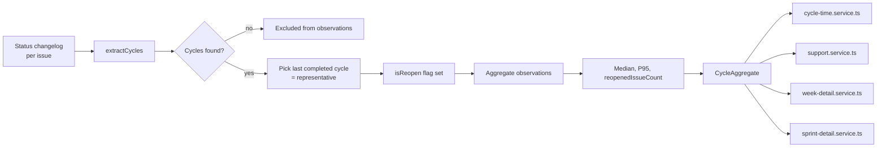

# 0054 — Cycle Time Reopen Handling: Canonical Cycle State Machine

**Date:** 2026-05-06
**Status:** Accepted
**Author:** Architect Agent
**Related ADRs:** ADR 0024 (Weekend Days Excluded from Lead Time / Cycle Time)
**Related Proposals:** [0007](0007-cycle-time-report.md)

---

## Problem Statement

Cycle time across the codebase is calculated by pairing the **first**
transition into an in-progress status with the **last** transition into
a done status (within the analysis window):

- `backend/src/metrics/cycle-time.service.ts` lines 196–210
- `backend/src/support/support.service.ts` lines 333–340

For an issue whose history is
`In Progress → Done → Re-Opened → In Progress → Done`,
this combines the **first** In Progress with the **second (last)** Done,
inflating the reported cycle time by the entire duration of the closed
period plus the second active period.

Additionally:

- `backend/src/week/week-detail.service.ts` lines 399–411 uses
  **first In Progress + first Done** — opposite asymmetry. If first-Done
  predates first-In-Progress (issue went straight to Done then was later
  reopened and worked), the guard returns `null` silently with no
  anomaly counter.
- `backend/src/sprint/sprint-detail.service.ts:507–516` clamps negative
  lead time to `null` with no anomaly visibility.

The behaviour is inconsistent across the three views, and none of the
three is correct for an issue with reopens. Reopen rates vary by team
but a single reopen can shift a board's median cycle time by 2–10×.

There are no calculation reopen tests in any of the three service
specs, so the behaviour was never validated.

Two additional defects discovered during implementation:

1. **Consecutive IP sub-status hops reset the clock.** Because
   `inProgressNames` includes sub-statuses such as `In Review`, `QA`,
   `IN TEST`, `Blocked`, and `PEER REVIEW`, a transition between them
   (e.g. `In Progress → In Review`) was resetting `openStart` to the
   latest transition timestamp. For ACC-1 this produced a reported cycle
   time of 0.2 days instead of the correct ~49 days.

2. **`Done → IP` without an intervening reset opens a spurious new
   cycle.** When an issue transitions directly from `Done` back to
   `In Progress` (no backlog/reset step), the prior `Done` was premature
   — the work continued. The original implementation treated this as a
   clean new cycle start, producing a 0.2-day "cycle" that became the
   representative and masked the real delivery time.

---

## Proposed Solution

Adopt a single canonical cycle definition and apply it everywhere.

### Canonical definition

A **cycle** is the interval from a transition **into an in-progress
status** to the **next** subsequent transition **into a done status**,
subject to the following state machine rules:

1. **IP sub-status hops do not reset the clock.** Transitions between
   statuses all within `inProgressNames` (e.g. `In Progress → In Review
   → QA → IN TEST`) leave `openStart` unchanged. The clock started at
   the first entry into any IP status and runs until Done.

2. **`Done → IP` without an intervening reset = premature close.** If
   the issue transitions directly from Done back into an IP status
   (skipping any reset/backlog status), the prior Done is treated as
   temporary. The original `openStart` is restored and the cycle
   continues to the next Done. This is tracked via a `hadResetSinceDone`
   flag in the state machine.

3. **A genuine reopen requires passing through a reset status.** Only
   when the issue transitions through a `resetNames` status (e.g.
   `To Do`, `Backlog`) between Done and the next IP does a new
   independent cycle begin, with `isReopen: true`.

For an issue with history `IP₁ → Done₁ → Backlog → IP₂ → Done₂`:

- Cycle 1 = `IP₁ → Done₁` (`isReopen: false`)
- Cycle 2 = `IP₂ → Done₂` (`isReopen: true`)
- Representative = Cycle 2 (last completed cycle)

For an issue with history `IP₁ → Done₁ → IP₂ → Done₂` (no reset):

- The intermediate Done₁ is absorbed. One cycle: `IP₁ → Done₂`
- Representative = that single cycle (`isReopen: false`)

The issue's **representative cycle** for aggregation is the **last
completed cycle** — this matches how the issue is characterised by users
("how long did it take, counting any rework?").

For aggregation across many issues, use the representative cycle.
Surface a separate `reopenedIssueCount` so users can see when the
median reflects rework.

### New utility

Add `backend/src/metrics/cycle.ts`:

```typescript
export interface CycleObservation {
  issueKey: string;
  start: Date;        // first entry into any IP status for this cycle
  end: Date;          // matching transition into done
  isReopen: boolean;  // true if a reset status was seen before this cycle
}

export interface IssueCycles {
  issueKey: string;
  cycles: CycleObservation[];       // all cycles, oldest → newest
  representative: CycleObservation; // last completed cycle
  anomalyCount: number;             // dangling open IP at end of changelog
}

export function extractCycles(
  changelogs: JiraChangelog[],
  inProgressNames: Set<string>,
  doneNames: Set<string>,
  resetNames: Set<string>,  // resets the cycle; Done→IP without this = premature close
): IssueCycles | null;
```

All services consume this utility. No service maintains its own
in-progress / done state machine.

### Aggregation contract

For each board:

```typescript
interface CycleAggregate {
  observations: CycleObservation[];   // representative cycles only
  medianDays: number | null;
  p95Days: number | null;
  reopenedIssueCount: number;         // issues whose representative is a reopen
  anomalyCount: number;               // negative cycles or unmatched IP transitions
}
```

The frontend shows `reopenedIssueCount` next to the median:
"Median cycle: 3.2 days (4 issues after rework)".

### Data flow



### Empty-result handling

When `observations.length === 0`, return `medianDays: null` and band:
`null` (not `classifyCycleTime(0) = 'elite'`). Frontend renders "No data".
This addresses the related defect of "no data → elite band" surfaced in
the audit.

---

## Alternatives Considered

### Alternative A — Use the first cycle (IP₁ → Done₁) as representative

Treats the first-completion as canonical; reopens are excluded from the
median.

Ruled out because:
- The first cycle is by definition the *fastest* — the team got to Done
  but it didn't stick. Median based on first cycle paints an
  unrealistically rosy picture.
- Hides rework cost entirely.

### Alternative B — Sum all cycles per issue (total active time)

Treats the issue's cycle time as the sum of all in-progress intervals.

Ruled out because:
- Definitions of "cycle time" in the DORA literature refer to a single
  interval, not cumulative active time.
- Conflates two distinct signals (initial cycle, rework cost) into one
  number that's hard to act on.

### Alternative C — Keep current per-service behaviour, document it

Status quo with documentation.

Ruled out because:
- Three views report three different numbers for the same issue.
- The first-IP + last-Done pairing is mathematically wrong by any
  definition of "cycle".

### Alternative D — Treat Done→IP as a new cycle (initial implementation)

Implemented initially: `Done → IP` without an intervening reset opened
a new independent cycle, making the short reopen cycle the representative.

Ruled out after real-data validation (ACC-1): a 6-hour hotfix reopen
on Apr 14 produced a representative of 0.2 days, completely masking the
original 49-day delivery. The user intent is "a Done which isn't final
is just another IP status" — the full elapsed time from first IP to
final Done is the single cycle time.

### Alternative E (adopted) — `hadResetSinceDone` flag; absorb premature Done

A `hadResetSinceDone` boolean in the state machine distinguishes:
- `Done → Reset → IP`: genuine reopen → new cycle, `isReopen: true`
- `Done → IP` (no reset): premature close → pop the prior cycle and
  restore its `openStart`, continuing to the next Done as one cycle

Combined with the fix that consecutive IP sub-status hops do not reset
`openStart`, this produces semantically correct cycle times for issues
with complex in-flight status flows.

---

## Impact Assessment

| Area | Impact | Notes |
|---|---|---|
| Database | None | All cycles reconstructed from existing changelog |
| API contract | Additive | `reopenedIssueCount` added to cycle responses |
| Frontend | Minor | Cycle time card shows reopened count; "No data" state replaces misleading "elite" |
| Tests | Significant | New `cycle.spec.ts` covering reopen scenarios; existing cycle-time tests need fixtures with reopens |
| External API | None | |
| Infrastructure | None | |
| Observability | New log field | Log `reopenedIssueCount` per board per period; informs whether reopens are a widespread issue |
| Security / Compliance | None | |

## Resolved Decisions

- **Reset status set:** the existing `BoardConfig.boardEntryStatuses`
  field is reused as the cycle-reset set. For boards where it is `null`
  (Scrum default), fall back to the hardcoded list
  `['To Do', 'Backlog', 'Open', 'Reopened']`. No schema change. The
  helper accepts the resolved set as a parameter; resolution lives in
  each calling service so the helper stays pure.
- **Aggregation exposes representative cycle only.** All-cycles surface
  is out of scope and reserved for a future "rework" view.
- **Scope:** all four services
  (`cycle-time.service.ts`, `support.service.ts`,
  `week-detail.service.ts`, `sprint-detail.service.ts`) route through
  the shared helper. `sprint-detail.service.ts` currently computes a
  `leadTimeDays` field with `createdAt → first-Done` semantics; this is
  preserved as `leadTimeDays`, and a separate `cycleTimeDays` is added
  via the helper so sprint detail surfaces both — readers can compare
  end-to-end lead time against pure in-flight cycle time. No existing
  field is removed or repurposed.

## Acceptance Criteria

- `backend/src/metrics/cycle.ts` exports `extractCycles` and
  `CycleObservation`. Pure function with no DB or external dependencies.
- `cycle-time.service.ts`, `support.service.ts`,
  `week-detail.service.ts`, and `sprint-detail.service.ts` all consume
  `extractCycles` — none implement their own cycle pairing.
- A unit test in `cycle.spec.ts` constructs an issue with history
  `IP₁ → Done₁ → Backlog → IP₂ → Done₂`, asserts `cycles.length === 2`
  and `representative === cycles[1]` (genuine reopen via reset).
- A unit test in `cycle.spec.ts` constructs an issue with history
  `Done → IP → Done` (Done first), asserts the lone valid cycle is
  returned and `anomalyCount === 0` (the leading Done is ignored).
- A unit test in `cycle.spec.ts` asserts that consecutive IP sub-status
  hops (e.g. `In Progress → In Review → QA → Done`) do not reset
  `openStart` — the cycle start is the first IP entry, not the last.
- A unit test in `cycle.spec.ts` asserts that `Done → IP` without an
  intervening reset is treated as a premature close: `cycles.length === 1`
  spanning original start → final Done (ACC-1 regression test).
- `cycle-time.service.ts` returns `band: null` and `medianDays: null`
  when `observations.length === 0`.
- An integration test asserts that the same board returns the same
  cycle-time number across the cycle-time, sprint-detail, week-detail,
  and support views.
- ADR 0056 (to be created on acceptance) records the canonical cycle
  definition, the `hadResetSinceDone` mechanism, and the reuse of
  `boardEntryStatuses` as the cycle-reset set.
