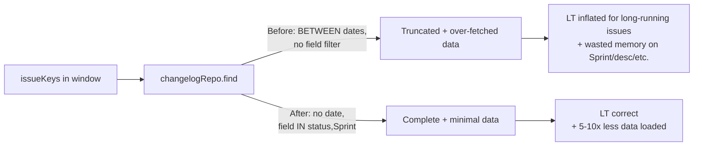

# 0055 — Third Audit: Clear Bug Fix Batch

**Date:** 2026-05-06
**Status:** Draft
**Author:** Architect Agent
**Related ADRs:** ADR 0006, ADR 0049
**Related Proposals:** [0017](0017-metric-calculation-audit.md),
[0018](0018-metric-calculation-fixes.md),
[0030](0030-metrics-correctness-second-audit-fixes.md),
[0048](0048-sprint-membership-service.md)

---

## Problem Statement

A May 2026 metrics audit (third in the series after 0017 and 0030)
identified **eight clear bugs** with no design ambiguity — they are
incorrect by every reasonable interpretation of the spec, ADRs, or
the existing code's documented intent. Each is small in isolation;
together they materially affect lead time, trend accuracy, and
sprint-detail consistency.

Six further audit findings require design decisions and are addressed
in proposals 0049–0054 in parallel. **This proposal covers only the
clear bugs**, batched for a single coordinated fix to keep the change
log readable.

---

## Proposed Solution

Eight fixes grouped into four themes. Each fix is independent and can
be reviewed individually inside the same PR.

### Theme A — ISO week / date utilities

#### Fix A-1 — ISO Sunday year-boundary bug

**Files:** `backend/src/roadmap/roadmap.service.ts:517`,
`backend/src/planning/planning.service.ts:790`

**Bug:** `daysToThursday = dow === 0 ? 4 : 4 - dow`

For Sunday (`dow = 0`), this walks **forward** 4 days to Thursday of
the **next** ISO week. ISO 8601 defines weeks as Monday–Sunday, so
Sunday belongs to the **prior** ISO week. The correct value is `-3`
(walk back to the Thursday of the same week).

The bug only manifests at year boundaries — when a Sunday falls on
Dec 28–31 — but on those Sundays, `isoYear` is computed as the
following calendar year, putting the day in week 1 of next year
instead of week 52/53 of this year. Roadmap and planning week-key
buckets straddle the year boundary incorrectly.

**Fix:** extract to `backend/src/lib/iso-week.ts`:

```typescript
export function dateToIsoWeekKey(d: Date): string {
  const dow = d.getUTCDay();
  const daysToThursday = dow === 0 ? -3 : 4 - dow;
  const thursday = new Date(d);
  thursday.setUTCDate(d.getUTCDate() + daysToThursday);
  // ... rest unchanged
}
```

Both call sites import this single function.

#### Fix A-2 — Dead code: `daysToMonday` in roadmap

**File:** `backend/src/roadmap/roadmap.service.ts:526`

`daysToMonday` is computed but never read. Remove.

### Theme B — Trend / changelog window correctness

#### Fix B-1 — Trend data loader truncates changelogs

**File:** `backend/src/metrics/trend-data-loader.service.ts:130–131`

`changelogRepo.find` filters
`changedAt BETWEEN rangeStart AND rangeEnd`. For long-running issues
whose first `In Progress` transition predates `rangeStart`, the
loader returns no relevant transition and downstream lead-time
calculation falls back to `createdAt → done`, inflating LT
arbitrarily.

The class-level comment (lines 23–26) explicitly states the loader's
purpose is to avoid this for issues — the same logic must apply to
their changelogs.

**Fix:** load **all** status changelogs for the in-window issue set,
unbounded by date:

```typescript
const changelogs = await this.changelogRepo.find({
  where: {
    issueKey: In([...issueKeys]),
    field: In(['status']),  // ← also fixes the over-fetch in B-2
  },
});
```

Then filter in-process if a date constraint is needed for a specific
calculation (lead time wants all-time; cycle time may want windowed).

#### Fix B-2 — Changelog over-fetch (no field filter)

**Files:** `backend/src/quarter/quarter-detail.service.ts:184–188`,
`backend/src/week/week-detail.service.ts:200–204`

`changelogRepo.find({ where: { issueKey: In(keys) } })` with no
`field` filter loads every changelog (Sprint, status, assignee,
summary, description, …). On chatty boards this is 5–10× the rows
needed.

**Fix:** add `field: In(['status', 'Sprint'])` per call site's needs.

### Theme C — ADR enforcement

#### Fix C-1 — `sprint-detail.service.ts` hardcoded `'In Progress'`

**File:** `backend/src/sprint/sprint-detail.service.ts:452–454`

Lead-time start is hardcoded to `cl.toValue === 'In Progress'`,
ignoring `boardConfig.inProgressStatusNames`. Boards using "In
Development", "Peer Review", "QA" etc. silently fall back to
`createdAt`, inflating LT.

**Fix:** read `inProgressStatusNames` from `BoardConfig`; match using
`Set.has` in case-insensitive form. Mirrors the existing pattern in
`lead-time.service.ts` and `cycle-time.service.ts`.

#### Fix C-2 — `quarter-detail` reimplements Sprint changelog scan

**File:** `backend/src/quarter/quarter-detail.service.ts:222–225`

Inline reimplementation of Sprint changelog scan instead of using
`SprintMembershipService.reconstructMany`. Direct violation of
ADR 0049's "single source of truth" mandate. Will diverge from
PlanningService whenever membership semantics evolve.

**Fix:** inject `SprintMembershipService` and call `reconstructMany`
exactly as `planning.service.ts` does.

### Theme D — Code defects

#### Fix D-1 — Recommendation `&&` / `||` precedence bug

**File:** `backend/src/sprint-report/recommendation.service.ts:346`

```typescript
template.includes('delivered only') ||
  template.includes('Delivery rate') ||
  template.includes('delivery rate') && template.includes('%')
```

`&&` binds tighter than `||`, so this evaluates as `A || B || (C && D)`.
Almost certainly intended `(A || B || C) && D`. Add parentheses.

(Note: a deeper redesign of `interpolate()` is in proposal 0051;
this fix is the minimal correction to make the existing logic match
its evident intent until the redesign lands.)

#### Fix D-2 — Planning closed-sprint completion check missing lower bound

**File:** `backend/src/planning/planning.service.ts:208–214`

Closed-sprint completion check `cl.changedAt <= sprint.endDate` has
no lower bound. A carry-over issue that already had a Done transition
**before** the sprint started is credited as "completed in this
sprint".

**Fix:** also require `cl.changedAt >= sprint.startDate` (apply the
existing `SPRINT_GRACE_PERIOD_MS` symmetrically, matching the
membership service).

#### Fix D-3 — Default `cancelled = ['Cancelled']` inconsistency

**File:** `backend/src/gaps/gaps.service.ts:131`

Every other service defaults `cancelled` to
`['Cancelled', "Won't Do"]`. Gaps uses `['Cancelled']` only.

**Fix:** harmonise to `['Cancelled', "Won't Do"]`.

#### Fix D-4 — Stale `eslint-disable` and dead injection

**Files:** `backend/src/support/support.service.ts:482`,
`backend/src/gaps/gaps.service.ts:10`

- `support.service.ts:482` has a stale
  `// eslint-disable-next-line no-console` with no `console` call
  beneath. Remove.
- `gaps.service.ts:10` imports `JiraChangelog` and constructor
  injects `changelogRepo` but neither is used. Remove the import
  and the constructor parameter.

### Data flow — fixes B-1 and B-2



---

## Alternatives Considered

### Alternative A — One PR per fix

Eight tiny PRs reviewed independently.

Ruled out because:
- Six fixes share the same test files (`planning`, `cycle-time`,
  `roadmap`); review thrash on those files would exceed the savings.
- The audit itself (0055) is the unit of context.

### Alternative B — Bundle with proposals 0049–0054

Single mega-proposal.

Ruled out because:
- The other six proposals contain design ambiguity that needs review;
  blocking clear bug fixes on those debates would prolong incorrect-data
  exposure unnecessarily.

### Alternative C (recommended) — Single proposal, single PR, per-fix commits

See Proposed Solution. Each fix lands as its own commit inside one PR
so the diff is small per file and reviewable per-theme.

---

## Impact Assessment

| Area | Impact | Notes |
|---|---|---|
| Database | None | All fixes are pure compute / query changes |
| API contract | None | All response shapes unchanged |
| Frontend | None | Numbers may shift slightly for affected boards |
| Tests | Moderate | Each fix needs a regression test; estimate ~12 new test cases |
| External API | None | |
| Infrastructure | None | |
| Observability | None | |
| Security / Compliance | None | |

## Open Questions

None — every fix in this proposal is a clear bug with one obvious
correct behaviour.

## Acceptance Criteria

- **A-1**: `backend/src/lib/iso-week.ts` exists with a unit test that
  asserts Sunday Dec 31 2023 (a real Sunday at year boundary) maps to
  ISO week `2023-W52`, not `2024-W01`. Both `roadmap.service.ts` and
  `planning.service.ts` import the shared utility; no inline
  `dateToWeekKey` remains in either file.
- **A-2**: `daysToMonday` removed from `roadmap.service.ts:526`.
- **B-1**: `trend-data-loader.service.ts` loads status changelogs
  unbounded by `changedAt`. A regression test asserts that for an
  issue created 365 days before `rangeStart` whose first In Progress
  transition was 360 days before `rangeStart`, lead time uses the
  correct In-Progress timestamp (not `createdAt`).
- **B-2**: Both `quarter-detail.service.ts` and
  `week-detail.service.ts` add `field: In(['status', 'Sprint'])`
  filters. A test asserts the query is constructed with the field
  filter (use Jest spy on `find`).
- **C-1**: `sprint-detail.service.ts` no longer references the literal
  `'In Progress'`. A regression test with a board configured for
  `inProgressStatusNames: ['In Development']` asserts lead time uses
  the In Development transition.
- **C-2**: `quarter-detail.service.ts` injects
  `SprintMembershipService` and uses `reconstructMany`. The inline
  Sprint changelog scan at lines 222–225 is removed.
- **D-1**: `recommendation.service.ts:346` parenthesised correctly.
  A test asserts the predicate is true for
  `template = 'delivery rate 80%'` and false for
  `template = 'roadmap coverage 80%'`.
- **D-2**: `planning.service.ts` requires
  `cl.changedAt >= sprint.startDate − GRACE` for closed-sprint
  completion. A regression test asserts a carry-over issue with a
  Done transition the day before sprint start is **not** counted as
  completed in this sprint.
- **D-3**: `gaps.service.ts` defaults `cancelled` to
  `['Cancelled', "Won't Do"]`. A test asserts the default value.
- **D-4**: stale eslint-disable comment removed from
  `support.service.ts:482`. `JiraChangelog` import and
  `changelogRepo` constructor injection removed from
  `gaps.service.ts`.
