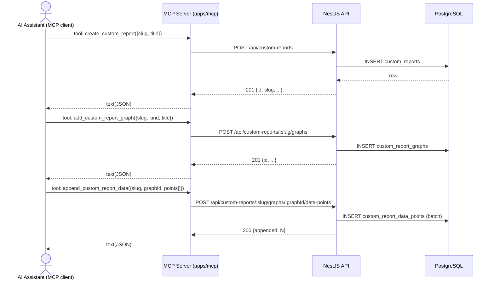
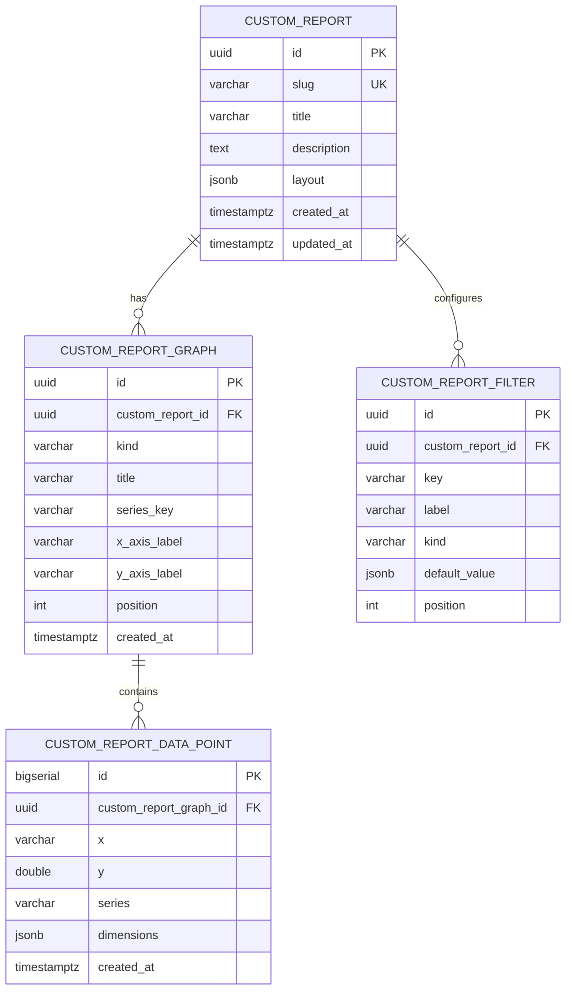

# 0056 — Custom Reports

**Date:** 2026-05-08
**Status:** Accepted
**Author:** Architect Agent
**Related ADRs:** [0057](../decisions/0057-custom-reports.md)

## Problem Statement

The dashboard today only surfaces a fixed set of opinionated reports (DORA, planning,
roadmap, sprint, week, quarter, gaps, cycle-time, support). Engineers and AI assistants
(via the MCP server) regularly want to push ad-hoc series into a chart and have it
appear in the dashboard, without going through a full feature cycle (proposal → entity →
controller → page) for every one-off question. There is no generic "drop data here, render
a chart" primitive. We need a small, well-bounded primitive — *Custom Reports* — that
exposes CRUD over reports, graphs, data points and filter definitions through both the
REST API and the MCP server, while keeping styling, navigation and the layout shell
identical to the existing first-class reports. See `docs/features/0008-custom-reports.md`.

## Proposed Solution

### Domain model

Three new entities under a new `custom-reports` NestJS module. Hierarchy:

```
CustomReport (1) ──< CustomReportGraph (1) ──< CustomReportDataPoint
                  └─< CustomReportFilter (filter *definitions*, not values)
```

- **`CustomReport`** — top-level container. Has a unique URL-safe `slug`, a `title`,
  optional `description`, and optional `layout` config (e.g. column count). Cascade
  deletes everything underneath.
- **`CustomReportGraph`** — one chart on a report. Has `kind` (`line` | `bar` | `area`),
  `title`, `xAxis` / `yAxis` labels, `seriesKey` (field name in the data point used to
  split into series — e.g. `boardId`), and a `position` integer for stable ordering.
- **`CustomReportDataPoint`** — a single point. Stores `x` (string — ISO date or
  bucket label), `y` (numeric), optional `series` (string), and an open
  `dimensions` JSONB map for filtering (e.g. `{ "team": "ACC", "env": "prod" }`).
- **`CustomReportFilter`** — declares a filter the UI should render. Has `key` (matches
  a key in `dimensions`), `label`, `kind` (`select` | `multiselect`), and optional
  `defaultValue`. Filters are applied **client-side** in the UI by matching against
  each data point's `dimensions` map.

Filters are intentionally **declarative metadata** — the backend does not evaluate them
in queries. This keeps the API trivial and avoids building a query DSL; the trade-off
(see Alternatives) is that the entire data set is shipped to the browser, which is
acceptable given the expected volume (hundreds-to-low-thousands of points per graph).

### Module layout (backend)

```
backend/src/custom-reports/
├── custom-reports.module.ts
├── custom-reports.controller.ts          # /api/custom-reports*
├── custom-reports.service.ts             # all business logic
├── custom-reports.service.spec.ts
├── dto/
│   ├── create-custom-report.dto.ts
│   ├── update-custom-report.dto.ts
│   ├── create-graph.dto.ts
│   ├── update-graph.dto.ts
│   ├── create-filter.dto.ts
│   ├── append-data-points.dto.ts
│   └── replace-data-points.dto.ts
backend/src/database/entities/
├── custom-report.entity.ts
├── custom-report-graph.entity.ts
├── custom-report-data-point.entity.ts
└── custom-report-filter.entity.ts
backend/src/migrations/
└── NNNNNNNNNNNNNN-CustomReports.ts
```

`CustomReportsModule` exports `TypeOrmModule.forFeature([...])` and registers the
controller + service. It is imported into `AppModule` alongside the other domain
modules. No cross-module dependencies.

### REST API contract

All paths under `/api/custom-reports`. Conforms to existing project conventions
(thin controller, DTO validation via global `ValidationPipe`).

| Method | Path | Purpose |
|---|---|---|
| `GET`    | `/api/custom-reports` | List all reports (no nested data) |
| `POST`   | `/api/custom-reports` | Create report — body: `{ slug, title, description?, layout? }` |
| `GET`    | `/api/custom-reports/:slug` | Get report with graphs, filters, and data points (full payload) |
| `PATCH`  | `/api/custom-reports/:slug` | Update title / description / layout |
| `DELETE` | `/api/custom-reports/:slug` | Delete report and cascade |
| `POST`   | `/api/custom-reports/:slug/graphs` | Add a graph to the report |
| `PATCH`  | `/api/custom-reports/:slug/graphs/:graphId` | Update graph metadata |
| `DELETE` | `/api/custom-reports/:slug/graphs/:graphId` | Remove a graph (cascade points) |
| `POST`   | `/api/custom-reports/:slug/graphs/:graphId/data-points` | **Append** points (additive) |
| `PUT`    | `/api/custom-reports/:slug/graphs/:graphId/data-points` | **Replace** the entire series |
| `DELETE` | `/api/custom-reports/:slug/graphs/:graphId/data-points` | Clear all points for a graph |
| `POST`   | `/api/custom-reports/:slug/filters` | Add a filter definition |
| `DELETE` | `/api/custom-reports/:slug/filters/:filterId` | Remove a filter |

Limits, hard-coded in DTO validation:
- Slug: 1–80 chars, `^[a-z0-9-]+$`.
- Append batch: max **1000 data points per request**; reject `413 Payload Too Large`
  beyond that.
- Description: max 4000 chars. Title: max 200 chars.

Error model: standard NestJS HTTP exceptions (`NotFoundException`, `ConflictException`
on duplicate slug, `BadRequestException` from validation pipe). Consistent with the
rest of the codebase (`boards`, `roadmap`).

### Sequence — appending data via MCP



### MCP server (apps/mcp)

Add a new tool module `apps/mcp/src/tools/custom-reports.ts` registering the following
tools. Tools delegate to the HTTP API — **no business logic in the MCP layer**
(consistent with all existing tool modules).

| MCP tool | HTTP call |
|---|---|
| `list_custom_reports` | `GET /api/custom-reports` |
| `get_custom_report` | `GET /api/custom-reports/:slug` |
| `create_custom_report` | `POST /api/custom-reports` |
| `update_custom_report` | `PATCH /api/custom-reports/:slug` |
| `delete_custom_report` | `DELETE /api/custom-reports/:slug` |
| `add_custom_report_graph` | `POST /api/custom-reports/:slug/graphs` |
| `update_custom_report_graph` | `PATCH /api/custom-reports/:slug/graphs/:graphId` |
| `delete_custom_report_graph` | `DELETE /api/custom-reports/:slug/graphs/:graphId` |
| `append_custom_report_data` | `POST /api/custom-reports/:slug/graphs/:graphId/data-points` |
| `replace_custom_report_data` | `PUT  /api/custom-reports/:slug/graphs/:graphId/data-points` |
| `clear_custom_report_data` | `DELETE /api/custom-reports/:slug/graphs/:graphId/data-points` |
| `add_custom_report_filter` | `POST /api/custom-reports/:slug/filters` |
| `delete_custom_report_filter` | `DELETE /api/custom-reports/:slug/filters/:filterId` |

The MCP HTTP client (`apps/mcp/src/client.ts`) currently exposes only `apiGet`. As part
of this work it will be extended with `apiPost`, `apiPatch`, `apiPut`, and `apiDelete`,
each following the existing error-handling pattern (translate non-2xx responses to
`McpError`). Tools are registered from `apps/mcp/src/server.ts` next to existing
registrations.

### Frontend

Two new App Router routes plus shared components. All API calls go through a new typed
section of `frontend/src/lib/api.ts` (`customReportsApi`). Recharts is already a
dependency — reused for line/bar/area.

```
frontend/src/app/reports/
├── page.tsx                      # index list
└── [slug]/
    └── page.tsx                  # render a single report
frontend/src/components/custom-reports/
├── CustomReportView.tsx          # composes filters + graphs
├── CustomReportFilters.tsx       # renders configured filters
├── CustomReportGraph.tsx         # dispatches on graph.kind
└── graphs/
    ├── LineGraph.tsx
    ├── BarGraph.tsx
    └── AreaGraph.tsx
frontend/src/store/
└── customReportFilters.ts        # Zustand store keyed by reportId
frontend/src/lib/
├── api.ts                        # add customReportsApi namespace
└── custom-report-filtering.ts    # pure fn: applyFilters(points, filterValues)
```

Filter state lives in Zustand (per-report keyed map). Filtering itself is a pure
function over `dimensions` — testable in isolation. Layout uses the existing
Tailwind v4 design language (cards, headers identical to e.g. `/dora`).

The existing top nav (`frontend/src/components/layout/`) gains a "Reports" entry.
The reports index lists all reports and links to `/reports/[slug]`.

### ER diagram



### Indexes

- `custom_reports (slug)` UNIQUE — slug lookup is the primary access path.
- `custom_report_graphs (custom_report_id, position)` — ordered fetch per report.
- `custom_report_data_points (custom_report_graph_id, id)` — bulk fetch per graph in
  insertion order; `BIGSERIAL` PK gives natural append order without a separate timestamp
  index.
- `custom_report_filters (custom_report_id, position)`.

### Migration strategy

Single TypeORM migration creating all four tables and indexes. Implements both
`up()` and `down()` per project rule. UUIDs generated via `gen_random_uuid()`
(Postgres `pgcrypto`/`gen_random_uuid` is built into Postgres 13+).

### Failure & limits

- Append batches > 1000 points → `413`.
- Duplicate slug → `409`.
- Unknown slug or graph id → `404`.
- Validation failures → `400` (existing global pipe).
- No advisory locks needed — writes are short-lived per-row inserts; concurrent
  appends are safe (different rows).

### Observability

- Use existing NestJS `Logger` (`new Logger(CustomReportsService.name)`) — log on
  create / delete / replace at `log` level; on append, log at `debug` only with the
  count (avoid log volume from MCP-driven bulk pushes).
- No new metrics or alerts required at v1.

### Data classification

`CustomReport*` entities are classified **internal** — same class as every other
entity in the system. Custom reports may carry arbitrary user-supplied numeric data
plus arbitrary `dimensions` strings; we do not constrain what is pushed in but we
treat the contents as internal-only and restrict access via the existing CloudFront
WAF IP allowlist (ADR 0034).

This **does** introduce a (very small) new attack surface: an internal user could
push arbitrary text into the database via these endpoints. Title/description
fields are bounded; `dimensions` keys/values are bounded to 200 chars each in DTO
validation. No HTML is interpreted on the frontend (Recharts + plain text), and we
will use React's default text escaping, so XSS risk is contained. No PII concern
because the system is internal-only and there is no existing PII in the database.

## Alternatives Considered

### Alternative A — Server-side filter evaluation with a query DSL
Build a small filter DSL parsed by the backend that evaluates filters in SQL when
returning data points. Rejected for v1: high implementation cost, requires a
non-trivial query builder, increases the surface area for SQL injection bugs and
adds latency for what is currently a small data set. Client-side filtering on the
returned `dimensions` map is simpler, easier to test, and the data volumes do
not justify the complexity. Easy to revisit once a single graph regularly exceeds
~5–10k points.

### Alternative B — One JSON blob per report (no separate tables)
Store the entire report (graphs + points + filters) as one JSONB column on a single
`custom_reports` table. Rejected: append operations would require read-modify-write
of the whole blob, creating a write-amplification problem and a real concurrency
hazard (two appends racing would clobber each other). Separate tables let appends
be true `INSERT`s.

### Alternative C — Reuse `BoardConfig`-style YAML config files
Keep custom report definitions in YAML config files baked into the Docker image.
Rejected: YAML config is gitignored and baked at build time, which defeats the
"create via API/MCP at runtime" requirement.

### Alternative D — Push points as a CSV/text upload
Accept a CSV body for bulk uploads. Rejected for v1 on simplicity grounds — JSON
arrays of `{ x, y, series, dimensions }` are sufficient and consistent with every
other endpoint in the codebase. CSV can be added later if a real ingest path needs it.

## Impact Assessment

| Area | Impact | Notes |
|---|---|---|
| Database | New entities + migration | 4 new tables, all in primary RDS; cascade deletes via FK |
| API contract | Additive | Brand-new namespace `/api/custom-reports/*` — no changes to existing routes |
| Frontend | New pages + components | `/reports`, `/reports/[slug]`, nav entry, ~3 graph components, 1 store |
| Tests | New unit + integration tests | service unit tests, controller integration tests, frontend component tests, store + filter pure-function tests, MCP tool tests |
| External API | No new external calls | No Jira / AWS interaction in this feature |
| Infrastructure | None | No new cloud resources, no IAM changes, no network changes — uses existing RDS schema and ECS Fargate task |
| Observability | Minor | New log lines in `CustomReportsService`; no new metrics or alerts |
| Security / Compliance | Small new surface | New write endpoints; no app-layer auth (ADR 0020 — protected by WAF allowlist). DTO validation bounds all input lengths; React escapes all rendered text; no SQL string interpolation (TypeORM repositories only). No PII. |

## Open Questions

- Should `slug` be user-supplied or server-generated from `title` if omitted?
  *Recommendation:* user-supplied (explicit, predictable URLs); reject conflicts
  with `409`.
- Should we cap total data points per graph (e.g. 100k) to prevent unbounded growth?
  *Recommendation:* yes — soft cap of 100k per graph enforced on append; return `409`
  with a clear message when exceeded. Cheap to enforce with `COUNT(*)` per append; can
  be relaxed later.
- Should the GET-by-slug response paginate data points? *Recommendation:* no at v1 —
  caps above keep the payload bounded; revisit if real workloads exceed them.

## Acceptance Criteria

1. `POST /api/custom-reports` with `{ slug: "demo", title: "Demo" }` returns `201` and
   a JSON body containing `id`, `slug`, `title`, `createdAt`, `updatedAt`. A second
   request with the same slug returns `409`.
2. `POST /api/custom-reports/:slug/graphs` with a valid body persists the graph and
   returns `201` with the graph's `id`, and the graph appears in
   `GET /api/custom-reports/:slug`.
3. `POST /api/custom-reports/:slug/graphs/:graphId/data-points` with `[{x,y,series?,dimensions?}, ...]`
   inserts every point and returns `{ appended: N }`. A subsequent identical call doubles
   the point count for that graph (proves additive behaviour, AC parity with feature doc).
4. `POST .../data-points` with > 1000 items returns `413`.
5. `PUT .../data-points` replaces all existing points for the graph.
6. `DELETE /api/custom-reports/:slug` returns `204` and a subsequent `GET` returns `404`;
   no orphaned graphs, points, or filters remain in the DB (verified by repository
   counts in test).
7. The frontend `/reports/[slug]` route fetches the report via `customReportsApi.get(slug)`
   and renders one chart per configured graph using the appropriate Recharts component.
8. Configured filters render in the UI; changing a filter value updates the rendered
   data without a network call (pure-function `applyFilters` covered by unit tests).
9. The MCP server registers all 13 tools from the table above; each delegates to the
   corresponding HTTP endpoint via the (extended) `apps/mcp/src/client.ts` helpers and
   returns the raw JSON to the assistant.
10. A TypeORM migration creates all four tables with the indexes listed; `down()`
    drops them cleanly. `npm run migration:run` (and revert) succeeds locally against
    the Docker Compose Postgres.
11. All new code passes the existing lint / type-check / test gates; backend unit
    test coverage of `CustomReportsService` covers create, append, replace, cascade
    delete, slug uniqueness, batch-size limit, and per-graph cap.
