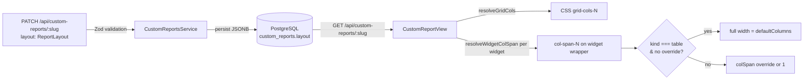

# 0058 — Custom Report Layout Configuration

**Date:** 2026-05-08
**Status:** Accepted
**Author:** Architect Agent
**Related ADRs:** docs/decisions/0059-custom-report-layout-schema.md

## Problem Statement

The `layout` field on `CustomReport` is an opaque `Record<string, unknown> | null` JSONB
column that is persisted by the backend but completely ignored by the frontend. The current
`CustomReportView` hardcodes a `lg:grid-cols-2` two-column Tailwind grid with no mechanism
for report authors to control column counts or widget widths. Table widgets — which render
dense tabular data — benefit strongly from full-width rendering but are constrained to the
same half-width slot as charts and stats. Additionally, the free-text comma-separated input
used for `multiselect` filters without known options blocks the comma character, making it
impossible to enter multiple values via that path.

## Proposed Solution

### Schema

Define a typed `ReportLayout` interface, validated on the backend with Zod and mirrored as
a TypeScript interface on the frontend:

```typescript
interface WidgetLayoutOverride {
  colSpan?: number   // 1–defaultColumns; how many columns this widget spans
}

interface ReportLayout {
  defaultColumns?: number                           // 1–6; default 2
  widgets?: Record<string, WidgetLayoutOverride>   // keyed by widget UUID
}
```

No database migration is required — `layout` is already a nullable JSONB column on
`custom_reports`.

### Backend changes

1. **`layout-schema.ts`** (new file in `backend/src/custom-reports/`) — exports the Zod
   schema for `ReportLayout`. Used by the DTO validator.
2. **`create-custom-report.dto.ts` / `update-custom-report.dto.ts`** — replace the opaque
   `layout?: Record<string, unknown>` with a `@IsOptional() @ValidateNested()` field backed
   by a `ReportLayoutDto` class validated by the Zod schema via a custom decorator, or
   alternatively use a `@Transform` + zod `.parse()` approach. Given the project already
   uses Zod elsewhere, use a custom `@IsValidLayout()` class-validator decorator that
   delegates to the Zod schema, keeping the global `ValidationPipe` contract intact.
3. No service changes — the service already persists and returns `layout` as-is.

### Frontend changes

1. **`frontend/src/lib/report-layout.ts`** (new file) — exports:
   - `ReportLayout`, `WidgetLayoutOverride` interfaces
   - `resolveWidgetColSpan(widget, layout): number` — pure function; returns `colSpan`
     for a given widget, applying table full-width default and per-widget override logic
   - `resolveGridCols(layout): number` — returns `defaultColumns ?? 2`
2. **`CustomReportView.tsx`** — reads `report.layout`, calls `resolveGridCols` to set the
   CSS grid column count dynamically, calls `resolveWidgetColSpan` per widget to set
   `col-span-N` on each widget wrapper.
3. **`CustomReportFilters.tsx`** — fix the comma-separated multiselect free-text input:
   remove any `onChange` handler that strips or blocks commas; parse comma-separated values
   on `onBlur` and `onChange`, trimming whitespace, updating the Zustand store with a
   `string[]` rather than a raw string.
4. **`frontend/src/lib/api.ts`** — add `ReportLayout` and `WidgetLayoutOverride` types;
   update `CreateCustomReportBody` and the inline `layout` typing on `CustomReport`.

### Data flow



### Widget colSpan resolution logic

```mermaid
flowchart TD
    Start([resolveWidgetColSpan]) --> HasOverride{layout.widgets\n[widget.id].colSpan?}
    HasOverride -->|yes| UseOverride[return override value\nclamped to 1–cols]
    HasOverride -->|no| IsTable{widget.kind\n=== table?}
    IsTable -->|yes| FullWidth[return defaultColumns\n= full row]
    IsTable -->|no| Default[return 1]
```

## Alternatives Considered

### Alternative A — Explicit row/column grid placement (gridRow + gridCol)
Allow report authors to specify both `gridRow` and `gridColumn` start/end positions per
widget. This gives maximum precision but requires understanding CSS grid internals and
makes ordering/insertion fragile. Ruled out as over-engineered for the current use case;
`colSpan` covers the stated requirements with far less complexity.

### Alternative B — Named layout presets (e.g. `"two-column"`, `"dashboard"`)
A string enum of fixed layout templates rather than a numeric `defaultColumns`. Simpler
API but inflexible — a preset for 3 columns with one full-width stat header cannot be
expressed. Ruled out in favour of the numeric + per-widget override approach.

### Alternative C — Move layout into widget-level fields
Store `colSpan` directly on `CustomReportWidget.layout` or as a first-class column rather
than nesting it under the report-level `layout.widgets` map. Requires a migration and
couples layout to the widget entity. Ruled out — the existing `layout` field on the report
is the correct home and avoids a migration.

## Impact Assessment

| Area | Impact | Notes |
|---|---|---|
| Database | None | `layout` column already exists as JSONB; no migration needed |
| API contract | Additive | `layout` accepted previously but unvalidated; now validates shape (400 on bad input is new but correct) |
| Frontend | Component change | `CustomReportView`, `CustomReportFilters`, `api.ts` |
| Tests | New unit tests | `report-layout.ts` pure functions; updated `CustomReportView` test; updated filter input test |
| External API | None | No Jira or AWS API changes |
| Infrastructure | None | No infra changes |
| Observability | None | No new log fields |
| Security / Compliance | None | Internal data only; no new attack surface |

## Open Questions

None.

## Acceptance Criteria

- Given `PATCH /api/custom-reports/:slug` with `layout: { defaultColumns: "three" }`, then the response is HTTP 400 with a validation error.
- Given `PATCH /api/custom-reports/:slug` with `layout: { defaultColumns: 3 }`, then the response is HTTP 200 and `GET` returns `layout.defaultColumns === 3`.
- Given `layout: { defaultColumns: 3 }` on a report, when `CustomReportView` renders, then the grid container has `grid-cols-3` applied.
- Given a `table` widget with no `layout.widgets[id]` override, when rendered in a 3-column grid, then the widget wrapper has `col-span-3`.
- Given a `table` widget with `layout.widgets[id].colSpan = 2` in a 3-column grid, then the widget wrapper has `col-span-2` (override wins).
- Given a non-table widget with no override, when rendered in a 3-column grid, then the widget wrapper has `col-span-1`.
- Given `layout: null`, when `CustomReportView` renders, then the grid renders with 2 columns (existing default preserved).
- Given the multiselect free-text input, when the user types `"foo,bar"`, then the comma character is accepted in the input field.
- Given the multiselect free-text input contains `"foo, bar, baz"` and the user blurs, then the Zustand store receives `["foo", "bar", "baz"]` (trimmed, split on comma).
- `resolveWidgetColSpan` and `resolveGridCols` are covered by unit tests with 100% branch coverage.
