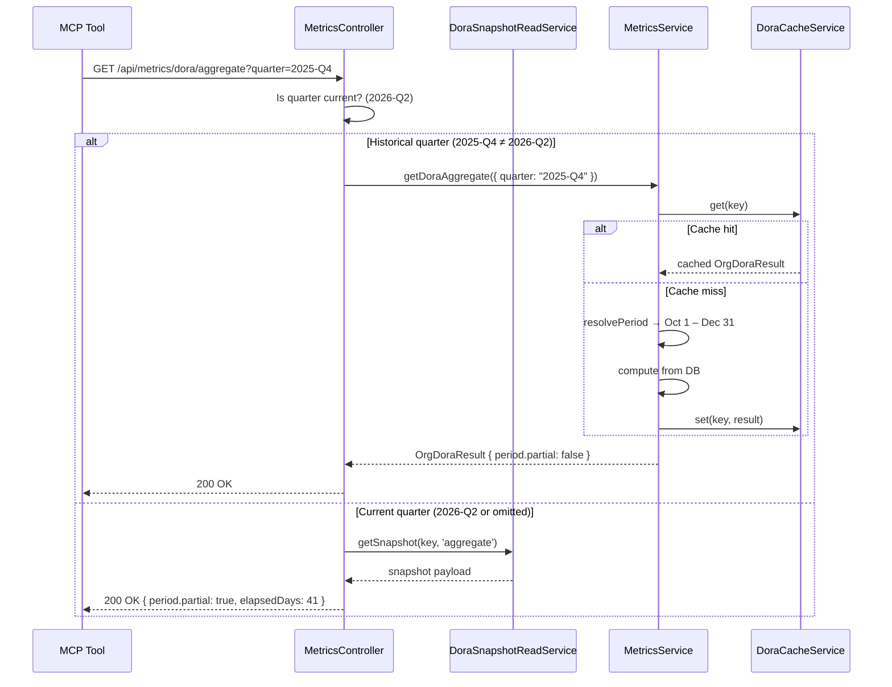
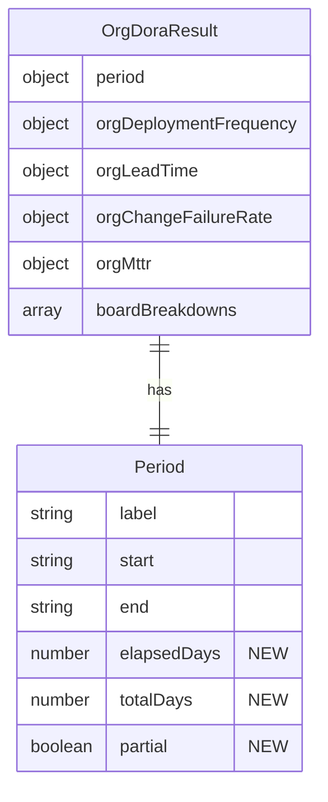

# 0059 — DORA Aggregate: Quarter Selection and Partial-Period Awareness

**Date:** 2026-05-11
**Status:** Accepted
**Author:** Architect Agent
**Related ADRs:** [ADR 0060](../decisions/0060-dora-aggregate-quarter-selection-and-partial-period.md)

## Problem Statement

The `GET /api/metrics/dora/aggregate` endpoint accepts a `quarter` query parameter (validated
as `YYYY-QN` format) but **ignores it entirely** in the non-sprint code path. The controller
always serves from the pre-computed snapshot, which is keyed only by `(boardId, snapshotType)`
with no quarter dimension. This means passing `2025-Q4` or `2026-Q1` silently returns the
current quarter's data (2026-Q2), violating the API contract and making the MCP tool
`get_dora_metrics` unreliable for historical point-in-time scorecards.

Separately, the `deploymentsPerDay` calculation always divides by the **full quarter length**
(~90–92 days) even when the quarter is incomplete. For the current quarter (e.g. 40 elapsed
days out of 91), this deflates the rate by ~2.4x. Consumers have no metadata to detect or
correct this, meaning stat tiles show misleadingly low deployment frequency for the current
period.

## Proposed Solution

### Fix 1: Honour the `quarter` parameter

Modify the controller to fall through to the live-computation path (via
`metricsService.getDoraAggregate(query)`) when a non-current quarter is requested.
The snapshot path remains the fast-path for the current quarter only.

**Logic change in `metrics.controller.ts`:**

```
if (query.sprintId) → live compute (existing)
else if (quarter is specified AND quarter ≠ current quarter) → live compute
else → serve from snapshot (existing)
```

The service layer already correctly respects `query.quarter` via `resolvePeriod()` and caches
results in the in-memory `DoraCacheService`. No service changes required for this fix.

### Fix 2: Partial-period metadata

Add three fields to the `OrgDoraResult.period` object and the per-board breakdown `period`:

| Field | Type | Description |
|---|---|---|
| `elapsedDays` | `number` | Days elapsed from period start to `min(now, endDate)` |
| `totalDays` | `number` | Full period length in days (same as existing `periodDays`) |
| `partial` | `boolean` | `true` when `now < endDate` (period still in progress) |

**Calculation:** In `buildOrgDoraResult` and `computeResult` (deployment-frequency.service):

```typescript
const now = new Date();
const effectiveEnd = endDate < now ? endDate : now;
const partial = now < endDate;
const elapsedMs = effectiveEnd.getTime() - startDate.getTime();
const elapsedDays = Math.max(Math.round(elapsedMs / (1000 * 60 * 60 * 24)), 1);
```

**Crucially, `deploymentsPerDay` continues to divide by the full `periodDays`** — we do NOT
change the denominator. The partial-period metadata lets consumers annualise or annotate
without altering the underlying metric semantics. This preserves backward compatibility and
avoids the confusing scenario where the same quarter's `deploymentsPerDay` changes meaning
depending on whether it was current or historical when computed.

If a consumer wants "actual current rate", it computes:
`totalDeployments / elapsedDays` (or equivalently `deploymentsPerDay * totalDays / elapsedDays`).





### Fix 3: MCP server `get_dora_metrics` tool — partial-period annotation

The MCP tool in `apps/mcp/src/tools/dora.ts` currently returns raw JSON via
`JSON.stringify(result.data, null, 2)`. After the backend changes, the response will
include `period.partial`, `period.elapsedDays`, and `period.totalDays`.

Update the tool to prepend a human-readable annotation when the period is partial:

```typescript
async ({ boardId, quarter }) => {
  // ... existing param assembly and apiGet call ...

  const data = result.data;
  const blocks: Array<{ type: 'text'; text: string }> = [];

  // Annotate partial periods so AI consumers know the rate is conservative
  if (data?.period?.partial) {
    blocks.push({
      type: 'text' as const,
      text: `Note: ${data.period.label} is in progress (${data.period.elapsedDays}/${data.period.totalDays} days elapsed). ` +
        `deploymentsPerDay is divided by the full ${data.period.totalDays}-day period. ` +
        `For the actual current rate, use: totalDeployments / elapsedDays.`,
    });
  }

  blocks.push({
    type: 'text' as const,
    text: JSON.stringify(data, null, 2),
  });

  return { content: blocks };
};
```

This ensures AI assistants consuming `get_dora_metrics` understand the partial-period
semantics without needing prior knowledge of the field meanings. The raw JSON remains
available for programmatic use.

The `get_dora_trend` tool requires no changes — the trend response already contains
`period.partial` per entry, and each quarter's data is consumed as a time series where
partial periods are obvious from the label (most recent entry).

## Alternatives Considered

### Alternative A — Snapshot per quarter (multi-row snapshots)

Add `quarter` as a third column in the `DoraSnapshot` composite primary key, then
pre-compute snapshots for all historical quarters during sync.

**Rejected because:**
- Historical quarters never change — pre-computing and storing them wastes sync time
- Would require a migration to alter the PK and re-seed all snapshot rows
- The in-memory cache in `DoraCacheService` (60s TTL) already handles repeated requests
  for the same historical quarter efficiently
- Over-engineers a rare access pattern (most requests are current quarter)

### Alternative B — Change `deploymentsPerDay` denominator to `elapsedDays` for current quarter

Divide by elapsed days instead of full period days when the quarter is incomplete.

**Rejected because:**
- Breaks backward compatibility — existing consumers and trend charts would see a
  discontinuity when comparing the current quarter to historical ones
- Makes the metric non-idempotent: the same quarter returns different `deploymentsPerDay`
  values depending on when it was queried, making caching semantics confusing
- Consumers cannot "undo" a rate that was already annualised if they need the raw total;
  but they _can_ annualise a conservative rate using the metadata
- DORA research papers use full-period rates for consistency across periods

### Alternative C — Separate `/api/metrics/dora/aggregate/historical` endpoint

Create a new endpoint for historical quarter queries.

**Rejected because:**
- Unnecessary API surface — the existing endpoint's contract already accepts `quarter`
- Forces MCP tool and frontend to know about two endpoints for the same data shape
- The "serve from snapshot vs compute live" distinction is an implementation detail that
  should not leak into the API contract

## Impact Assessment

| Area | Impact | Notes |
|---|---|---|
| Database | None | No schema change; historical queries hit existing issue/changelog tables |
| API contract | Additive | Three new optional fields in `period` object; no breaking changes |
| Frontend | Component change | Stat tiles can display "(partial)" annotation or annualised rate |
| MCP server | Tool output change | `get_dora_metrics` prepends partial-period annotation text block |
| Tests | New unit tests / Updated integration tests | Controller routing logic; partial-period field population; MCP annotation |
| External API | No new calls | Jira data already cached in DB |
| Infrastructure | None | No new resources |
| Observability | None | Existing logging sufficient for live-compute path |
| Security / Compliance | None | No new attack surface; read-only query on existing data |

## Open Questions

1. **Snapshot staleness for current quarter:** The snapshot for the current quarter is
   re-computed on every sync. Should the controller fall through to live compute if the
   snapshot's `computedAt` is older than N hours? Currently the staleness threshold
   (60 min default) already signals via `X-Snapshot-Stale` header. Recommendation: keep
   existing staleness header behaviour; do not add a second live-compute fallback.

None remaining — Open Question 2 (MCP response enrichment) is resolved in Fix 3 above.

## Acceptance Criteria

- `GET /api/metrics/dora/aggregate?quarter=2025-Q4` returns data for 2025-Q4 (period.start
  = `2025-10-01T...`, period.end = `2025-12-31T...`), not the current quarter
- `GET /api/metrics/dora/aggregate?quarter=2025-Q4` response includes
  `period.partial: false` and `period.elapsedDays === period.totalDays`
- `GET /api/metrics/dora/aggregate` (no quarter param) returns the current quarter snapshot
  with `period.partial: true` and `period.elapsedDays` reflecting actual days elapsed
- `GET /api/metrics/dora/aggregate?quarter=2026-Q2` (current quarter, explicit) still
  serves from snapshot (fast path)
- The `deploymentsPerDay` denominator remains `totalDays` (full period length) in all cases
- Existing trend endpoint behaviour is unchanged
- MCP `get_dora_metrics` tool with `quarter: "2025-Q4"` returns historical data correctly
  (period.label = "2025-Q4", period.partial = false)
- MCP `get_dora_metrics` tool for a partial quarter includes a text annotation block
  before the JSON stating elapsed/total days and the annualisation formula
- MCP `get_dora_metrics` tool for a completed quarter does NOT include the partial
  annotation block (only the JSON data block)
- MCP `get_dora_trend` tool is unchanged — returns raw JSON as before
- Unit test covers: controller routing (historical vs current vs sprint), partial-period
  field calculation (complete quarter → `partial: false`, in-progress → `partial: true`)
- Unit test covers: MCP tool annotation logic (partial → annotation prepended, complete → no annotation)
- Integration test: request with `quarter` in the past returns period matching that quarter
