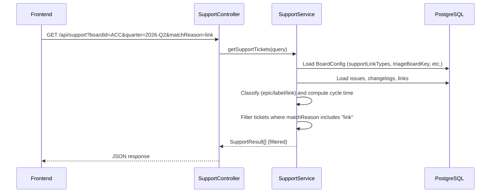
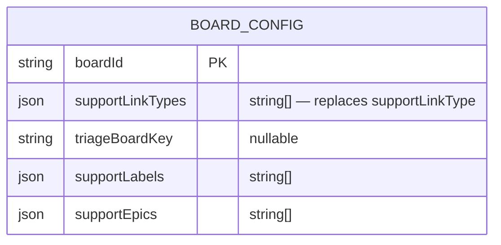

# 0060 — Support Report TTB Filter and Plural Link Types

**Date:** 2026-05-12
**Status:** Accepted
**Author:** Architect Agent
**Related ADRs:** TBD (will produce ADR 0061)

## Problem Statement

The support report currently shows all issues classified as support via any of the three
detection mechanisms (epic match, label match, link match). Users want to filter the report
to show only issues that are linked to the triage board (TTB), providing a narrower view of
triage-originated work.

Additionally, the `supportLinkType` field on `BoardConfig` is a single nullable varchar.
Teams sometimes use multiple Jira link types to connect issues to the triage board (e.g.
"clones", "is caused by"). The current schema forces choosing just one, limiting detection
accuracy.

## Proposed Solution

### 1. Plural link types on BoardConfig

Rename `supportLinkType` (varchar, nullable) to `supportLinkTypes` (simple-json string
array, default `[]`). The entity field, service classification logic, board config API
(GET/PUT), frontend settings UI, and MCP tools all update to the plural form.

A TypeORM migration handles the schema change:
- `up()`: Add `supportLinkTypes` column (simple-json, default `'[]'`); copy existing
  non-null `supportLinkType` values into the new array column; drop the old column.
- `down()`: Reverse the process (take first element of array, restore varchar column).

### 2. TTB-linked-only filter

Add a `matchReason` query parameter to both `/api/support` and `/api/support/summary`.
When `matchReason=link` is provided, only tickets whose computed match reason includes
"link" are returned. The filter is applied server-side after classification so that
`totalIssues` (denominator) remains unchanged but `supportIssues` (numerator) and the
`tickets` array reflect only link-matched issues.

This approach keeps the filter generic — `matchReason=epic`, `matchReason=label`, or
`matchReason=link` all work — even though the immediate requirement is "TTB-linked only".
The frontend exposes a toggle labelled "TTB-linked only" that sets `matchReason=link`.

### Data flow

### Schema change

## Alternatives Considered

### Alternative A — Client-side filter only (no server-side `matchReason` param)

Filter tickets in the frontend after receiving the full result set. Simpler — no API
change needed.

Rejected because: the `supportIssues` count, `supportPercentage`, `p50Days`, and `p95Days`
in the summary response would still reflect all match reasons. The frontend would need to
recompute percentiles locally, duplicating logic. Server-side filtering is cleaner and
keeps the API response self-consistent.

### Alternative B — Keep `supportLinkType` as singular, add a separate `supportLinkTypes` array

Maintain backward compatibility without a migration by supporting both fields.

Rejected because: maintaining two overlapping fields increases confusion and the
classification logic must reconcile them. A clean migration is straightforward and this is
an internal tool with no external API consumers.

## Impact Assessment

| Area | Impact | Notes |
|---|---|---|
| Database | Migration required | Rename column `supportLinkType` → `supportLinkTypes` (varchar → simple-json) |
| API contract | Additive | New optional `matchReason` query param on two existing endpoints |
| Frontend | Component change | New toggle filter on support page; settings UI field updated from text input to multi-value |
| Tests | New unit tests + updated | Service tests for plural link matching and matchReason filter; frontend component test for toggle |
| External API | No new calls | No change to Jira integration |
| Infrastructure | None | No infra changes |
| Observability | None | Existing logging sufficient |
| Security / Compliance | None | No new attack surface or data class |

## Open Questions

None.

## Acceptance Criteria

- `BoardConfig` entity uses `supportLinkTypes: string[]` (simple-json); the old
  `supportLinkType` varchar column no longer exists after migration.
- Migration preserves existing non-null `supportLinkType` values: if a board had
  `supportLinkType = "clones"`, after migration it has `supportLinkTypes = ["clones"]`.
- `SupportService` classification logic matches an issue if its link type name equals
  ANY element in `supportLinkTypes` (OR semantics within the array).
- `GET /api/support?matchReason=link` returns only tickets whose `matchReason` contains
  "link" (i.e. "link", "epic+link", "label+link", "epic+label+link").
- `GET /api/support/summary?matchReason=link` returns stats computed over link-matched
  tickets only (supportIssues, p50, p95 filtered); `totalIssues` remains the full
  denominator.
- Frontend support page has a "TTB-linked only" toggle that applies `matchReason=link`.
- Board settings UI allows entering multiple support link types (array input).
- All existing tests pass; new tests cover the plural matching and the filter parameter.
