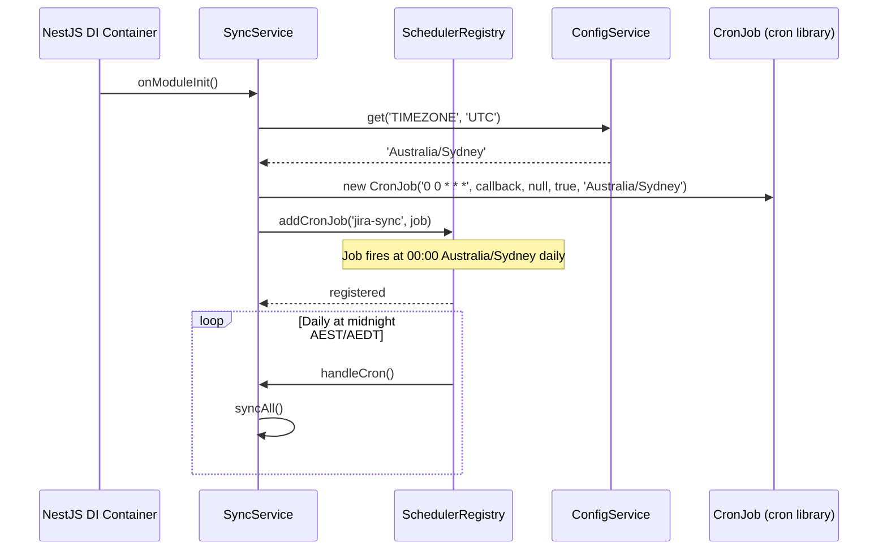

# 0061 — Timezone-Aware Sync Schedule

**Date:** 2026-05-12
**Status:** Accepted
**Author:** Architect Agent
**Related ADRs:** [ADR 0061](../decisions/0061-timezone-aware-sync-schedule.md) (to be created)

## Problem Statement

`SyncService.handleCron()` was previously scheduled via `@Cron('0 0 * * *')` with no
timezone option, causing the cron expression to fire at UTC midnight regardless of where
the engineering team operates. The project is deployed in `ap-southeast-2` (Sydney) and
all other time-relative configuration (quarter boundaries, lead-time windows, cycle-time
buckets) is already driven by the `TIMEZONE` env var via `ConfigService`. The sync
schedule was the only time-sensitive operation that ignored this configuration, creating
an inconsistency and a usability gap — the scheduled sync fires at 10:00 AM AEST rather
than midnight local time.

Additionally, the `@Cron` decorator is a compile-time constant: NestJS evaluates it
during class decoration before the DI container exists, making it impossible to inject a
runtime-configured timezone into the expression using the decorator approach alone.

## Proposed Solution

Replace the `@Cron` decorator on `handleCron` with a programmatic `CronJob` registered
in `onModuleInit`. The `SyncService` implements `OnModuleInit` and uses
`SchedulerRegistry` (provided by `ScheduleModule.forRoot()`) to register a named
`'jira-sync'` cron job at module startup. The cron expression (`0 0 * * *`) remains
fixed; the timezone is sourced from `ConfigService.get('TIMEZONE', 'UTC')` — the same
env var used everywhere else in the application.

**Affected components:**

- `backend/src/sync/sync.service.ts` — removes `@Cron` decorator, adds `OnModuleInit`,
  injects `ConfigService` and `SchedulerRegistry`, registers `CronJob` in `onModuleInit`
- `backend/src/sync/sync.service.spec.ts` — adds `mockConfigService` and
  `mockSchedulerRegistry` helpers; replaces the decorator metadata test with two
  `onModuleInit` behavioural tests

No module file changes are required — `SchedulerRegistry` is automatically provided by
`ScheduleModule.forRoot()` (already registered in `AppModule`) and `ConfigModule` is
global.

## Alternatives Considered

### Alternative A — Hardcode `timeZone: 'Australia/Sydney'` in the `@Cron` options object

This was the initial (incorrect) implementation in PR #8. It works for the immediate
need but violates the project rule that configuration must not be hardcoded in source —
all time-zone-relative behaviour uses `TIMEZONE` from `ConfigService`. It would also
break any deployment not targeting Sydney, and would diverge from every other
time-sensitive calculation in the codebase.

### Alternative B — Set `TZ=Australia/Sydney` in the ECS task definition environment

Setting the system timezone at the process level would make `0 0 * * *` fire at midnight
AEST/AEDT without any code change. However: (1) it is an infra-layer side-effect that is
invisible to the application code; (2) it would affect all system calls that rely on the
local timezone, not just the cron schedule; (3) `TIMEZONE` is already the established
mechanism for controlling time-relative behaviour; (4) it would not survive a deployment
to a different region without a matching infra change.

### Alternative C — `@Cron` with `utcOffset` option

`@Cron` accepts a `utcOffset` in minutes, which could be set to `600` (UTC+10) at
decoration time. Ruled out because: (a) it is still a hardcoded value; (b) it does not
handle AEDT (UTC+11) — a fixed offset misses daylight saving transitions. The IANA
timezone identifier `Australia/Sydney` handles DST correctly via the `cron` library.

## Impact Assessment

| Area | Impact | Notes |
|---|---|---|
| Database | None | No schema or query changes |
| API contract | None | No endpoint changes |
| Frontend | None | No UI changes |
| Tests | Updated unit tests | `onModuleInit` tests replace `@Cron` metadata reflection tests; 66 tests pass |
| External API | None | No new Jira API calls |
| Infrastructure | None | No new cloud resources; `TIMEZONE` env var already present |
| Observability | None | No log shape changes |
| Security / Compliance | None | No new attack surface or data class |

## Open Questions

None.

## Acceptance Criteria

- `SyncService` implements `OnModuleInit` and registers a `CronJob` named `'jira-sync'` via `SchedulerRegistry.addCronJob` during `onModuleInit()`
- The registered `CronJob` uses cron expression `0 0 * * *` (verified via `job.cronTime.source`)
- The registered `CronJob` uses the timezone returned by `ConfigService.get('TIMEZONE', 'UTC')` (verified via `job.cronTime.timeZone`)
- When `TIMEZONE` is not configured, the job timezone falls back to `'UTC'`
- No `@Cron` decorator remains on `handleCron`
- No hardcoded timezone string (`'Australia/Sydney'` or any other) appears in `sync.service.ts`
- All 66 tests in `sync.service.spec.ts` pass
