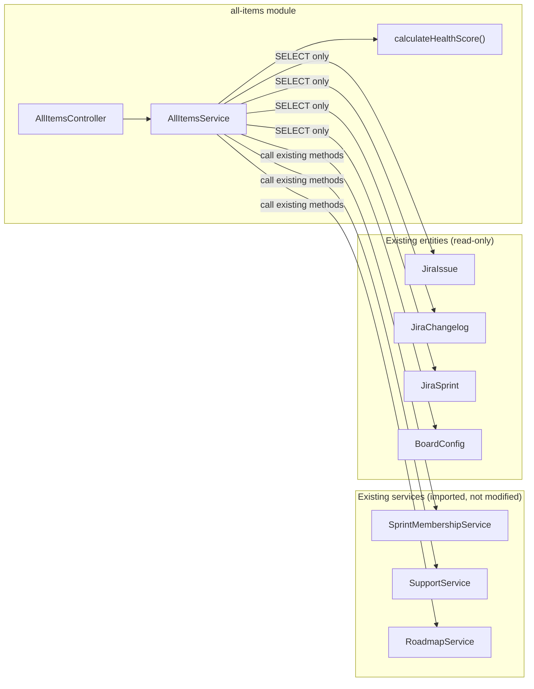
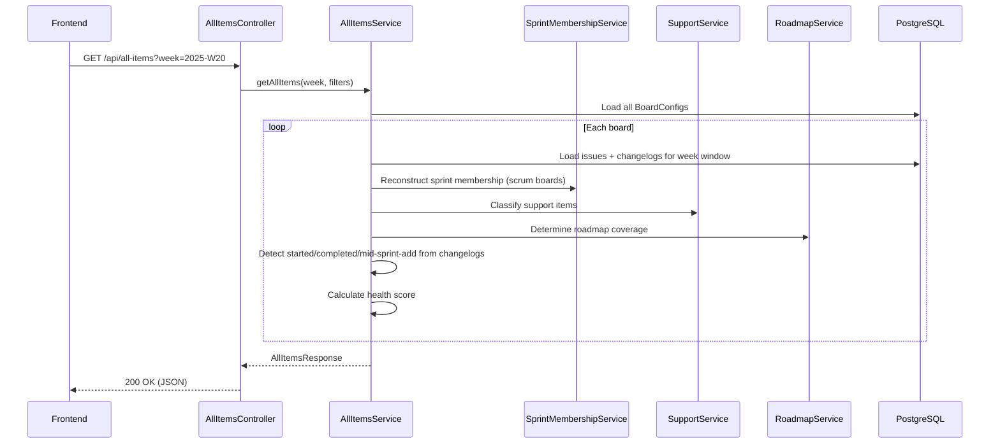

# 0062 — All Items Weekly Report

**Date:** 2026-05-13
**Status:** Accepted
**Author:** Architect Agent
**Related ADRs:** *(to be created on acceptance)*

## Problem Statement

Stakeholders require a single weekly-cadence pulse view that shows issue activity across
all configured boards — what was started, what was added mid-sprint (disruption signal),
what was completed, and whether each item is aligned to the roadmap. Currently no report
aggregates this cross-board weekly view; the existing `week` module only serves Kanban
boards. Without this, managers must check each board individually and mentally correlate
sprint boundaries with calendar weeks.

This report is explicitly a bespoke MyPass tool — it will **never** be upstreamed. It
must therefore be entirely isolated: no modifications to existing modules, services,
calculations, or entities.

## Proposed Solution

Introduce a new, fully isolated NestJS module `all-items` and a corresponding frontend
page at `/all-items`. The module reads existing entities (read-only) and performs its own
calculations without modifying or extending existing services.

### Backend: `backend/src/all-items/`

| File | Purpose |
|---|---|
| `all-items.module.ts` | Module registration; imports TypeORM entities only |
| `all-items.controller.ts` | Thin REST controller: `GET /api/all-items` |
| `all-items.service.ts` | Core logic: weekly bucketing, classification, health scoring |
| `dto/all-items-query.dto.ts` | Validated query DTO (week, filters) |
| `dto/all-items-response.dto.ts` | Response type definitions |

### API Contract

```
GET /api/all-items?week=2025-W20&filter=added-mid-sprint|not-on-roadmap|support|ttb-support
```

**Query parameters:**
| Param | Type | Required | Description |
|---|---|---|---|
| `week` | string (ISO week: `YYYY-Www`) | Yes | The week period to report on |
| `filter` | string (pipe-delimited) | No | Active filters: `added-mid-sprint`, `not-on-roadmap`, `support`, `ttb-support` |

**Response shape:**
```typescript
interface AllItemsResponse {
  week: string;                    // e.g. "2025-W20"
  weekStart: string;               // ISO date
  weekEnd: string;                 // ISO date
  boards: AllItemsBoardResult[];
  totals: AllItemsTotals;
}

interface AllItemsBoardResult {
  boardId: string;
  boardType: 'scrum' | 'kanban';
  items: AllItemsIssue[];
  healthScore: BoardHealthScore;
  summary: AllItemsBoardSummary;
}

interface AllItemsIssue {
  key: string;
  summary: string;
  issueType: string;
  status: string;
  boardId: string;
  assignee: string | null;
  points: number | null;
  labels: string[];
  jiraUrl: string;
  // Classification flags
  started: boolean;           // first in-progress transition in this week
  addedMidSprint: boolean;    // added to sprint after sprint start (scrum) or flagged as kanban-add (kanban)
  completed: boolean;         // transitioned to done status in this week
  onRoadmap: boolean;         // completed within committed roadmap item target date
  isSupport: boolean;         // classified as support per BoardConfig rules
  isTtbSupport: boolean;      // specifically link-based TTB support (triageBoardKey match)
  kanbanAdd: boolean;         // true if kanban board and added to board this week
  // Context
  sprintName: string | null;  // current/relevant sprint (null for kanban)
  epicKey: string | null;
}

interface AllItemsBoardSummary {
  totalItems: number;
  startedCount: number;
  addedMidSprintCount: number;
  completedCount: number;
  onRoadmapCount: number;
  supportCount: number;
  ttbSupportCount: number;
}

interface BoardHealthScore {
  overall: number;            // 0-100
  roadmapAlignmentScore: number;   // 0-100 (higher = more roadmap-aligned)
  supportBurdenScore: number;      // 0-100 (higher = less support = healthier)
  stabilityScore: number;          // 0-100 (higher = fewer mid-sprint adds = more stable)
}

interface AllItemsTotals {
  totalItems: number;
  startedCount: number;
  addedMidSprintCount: number;
  completedCount: number;
  onRoadmapCount: number;
  supportCount: number;
  ttbSupportCount: number;
}
```

### Classification Logic

| Flag | Scrum boards | Kanban boards |
|---|---|---|
| `started` | First `status` changelog → any `inProgressStatusNames` status within the week | First transition to `boardEntryStatuses` within the week |
| `addedMidSprint` | Sprint changelog shows issue added to an active sprint after that sprint's `startDate`, AND the addition occurred within the week | N/A — use `kanbanAdd` instead |
| `kanbanAdd` | N/A | First transition to `boardEntryStatuses` occurred within the week |
| `completed` | `status` changelog → any `doneStatusNames` status within the week | Same |
| `onRoadmap` | Issue's epic key or direct link matches a JPD idea whose `targetDate >= completionDate` (reuse existing roadmap logic read-only) | Same |
| `isSupport` | Any of: epic in `supportEpics`, label in `supportLabels`, or link-type match with `triageBoardKey` | Same |
| `isTtbSupport` | Link-type match where target issue starts with `triageBoardKey + '-'` | Same |

### Health Score Calculation

Per board, for the week period:

```
roadmapAlignmentScore = (completedOnRoadmap / totalCompleted) * 100     // 100 if nothing completed
supportBurdenScore    = (1 - (supportCount / totalItems)) * 100          // 100 if no support
stabilityScore        = (1 - (addedMidSprintCount / totalItems)) * 100   // 100 if no disruption

overall = round((roadmapAlignmentScore + supportBurdenScore + stabilityScore) / 3)
```

Edge cases:
- If `totalCompleted === 0`, `roadmapAlignmentScore = 100` (no signal, assume healthy)
- If `totalItems === 0`, all scores = 100, overall = 100 (empty board = healthy)

### Frontend: `/all-items`

New page at `frontend/src/app/all-items/page.tsx`:
- Week picker (ISO week selector, defaults to current week)
- Filter chips for: added mid-sprint, not on roadmap, support, TTB support
- Per-board card showing: health score badge, summary counts, expandable item list
- Totals row at the top

New nav item in `sidebar.tsx`:
```typescript
{ label: 'All Items', href: '/all-items', icon: <ListChecks className="h-5 w-5" /> }
```

### Isolation Strategy

This module:
- **Imports `SprintMembershipService`** to reuse sprint membership reconstruction — no duplication of that logic
- **Re-implements** support detection and roadmap windowing locally using the same algorithms and underlying entities; `SupportService` and `RoadmapService` are not imported directly, keeping the dependency surface minimal
- **Does NOT modify** any existing service, entity, migration, controller, or test
- Can be deleted entirely (remove module + frontend page + nav entry) without affecting any other module





## Alternatives Considered

### Alternative A — Extend existing WeekDetailService

Add a multi-board mode to the existing `week` module. Rejected because:
- The existing module is Kanban-only with hardcoded assumptions
- Modifying it risks breaking the existing Kanban week view
- Coupling would make future removal difficult

### Alternative B — Re-implement all classification logic locally

Duplicate support detection, roadmap coverage, and sprint membership logic within the
`all-items` module as standalone helpers. Rejected because:
- Violates DRY — bug fixes in existing services would not propagate
- More code to maintain in a report that is already acknowledged as bespoke
- Existing services are stable and well-tested; consuming them is safer

### Alternative C — Store as pre-computed snapshots

Pre-compute weekly data post-sync like DORA snapshots. Rejected because:
- Adds complexity (new entity, new migration, new trigger)
- The data volume is small enough for on-demand calculation
- The report only needs to serve a handful of users

## Impact Assessment

| Area | Impact | Notes |
|---|---|---|
| Database | None — no migration | Read-only access to existing entities |
| API contract | Additive | New endpoint `GET /api/all-items` only |
| Frontend | New page + nav entry | `/all-items` page, sidebar entry |
| Tests | New unit tests | Service logic tests with mocked repos; no existing tests modified |
| External API | No new calls | Uses locally-cached Jira data only |
| Infrastructure | None | No new cloud resources |
| Observability | None | Standard NestJS Logger |
| Security / Compliance | None | Same data access as existing endpoints; internal data only |

## Open Questions

None — the isolation strategy and health score weighting (equal thirds) are defined above.
The user confirmed TTB support detection reuses the existing `triageBoardKey` + `supportLinkTypes` pattern.

## Acceptance Criteria

- `GET /api/all-items?week=2025-W20` returns a 200 response matching the `AllItemsResponse` shape
- Response includes all configured boards (scrum and kanban)
- Epics and subtasks are excluded from all results (`isWorkItem` filter applied)
- Each item is classified with `started`, `addedMidSprint`/`kanbanAdd`, `completed`, `onRoadmap`, `isSupport`, `isTtbSupport`
- Filters (`added-mid-sprint`, `not-on-roadmap`, `support`, `ttb-support`) reduce the returned items to matching subset
- Each board includes a `healthScore` with `overall`, `roadmapAlignmentScore`, `supportBurdenScore`, `stabilityScore` (0-100)
- Frontend page at `/all-items` renders the data with week picker and filter chips
- "All Items" appears in the left-hand sidebar navigation
- No existing module, service, controller, entity, or test is modified in a way that affects existing reports
- The `all-items` module can be deleted (module + frontend page + nav entry) without affecting any other module
