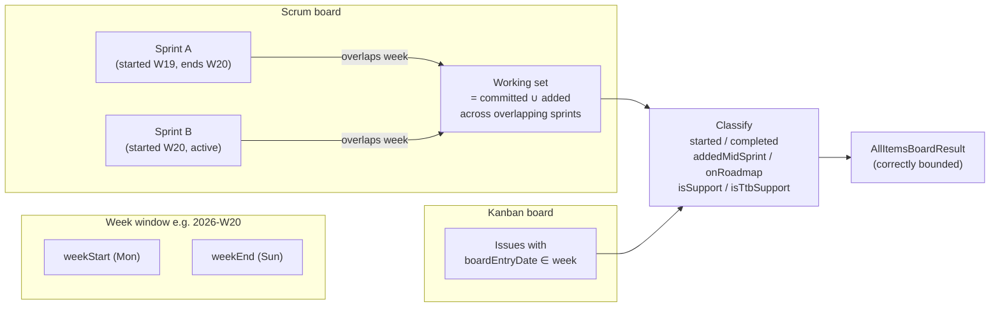
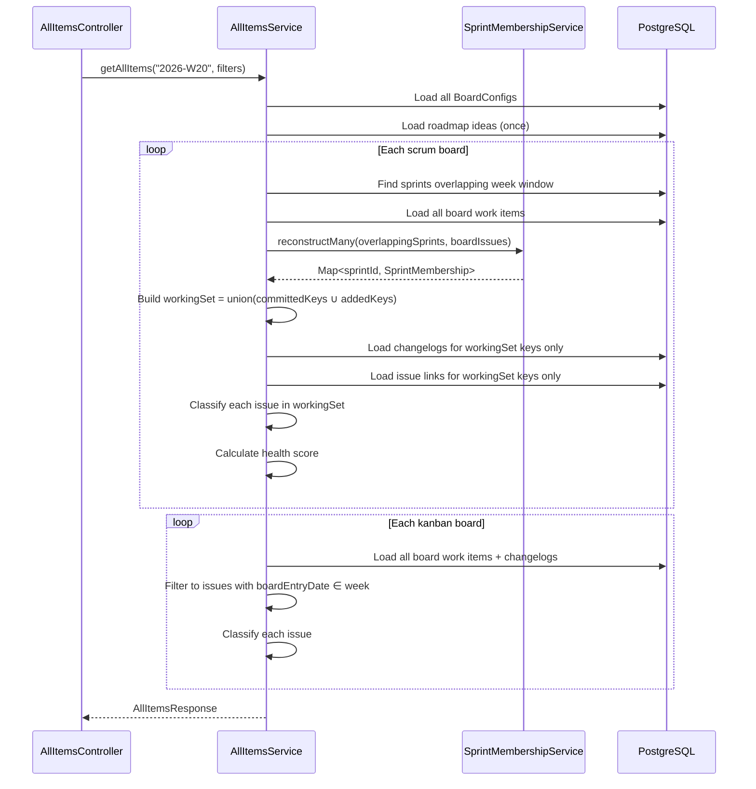

# 0063 — All Items Weekly Report: Correct Issue Population (Supersedes 0062)

**Date:** 2026-05-13
**Status:** Accepted
**Author:** Architect Agent
**Related ADRs:** *(to be created on acceptance)*

## Problem Statement

Proposal 0062 was implemented but produces incorrect numbers. The current
`AllItemsService.processBoardForWeek` loads **all issues on the board** and pushes every
one into `items` unconditionally — line 298 `items.push(...)` is reached for every issue
regardless of board type or whether the issue had any activity in the selected week.

**Scrum boards** (DATA 219, SPS 401, OCS 651 etc.): `allSprintMemberKeys` was computed
from sprint membership but never used as a filter gate. The full board backlog is
iterated and included.

**Kanban board** (PLAT 980): `kanbanAdd` is set as a flag when `boardEntryDate` falls
within the week, but the issue is still pushed unconditionally when `kanbanAdd=false`.
All 980 PLAT issues appear in every week regardless of when they were boarded.

The root cause is the same in both paths: there is no **population gate** — no
`continue` or working-set filter before `items.push`. The report therefore shows the
entire board backlog for every week, not what the team was actually engaged with.

The correct interpretation is:
- **Scrum**: the item population for a given week is the union of `committedKeys ∪ addedKeys`
  from all sprints that overlap the calendar week
- **Kanban**: the item population is issues whose `boardEntryDate` falls within the week

## Proposed Solution

Replace the `processBoardForWeek` logic in `AllItemsService` with a sprint-window-scoped
approach. No changes to any other module, entity, or service are required.

### Correct population algorithm

#### Scrum boards

1. Find all sprints for the board whose window **overlaps** the calendar week:
   `sprint.startDate <= weekEnd AND (sprint.endDate >= weekStart OR sprint.state = 'active')`
2. Use `SprintMembershipService.reconstructMany` to reconstruct membership for those sprints
3. The working set = union of `committedKeys ∪ addedKeys` across all overlapping sprints
   (do **not** include `committedRemovedKeys`/`addedRemovedKeys` in isolation — they are
   already present in their respective parent sets)
4. Classify only issues within that working set

#### Kanban boards

Unchanged from 0062: issues whose board-entry date (`first transition to boardEntryStatuses`)
falls within the week window. This is the same bucketing used by the existing
`WeekDetailService` and `PlanningService`.

### Classification changes within the corrected population

| Flag | Scrum | Kanban |
|---|---|---|
| `started` | First in-progress status transition is within the week | First board-entry transition within the week (same as before) |
| `completed` | Last done-status transition within the week | Same |
| `addedMidSprint` | Issue is in `addedKeys` (not `committedKeys`) for **any** overlapping sprint | N/A |
| `kanbanAdd` | N/A | Board-entry date within the week |
| `onRoadmap` | Unchanged — completed within roadmap idea target date | Same |
| `isSupport` / `isTtbSupport` | Unchanged | Same |

### What "total items" means per board

- **Scrum**: count of distinct issues in the sprint-window working set (committed + added
  across all overlapping sprints, deduplicated by key)
- **Kanban**: count of issues with board-entry date in the week

This produces numbers consistent with what the team was actually doing in that week —
e.g. a two-week sprint starting Monday will appear across both weeks it overlaps.

### Health score — unchanged formula, corrected denominator

The health score formula (equal-thirds: roadmap alignment, support burden, stability)
is unchanged. With the corrected population the denominators will be meaningful.





### Sprint overlap definition

A sprint overlaps a week window `[weekStart, weekEnd]` when:
```
sprint.startDate <= weekEnd
AND (sprint.endDate IS NULL OR sprint.endDate >= weekStart OR sprint.state = 'active')
```

Active sprints with no `endDate` are always considered overlapping if `startDate <= weekEnd`.

### Edge cases

| Case | Handling |
|---|---|
| Issue committed to Sprint A (W19–W20) AND Sprint B (W20–W21) | Appears once in the working set (deduplication by key); `addedMidSprint` is true only if it was in `addedKeys` of either sprint |
| Sprint started in W18, ends in W21 (long sprint) | Included — it overlaps the week window |
| No sprints overlap the week | Working set is empty → board shows 0 items with health 100 |
| Kanban board | Board-entry bucketing unchanged from 0062 design |
| Issue in sprint but zero changelogs in week | Still included in total; `started=false`, `completed=false` — it is committed work that didn't move this week |

## Alternatives Considered

### Alternative A — Filter by changelog activity in week

Include only issues with at least one status changelog entry in the week. Rejected because:
- An issue committed to a sprint that didn't move this week is still relevant work the
  team is carrying — excluding it gives a false picture of throughput
- The stated requirement is "sprint commitments within the time period", not "active issues"

### Alternative B — Use completion date as the only gate

Include only issues completed within the week. Rejected because:
- This would exclude started-but-not-done work and newly added issues
- The requirement explicitly asks for started / added / completed as separate dimensions

### Alternative C — Keep all-board issues, add a "week active" filter

Tag each issue with a `weekActive` flag and let the frontend filter. Rejected because:
- The denominator for health score would still be wrong
- "Total items" would still show the full backlog to users who don't apply the filter

## Impact Assessment

| Area | Impact | Notes |
|---|---|---|
| Database | None | No schema or migration changes |
| API contract | None | Same endpoint, same response shape |
| Frontend | None | No frontend changes needed |
| Tests | Updated unit tests | Working set logic needs new test cases |
| External API | No new calls | No Jira HTTP calls |
| Infrastructure | None | No new resources |
| Observability | None | |
| Security / Compliance | None | |

## Open Questions

None.

## Acceptance Criteria

- For a scrum board, `GET /api/all-items?week=YYYY-Www` returns only issues that were
  members of a sprint overlapping that week (committed or added), not the full board backlog
- For a week with two overlapping sprints, items from both sprints appear (deduplicated)
- `addedMidSprint=true` only for issues in `addedKeys` (not `committedKeys`)
- `completed=true` only for issues that transitioned to a done status within the week window
- `started=true` only for issues with a first in-progress transition within the week window
- An issue committed to a sprint but with no changelog activity in the week has
  `started=false` and `completed=false` but is still counted in `totalItems`
- For a Kanban board, only issues with `boardEntryDate` within the week window are included
- `totalItems` for each board matches the sprint-window working set count, not the full backlog
- No existing tests or behaviour of any other module are changed
