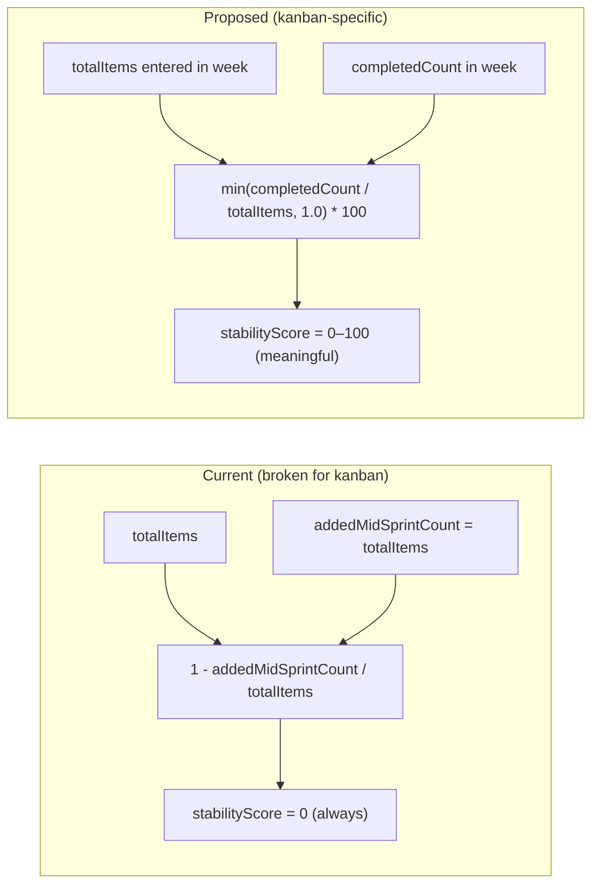
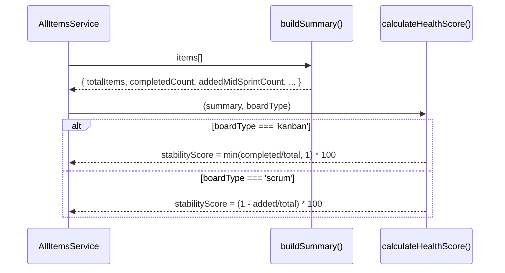

# 0064 — Kanban Stability Score: Throughput Balance

**Date:** 2026-05-15
**Status:** Accepted
**Author:** Architect Agent
**Related ADRs:** (pending acceptance)

## Problem Statement

The pulse report (All Items Weekly Report) calculates a `stabilityScore` for every board
using the formula `(1 - addedMidSprintCount / totalItems) * 100`. For scrum boards this
works well: it measures how much unplanned work was injected after sprint commitment.

For kanban boards the metric is meaningless. The kanban working set is defined as issues
whose board-entry date falls within the selected week — so by definition every item in
the set is a "new addition", yielding `addedMidSprintCount === totalItems` and a
permanent stability score of **0%**. This gives kanban teams a consistently poor health
score that provides no actionable signal.

## Proposed Solution

Redefine stability for kanban boards as **throughput balance**: the ratio of items
completed within the week to items that entered the board within the week.

```
kanbanStabilityScore = min(completedCount / totalItems, 1.0) * 100
```

| Scenario | Score | Interpretation |
|---|---|---|
| 3 entered, 3 completed | 100% | Perfectly balanced — team completes as much as it pulls in |
| 5 entered, 3 completed | 60% | WIP accumulating — team pulled more than it finished |
| 2 entered, 2 completed | 100% | Balanced (regardless of absolute volume) |
| 0 entered, 0 completed | 100% (empty default) | No data — assume healthy |

The score is capped at 100% via `Math.min`. If a team completes more items than entered
the board this week (e.g. clearing a backlog), they still score 100% — we do not penalise
over-delivery.

### Semantic justification

For kanban teams, "stability" means **sustainable pace**: the team is not accumulating
unbounded WIP. A team that consistently brings in more work than it finishes is unstable —
their cycle times will degrade as WIP grows. This metric directly measures that risk
without requiring sprint boundaries.

### Implementation scope

The change is confined to the `calculateHealthScore` method and its inputs. No new data
sources, no schema changes, no new API fields.



### Code changes

**`backend/src/all-items/all-items.service.ts`** — `calculateHealthScore`:

```typescript
private calculateHealthScore(
  summary: AllItemsBoardSummary,
  boardType: 'scrum' | 'kanban',
): BoardHealthScore {
  const { totalItems, completedCount, onRoadmapCount, supportCount, addedMidSprintCount } = summary;

  if (totalItems === 0) {
    return { overall: 100, roadmapAlignmentScore: 100, supportBurdenScore: 100, stabilityScore: 100 };
  }

  const roadmapAlignmentScore =
    completedCount === 0
      ? 100
      : Math.round((onRoadmapCount / completedCount) * 100);

  const supportBurdenScore = Math.round((1 - supportCount / totalItems) * 100);

  // Stability: scrum = disruption ratio; kanban = throughput balance
  const stabilityScore =
    boardType === 'kanban'
      ? Math.round(Math.min(completedCount / totalItems, 1) * 100)
      : Math.round((1 - addedMidSprintCount / totalItems) * 100);

  const overall = Math.round((roadmapAlignmentScore + stabilityScore) / 2);

  return { overall, roadmapAlignmentScore, supportBurdenScore, stabilityScore };
}
```

**`backend/src/all-items/dto/all-items-response.dto.ts`** — update JSDoc for `stabilityScore`:

```typescript
/**
 * 0-100: Scrum = (1 - addedMidSprintCount / totalItems) * 100. 100 when no mid-sprint adds.
 * Kanban = min(completedCount / totalItems, 1) * 100. 100 when throughput >= intake.
 */
stabilityScore: number;
```

**Frontend tooltip** — update the stability tooltip text on `/all-items` to show the
kanban-specific explanation when displaying a kanban board.

### Data flow



## Alternatives Considered

### Alternative A — Remove stability for kanban entirely

Set `stabilityScore = null` for kanban boards and exclude it from the `overall`
calculation, making `overall = roadmapAlignmentScore` for kanban.

**Ruled out:** Loses the ability to surface meaningful health signal for kanban teams.
The `overall` composite score would be less comparable across board types.

### Alternative B — Measure WIP age / stale items

Define stability as the proportion of items that have been in-progress for less than N
days (e.g. 14 days), penalising stale items.

**Ruled out:** Requires configurable thresholds per board and introduces a new
concept (age-based staleness) unrelated to the weekly report's per-week framing. More
complex for questionable additional signal. Could be a future enhancement layered on top.

### Alternative C — Carry-over ratio (items remaining from previous week)

Measure how many items are new this week vs carried over from prior weeks.

**Ruled out:** The kanban working set is already scoped to board-entry-within-the-week,
so by definition there are no carry-over items in the current data model. Would require
expanding the working set definition, which is a larger scope change.

## Impact Assessment

| Area | Impact | Notes |
|---|---|---|
| Database | None | No schema change — uses existing `completedCount` and `totalItems` |
| API contract | None | `stabilityScore` field unchanged — same 0-100 integer range |
| Frontend | Tooltip text change | Update explanation shown on hover for kanban boards |
| Tests | Updated unit tests | Add kanban stability test cases to existing health score tests |
| External API | None | No new Jira calls |
| Infrastructure | None | No resource changes |
| Observability | None | No new log fields |
| Security / Compliance | None | No new data access |

## Open Questions

None.

## Acceptance Criteria

- `calculateHealthScore` accepts `boardType` parameter and uses the throughput-balance
  formula (`min(completedCount / totalItems, 1) * 100`) when `boardType === 'kanban'`
- Scrum boards continue to use the existing disruption-ratio formula unchanged
- A kanban board with 5 items entered and 3 completed in the week returns
  `stabilityScore = 60`
- A kanban board with 3 items entered and 5 completed returns `stabilityScore = 100`
  (capped)
- A kanban board with 0 items returns `stabilityScore = 100` (empty default)
- The `overall` health score for kanban boards reflects the new stability formula
- Frontend tooltip for stability on kanban boards reads: "Throughput balance:
  completed items / items entered this week. 100% = team completes as much as it
  pulls in."
- Unit tests cover: empty board, balanced throughput, over-delivery cap, under-delivery
  ratio, and confirm scrum boards are unaffected
- JSDoc on `BoardHealthScore.stabilityScore` documents both formulas
