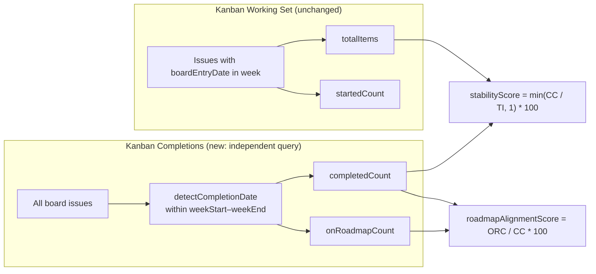
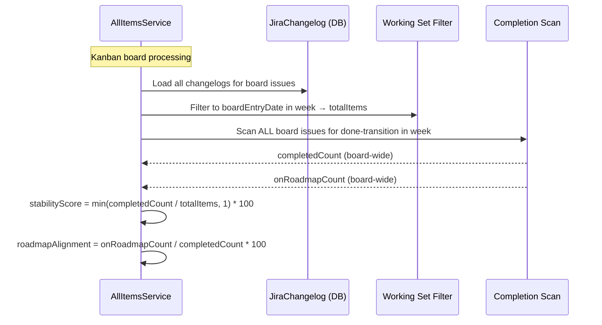

# 0065 — Kanban Pulse Report: Decouple Completed Count from Working Set Entry Date

**Date:** 2026-05-15
**Status:** Accepted
**Author:** Architect Agent
**Related ADRs:** ADR 0062 (Kanban Stability Score: Throughput Balance)

## Problem Statement

The pulse report's kanban `completedCount` only counts items that both **entered the board**
and **transitioned to Done within the same calendar week**. This is because the kanban
working set is defined as "issues whose board-entry date falls within the selected week"
(line 186–192 of `all-items.service.ts`), and `completed` is only evaluated for items
already in the working set (line 310).

For any kanban team with cycle times longer than a few days, the overwhelming majority of
items that complete in a given week entered the board in a **prior** week. These completions
are invisible to the pulse report — `completedCount` is near-zero in most weeks even though
the team is actively delivering.

This cascades into two broken health scores:
1. **stabilityScore** (ADR 0062): `min(completedCount / totalItems, 1) * 100` → near 0%
   because `completedCount ≈ 0`.
2. **roadmapAlignmentScore**: `onRoadmapCount / completedCount * 100` → defaults to 100%
   ("no signal") because `completedCount === 0`, hiding genuine misalignment.

The scrum path is unaffected — its working set is sprint-membership-based and includes
items regardless of when they entered the sprint.

## Proposed Solution

For kanban boards, compute `completedCount` (and its derivative `onRoadmapCount`)
**independently of the board-entry working set** by scanning all board issues for
done-transitions within the week window.

The working set continues to define `totalItems` (items that entered the board this week)
— this is the correct denominator for the stability formula. But `completedCount` becomes
a separate, broader query: "how many board items transitioned to Done this week, regardless
of when they entered?"

### Data flow (after fix)



### Implementation detail

In `processBoardForWeek`, after building the kanban working set and `items` array:

1. **New step — scan all board issues for completions this week** (kanban only):
   ```typescript
   if (isKanban) {
     // Completions are counted independently of the board-entry working set.
     // An item that entered the board 3 weeks ago and completed this week
     // must be counted.
     const allCompletedThisWeek: { key: string; completedAt: Date }[] = [];
     for (const issue of allBoardIssues) {
       const statusLogs = statusChangelogsByIssue.get(issue.key) ?? [];
       const completedAt = this.detectCompletionDate(statusLogs, doneStatuses, weekStart, weekEnd);
       if (completedAt !== null) {
         allCompletedThisWeek.push({ key: issue.key, completedAt });
       }
     }
     kanbanCompletedCount = allCompletedThisWeek.length;
     kanbanOnRoadmapCount = allCompletedThisWeek.filter(({ key, completedAt }) => {
       const issue = issueByKey.get(key)!;
       return this.classifyRoadmap(issue, completedAt, epicIdeaMap, directLinkIdeaMap);
     }).length;
   }
   ```

2. **Override summary counts for kanban boards** before computing health score:
   ```typescript
   const summary = this.buildSummary(items);
   if (isKanban) {
     summary.completedCount = kanbanCompletedCount;
     summary.onRoadmapCount = kanbanOnRoadmapCount;
   }
   const healthScore = this.calculateHealthScore(summary, isKanban ? 'kanban' : 'scrum');
   ```

3. **No change to the items array** — individual items in the response still show
   `completed: true/false` only for items in the working set (entered this week). The
   `completedCount` in the summary is now a board-wide weekly total, decoupled from the
   item list length.

### Sequence diagram



### Summary field semantics (after fix)

| Field | Scrum | Kanban (current, broken) | Kanban (proposed) |
|---|---|---|---|
| `totalItems` | Sprint members | Board-entry in week | Board-entry in week (unchanged) |
| `startedCount` | First in-progress in week | First board-entry in week | Unchanged |
| `completedCount` | Done transition in week (within sprint members) | Done transition in week (within board-entry-in-week set only) | **Done transition in week (all board issues)** |
| `onRoadmapCount` | Completed + roadmap-aligned (within sprint members) | Completed + roadmap-aligned (within board-entry-in-week set only) | **Completed + roadmap-aligned (all board issues)** |
| `addedMidSprintCount` | Added after sprint start | = totalItems (always) | Unchanged |

### Performance consideration

The completion scan iterates `allBoardIssues` (already loaded) and their changelogs
(already loaded into `statusChangelogsByIssue`). No additional DB queries. The only cost
is iterating the full board issue list (typically hundreds, not thousands) through
`detectCompletionDate` — negligible.

## Alternatives Considered

### Alternative A — Expand the kanban working set to include items completed this week

Add items that completed this week (regardless of board-entry date) to the working set,
inflating `totalItems`.

**Ruled out:** This breaks the stability formula's semantics. `totalItems` should mean
"new items entering the system this week" — conflating it with "items leaving the system"
would make the ratio meaningless. A board that completed 10 items from prior weeks would
have `totalItems = 10 + new items`, distorting the throughput balance calculation.

### Alternative B — Use a separate `weeklyCompletedCount` field

Add a new field to `AllItemsBoardSummary` specifically for kanban rather than overriding
`completedCount`.

**Ruled out:** `completedCount` is already the semantically correct field — "how many items
did this board complete this week". The scrum path already uses this interpretation (it
counts completions within the sprint members set, which includes items from prior sprints).
Overriding the existing field maintains API contract compatibility and avoids introducing
a redundant field that frontend consumers would need to branch on.

### Alternative C — Change the kanban working set to be "active in week" (entered OR completed)

**Ruled out:** Similar to Alternative A but worse — it would conflate entry and exit in the
working set, making it impossible to compute a meaningful "new vs done" ratio.

## Impact Assessment

| Area | Impact | Notes |
|---|---|---|
| Database | None | No schema change — reuses existing loaded data |
| API contract | None | Same `completedCount` field, same type, same range; just now populated correctly for kanban |
| Frontend | None | No changes needed — renders `completedCount` and health scores as before |
| Tests | Updated unit tests | New kanban-specific tests for completedCount and onRoadmapCount independent of working set |
| External API | None | No new Jira calls |
| Infrastructure | None | No resource changes |
| Observability | None | No new log fields |
| Security / Compliance | None | No new data access |

## Open Questions

None.

## Acceptance Criteria

- For kanban boards, `completedCount` in `AllItemsBoardSummary` counts all board issues
  whose done-transition fell within the week window — regardless of when they entered the
  board
- For kanban boards, `onRoadmapCount` is computed over the same board-wide completion set
- For scrum boards, `completedCount` and `onRoadmapCount` remain unchanged (derived from
  sprint-membership working set only)
- A kanban board with 3 items entered this week and 5 items completed this week (from
  prior weeks) returns `totalItems = 3`, `completedCount = 5`, `stabilityScore = 100`
  (capped)
- A kanban board with 5 items entered this week and 3 items completed this week (from
  any week) returns `totalItems = 5`, `completedCount = 3`, `stabilityScore = 60`
- A kanban board where 0 items entered this week but 4 items completed returns
  `totalItems = 0` → `emptyBoardResult` with all scores = 100 (existing empty-board
  behaviour unchanged)
- `roadmapAlignmentScore` for kanban boards uses the board-wide `completedCount` as
  denominator, not the working-set-only count
- Unit tests verify that kanban `completedCount` includes items that entered the board
  in a prior week but completed this week
- Scrum regression test confirms no change to scrum behaviour
- No additional database queries introduced (reuses `allBoardIssues` and
  `statusChangelogsByIssue` already in memory)
