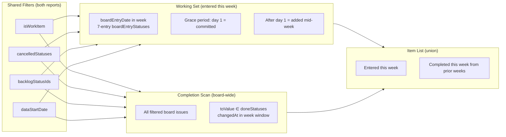

# 0066 — Align Pulse Kanban Metrics with Week Detail Report

**Date:** 2026-05-15
**Status:** Draft
**Author:** Architect Agent
**Related ADRs:** ADR 0062 (Kanban Stability: Throughput Balance), ADR 0063 (Decouple Completed from Entry Date)

## Problem Statement

The pulse report (`/all-items`) and the week-detail report (`/api/weeks/:boardId/:week/detail`)
show different numbers for the same kanban board in the same week. For PLAT in 2026-W20 they
diverge on every metric — total items, completed, added mid-week — because they apply
different filters, use different `boardEntryStatuses` defaults, and define the item list
differently.

These two reports should show **the same view of the week** for a kanban board. The
week-detail report is the established, correct implementation with proper
`backlogStatusIds`, `dataStartDate`, 7-entry `boardEntryStatuses`, and 1-day grace period.
The pulse report must be brought into alignment.

Additionally, the pulse report's item list only shows issues that **entered** the board this
week. It does not show issues that **completed** this week (from prior weeks). This means the
user cannot see which tickets contributed to the `completedCount` number. The item list
should include all relevant tickets for the week.

## Proposed Solution

Align every kanban metric in the pulse report to match the week-detail report's
definitions, and expand the kanban item list to include all issues that were active in the
week (entered OR completed).

### Changes Required

#### 1. Widen `boardEntryStatuses` fallback (pulse → match week-detail)

```typescript
// Current (pulse):
(config.boardEntryStatuses ?? ['To Do']).map((s) => s.toLowerCase())

// Proposed (match week-detail and all other services):
(config.boardEntryStatuses ?? [
  'To Do', 'Backlog', 'Open', 'New', 'TODO', 'OPEN', 'Selected for Development',
]).map((s) => s.toLowerCase())
```

#### 2. Apply `backlogStatusIds` filter to kanban working set AND completion scan

Issues whose current `statusId` is in `config.backlogStatusIds` must be excluded — they
are pre-board items that have never been pulled into the workflow.

```typescript
const backlogStatusIds: string[] = config.backlogStatusIds ?? [];

// In working set filter:
if (backlogStatusIds.length > 0 && issue.statusId !== null &&
    backlogStatusIds.includes(issue.statusId)) return false;

// In completion scan:
if (backlogStatusIds.length > 0 && issue.statusId !== null &&
    backlogStatusIds.includes(issue.statusId)) continue;
```

#### 3. Apply `dataStartDate` filter to kanban working set AND completion scan

Issues whose board-entry date (falling back to `createdAt`) is before the configured
`dataStartDate` must be excluded — they predate the data window.

```typescript
const dataStartBound: Date | null = config.dataStartDate
  ? new Date(config.dataStartDate) : null;

// In working set filter and completion scan:
const entryDate = detectBoardEntryDate(statusLogs, boardEntryStatuses) ?? issue.createdAt;
if (dataStartBound !== null && entryDate < dataStartBound) return false;
```

#### 4. Adopt 1-day grace period for `addedMidSprintCount` (match week-detail)

Replace the current `kanbanAdd = true` (always) with a meaningful committed-vs-added
split using the same 1-day grace period as week-detail:

```typescript
// Current:
const kanbanAdd = isKanban; // always true — no signal

// Proposed:
const gracePeriodEnd = new Date(weekStart.getTime() + 1 * 24 * 60 * 60 * 1000);
const kanbanAdd = isKanban && entryDate > gracePeriodEnd;
```

Items entering on Monday (day 1) are "committed" (`kanbanAdd = false`). Items entering
after Monday are "added mid-week" (`kanbanAdd = true`).

#### 5. `completedCount` — board-wide weekly throughput (both reports)

`completedCount` means "all board items that completed this week" — regardless of when
they entered. This is the correct throughput metric for kanban (ADR 0063). The week-detail
report currently only counts same-week-entry-and-completion, which understates throughput.
**Both reports should use the board-wide definition:**

- Candidate pool: all board `isWorkItem` issues, excluding `cancelledStatuses`,
  `backlogStatusIds`, and `dataStartDate`-filtered issues
- Done-transition: any `toValue ∈ doneStatuses` with `changedAt ∈ [weekStart, weekEnd]`

The week-detail report's `completedIssues` summary field should also adopt this
board-wide definition for consistency.

#### 6. Expand kanban item list to include completed-this-week issues

The pulse item list currently only contains issues whose board-entry date fell in the
week. For kanban, expand it to **also include** issues that completed this week from prior
weeks. These additional items will have:
- `kanbanAdd = false` (they did not enter this week)
- `started = false` (they started in a prior week)  
- `completed = true`

This allows the user to see which tickets contributed to the `completedCount` and the
stability score.

The existing per-item `completed` flag remains correct: it indicates whether the issue
has a done-transition in the week window.

### Data flow after changes



### Summary field semantics (after alignment)

| Field | Kanban definition (both reports) |
|---|---|
| `totalItems` | Issues whose board-entry date is in the week (filtered by `backlogStatusIds`, `dataStartDate`, `cancelledStatuses`) |
| `completedCount` | All filtered board issues with a done-transition in the week window (board-wide throughput) |
| `addedMidSprintCount` | Items in working set whose board-entry date is > 1 day after weekStart |
| `startedCount` | Items in working set whose board-entry is in the week (= `totalItems` for kanban) |
| `onRoadmapCount` | Completed items (board-wide) that are roadmap-aligned |
| Item list | Union of {entered this week} ∪ {completed this week from prior weeks} |

### Week-detail changes

The week-detail service requires a smaller change:
- `completedIssues` in `WeekDetailSummary` should adopt the board-wide definition (scan
  all filtered board issues for done-transitions in the week, not just same-week entrants)
- The issue list should also include issues that completed this week from prior weeks
  (with `addedMidWeek = false`, `completedInWeek = true`)
- Already correctly applies `backlogStatusIds`, `dataStartDate`, 7-entry
  `boardEntryStatuses`, and 1-day grace period — no filter changes needed

## Alternatives Considered

### Alternative A — Only fix the pulse report, leave week-detail as cohort metric

Keep week-detail's `completedIssues` as a same-week-entry-and-completion count (cohort
delivery rate).

**Ruled out:** The user expects these reports to show the same numbers for the same week.
Having two different "completed" definitions for the same board/week creates confusion.
The cohort delivery rate is available via `deliveryRate` in the planning kanban-weeks
endpoint if needed.

### Alternative B — Make the pulse delegate to week-detail's service

Have the all-items service call `WeekDetailService.getDetail()` internally for kanban
boards.

**Ruled out:** The all-items service has different concerns (health score, support
classification, multi-board aggregation, filters) that don't map cleanly to week-detail's
response shape. Better to align the definitions and filters while keeping the services
independent.

## Impact Assessment

| Area | Impact | Notes |
|---|---|---|
| Database | None | No schema change — reuses existing loaded data |
| API contract | Additive | Pulse kanban item list will now include additional items (completed from prior weeks); existing fields unchanged |
| Frontend | Minor | Updated tooltip text for "Added" on kanban; `kanbanAdd` flag will no longer be true for all items |
| Tests | Updated + new | New tests for grace period, backlogStatusIds, dataStartDate; updated existing kanban tests that assumed `kanbanAdd = true` for all |
| External API | None | No new Jira calls |
| Infrastructure | None | |
| Observability | None | |
| Security / Compliance | None | |

## Open Questions

None.

## Acceptance Criteria

### Pulse report (all-items)
- `boardEntryStatuses` uses the 7-entry default list when `config.boardEntryStatuses` is null
- `backlogStatusIds` filter applied to both kanban working set and completion scan —
  issues with `statusId` in the configured list are excluded
- `dataStartDate` filter applied to both kanban working set and completion scan — issues
  whose board-entry date (falling back to `createdAt`) is before the bound are excluded
- `kanbanAdd` uses 1-day grace period: `false` for items entering day 1 (Monday),
  `true` for items entering day 2+ (matching week-detail's `addedMidWeek`)
- `addedMidSprintCount` for kanban is no longer always equal to `totalItems`
- Kanban item list includes issues that completed this week from prior weeks (with
  `completed = true`, `kanbanAdd = false`, `started = false`)
- `completedCount` remains board-wide (all non-cancelled, non-backlog, post-dataStartDate
  board issues with a done-transition in the week window)

### Week-detail report
- `completedIssues` in summary adopts the board-wide definition: counts all filtered
  board issues with a done-transition in the week window, not just same-week entrants
- Issue list includes issues that completed this week from prior weeks (with
  `completedInWeek = true`, `addedMidWeek = false`)
- Existing filters (`backlogStatusIds`, `dataStartDate`, 7-entry `boardEntryStatuses`,
  1-day grace period) remain unchanged

### Cross-report consistency
- For PLAT in any given week, pulse `totalItems` equals week-detail `totalIssues`
- For PLAT in any given week, pulse `completedCount` equals week-detail `completedIssues`
- For PLAT in any given week, pulse `addedMidSprintCount` equals week-detail `addedMidWeek`
- Scrum boards are unaffected by all changes

---

## Appendix — Cross-Report Divergence Diagnosis (PLAT, 2026-W20)

### 1. Total Items / Issues Pulled In

| Dimension | Week Detail (`totalIssues`) | Pulse (`totalItems`) | Verdict |
|---|---|---|---|
| Definition | Issues whose `boardEntryDate ∈ [weekStart, weekEnd]` | Issues whose `boardEntryDate ∈ [weekStart, weekEnd]` AND `status ∉ cancelledStatuses` | Different |
| `boardEntryStatuses` default | `['To Do','Backlog','Open','New','TODO','OPEN','Selected for Development']` (7 statuses) | **`['To Do']` (1 status only)** | **Pulse under-counts** |
| `backlogStatusIds` filter | Yes — statusId `10303` excluded | **No** | **Pulse over-counts** |
| `dataStartDate` filter | Yes — pre-2024 issues excluded | **No** | **Pulse over-counts** |
| `cancelledStatuses` filter | No — cancelled issues included | Yes — cancelled excluded | Different |
| Fallback when no boardEntryDate found | `issue.createdAt` | `null` — issue excluded | Pulse excludes more |

**Net effect:** On PLAT, any issue that entered via `'Backlog'`, `'Open'`, etc. is invisible to the pulse. Issues currently in statusId `10303` or pre-2024 are counted by the pulse but not week-detail.

---

### 2. Completed

| Dimension | Week Detail (`completedIssues`) | Pulse (`completedCount`) | Verdict |
|---|---|---|---|
| Candidate pool | Issues in the **entry-week working set only** | **All** board issues (board-wide scan) | **Fundamentally different** |
| Done-transition used | First (any) matching transition in week window (`Array.some()`) | Last matching transition in week window (`.reverse().find()`) | Minor edge-case difference |
| `backlogStatusIds` applied | Yes (excluded from candidate pool) | **No** | **Pulse over-counts** |
| `dataStartDate` applied | Yes | **No** | **Pulse over-counts** |
| `cancelledStatuses` applied | No — cancelled may appear as completed | Yes — cancelled excluded | Different |

**Net effect:** Week-detail `completedIssues` is a **cohort delivery rate** — only issues that entered AND completed in the same week. Pulse `completedCount` is a **weekly throughput** — all board items completed this week. The pulse approach is the correct semantic (per ADR 0063) but is inflated by missing `backlogStatusIds` and `dataStartDate` gates.

---

### 3. Added Mid-Week

| Dimension | Week Detail (`addedMidWeek`) | Pulse (`addedMidSprintCount`) | Verdict |
|---|---|---|---|
| Definition | `boardEntryDate > weekStart + 1 day` | `kanbanAdd = true` for **all** working-set items | **Pulse meaningless** |
| Grace period | 1 calendar day (Mon → Tue midnight) | None | Different |
| Signal | Distinguishes Monday-committed vs mid-week-added | Always = `totalItems` — no information content | Pulse carries no signal |

**Net effect:** Pulse `addedMidSprintCount` is always equal to `totalItems` for kanban — it provides zero actionable information. Week-detail correctly separates planned (Monday entry) from unplanned (Tuesday+ entry).

---

### 4. Started

| Dimension | Week Detail | Pulse (`startedCount`) | Verdict |
|---|---|---|---|
| Definition | Not tracked — field does not exist | `boardEntryDate ∈ [weekStart, weekEnd]` — always = `totalItems` | Pulse always = `totalItems` |

**Net effect:** Pulse `startedCount` always equals `totalItems` for kanban — tautological, no information content. Week-detail correctly omits this metric.

---

### 5. Board Entry Detection

| Dimension | Week Detail | Pulse | Verdict |
|---|---|---|---|
| Status list | 7-entry configurable default | `['To Do']` (1 entry) | **Critical divergence** |
| Transition direction | First transition **to** a listed status (`toValue` match) | Same | Consistent |
| Case sensitivity | Case-insensitive (both sides lowercased) | Case-insensitive (both sides lowercased) | Consistent |
| Fallback | `issue.createdAt` | `null` — issue excluded | Different |

---

### 6. Filter Comparison Summary

| Filter | Week Detail | Pulse |
|---|---|---|
| `isWorkItem` (exclude Epic/Sub-task) | Yes | Yes |
| `cancelledStatusNames` | Partial — affects `roadmapStatus` only | Yes — full exclusion |
| `backlogStatusIds` | **Yes** — statusId `10303` excluded | **Missing** |
| `dataStartDate` | **Yes** — pre-2024 excluded | **Missing** |
| `boardEntryStatuses` | **7-entry default** | **1-entry `['To Do']` only** |

---

### 7. Root Cause Summary

| # | Cause | Effect | Severity |
|---|---|---|---|
| 1 | `boardEntryStatuses` narrow fallback in pulse | `totalItems` under-counts any issue entering via `Backlog`, `Open`, etc. | High |
| 2 | Missing `backlogStatusIds` on pulse completion scan | `completedCount` includes pre-board issues | High |
| 3 | Missing `dataStartDate` on pulse completion scan | `completedCount` includes pre-2024 historical issues | Medium |
| 4 | Pulse `completedCount` is board-wide; week-detail is cohort-scoped | Numbers will differ by design until week-detail adopts board-wide definition | By design (addressed in proposal) |
| 5 | No grace-period concept in pulse | `addedMidSprintCount` always = `totalItems`; provides no signal | Medium |
| 6 | Pulse `startedCount` always = `totalItems` | Metric carries no information for kanban | Low |
| 7 | Pulse uses LAST done-transition; week-detail uses FIRST | Edge-case difference for items re-completed in same week | Low |
