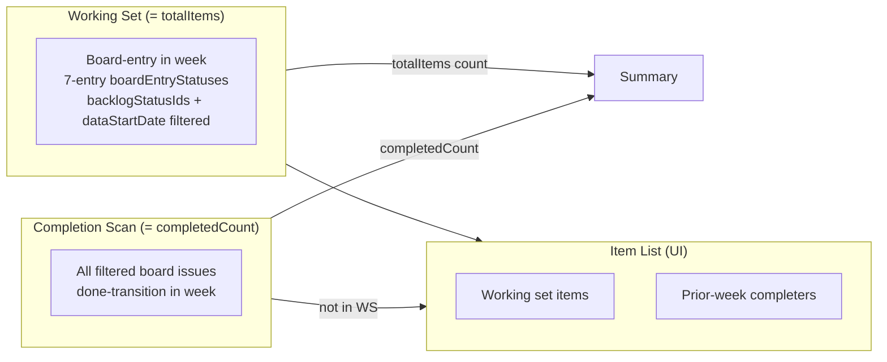

# 0066 — Align Pulse Kanban Metrics with Week Detail Report

**Date:** 2026-05-15
**Status:** Accepted
**Author:** Architect Agent
**Related ADRs:** ADR 0062 (Kanban Stability: Throughput Balance), ADR 0063 (Decouple Completed from Entry Date)

## Problem Statement

The pulse report and planning report show different numbers for PLAT in 2026-W20:

| Metric | Pulse (current) | Week Detail | Planning `getKanbanWeeks` | Correct |
|---|---|---|---|---|
| Total / Pulled In | 30 | 10 | 10 | 10 |
| Added | 23 | 4 (mid-week) | 4 (mid-week) | Remove for kanban |
| Completed | 13 | 13 | **4 (wrong — cohort only)** | **13** (board-wide throughput) |
| Started | 3 | — | — | Remove for kanban |

Root causes:
1. Pulse `buildSummary` is called on the expanded `items` array (which includes
   prior-week completers), inflating `totalItems` from 10 to 30 and computing
   `addedMidSprintCount` over those 30 items.
2. "Added mid-week" (grace period concept) adds no value for kanban — the meaningful
   numbers are simply: how many issues entered the board this week, and how many completed.
3. "Started" for kanban is always identical to total (tautological — board-entry = started).
4. Planning `getKanbanWeeks` uses a **cohort completion** definition (entered AND completed
   same week), which understates throughput. Kanban is about throughput — if 13 items were
   done this week, `completed` should be 13 regardless of when they entered.

All three reports should agree:
- **Total / Pulled In** = issues that entered the board this week = 10
- **Completed** = issues that completed this week (board-wide) = 13

## Proposed Solution

For kanban boards across all three reports (pulse, week-detail, planning), align on two
core metrics with a single board-wide completion definition:

### The two numbers that matter for kanban

1. **Pulled In / Total** = issues whose board-entry date is in `[weekStart, weekEnd]`
2. **Completed** = all filtered board issues with a done-transition in the week (board-wide throughput)

### Changes per report

#### Pulse (`all-items`)

| Change | Detail |
|---|---|
| Fix `buildSummary` call order | Call on working-set items BEFORE expanding with prior-week completers |
| Remove grace period | `kanbanAdd = false` always; `addedMidSprintCount = 0` for kanban |
| Keep item list expansion | Prior-week completers still appear in item list |
| Keep filters | 7-entry `boardEntryStatuses`, `backlogStatusIds`, `dataStartDate`, `cancelledStatuses` |

#### Week Detail (`/api/weeks/:boardId/:week/detail`)

Already correct — `completedIssues = 13` (board-wide scan added in this branch). No
further changes needed.

#### Planning `getKanbanWeeks` (`/api/planning/kanban-weeks/:boardId`)

| Change | Detail |
|---|---|
| Board-wide `completed` | Scan all filtered board issues for done-transition in the week window, not just the entry-week cohort |
| `deliveryRate` numerator | Use board-wide `completed` (was: cohort completed / pulled-in) |

The planning report currently defines `completed` as "issues that entered this week AND
had their first-ever done-transition within this week". This is a cohort delivery rate.
For kanban throughput, this is wrong — a team that completes 13 items should see
`completed = 13`, not `completed = 4` just because 9 of them entered in prior weeks.

### Summary fields for kanban

| Field | Value | Source |
|---|---|---|
| `totalItems` | Issues whose board-entry date is in `[weekStart, weekEnd]` | Working set size (unchanged) |
| `completedCount` | All filtered board issues with done-transition in week | Board-wide scan (unchanged) |
| `addedMidSprintCount` | **0** (not applicable for kanban) | Hardcoded — remove mid-week concept |
| `startedCount` | Same as `totalItems` | Keep as-is (entry = started for kanban) |

### Key fix: call `buildSummary` BEFORE expanding the items array

The current bug: `buildSummary(items)` is called after prior-week completers are pushed
into `items`, making `totalItems = workingSet + completers` instead of just `workingSet`.

Fix: call `buildSummary` on the working-set items only, then expand the items array for
the ticket list.

### Remove grace period / `kanbanAdd` for kanban

The 1-day grace period and `kanbanAdd` flag provide no useful signal for kanban boards.
On PLAT, work enters throughout the week — there is no meaningful "committed on Monday"
vs "added Tuesday+" distinction. Remove it:

- `kanbanAdd = false` for all kanban items (entered this week OR completed from prior week)
- `addedMidSprintCount = 0` for kanban in `buildSummary`
- Frontend hides the "Added" stat for kanban boards (or shows 0)

### Filters (unchanged from current commit)

The already-implemented filters remain correct:
- 7-entry `boardEntryStatuses` default
- `backlogStatusIds` exclusion on working set AND completion scan
- `dataStartDate` exclusion on working set AND completion scan
- `cancelledStatuses` exclusion on working set AND completion scan

### Item list

The kanban item list shows the union of:
- Issues that entered the board this week (working set)
- Issues that completed this week from prior weeks

All items have `kanbanAdd = false`. Prior-week completers have `started = false`,
`completed = true`.

### Cross-report guarantee

After this fix, for PLAT in any given week:
- Pulse `totalItems` = Planning `issuesPulledIn` = Week-detail `totalIssues` = 10
- Pulse `completedCount` = Planning `completed` = Week-detail `completedIssues` = 13
- Pulse `addedMidSprintCount` = 0 (kanban boards don't use this metric)

### Code changes

```typescript
// all-items.service.ts — key changes

// 1. Build summary from working-set items ONLY (before expanding)
const summary = this.buildSummary(items); // items = working set at this point

// 2. For kanban, zero out addedMidSprintCount (not applicable)
if (isKanban) {
  summary.addedMidSprintCount = 0;
}

// 3. kanbanAdd is always false (remove grace period concept)
const kanbanAdd = false; // was: isKanban && entryDate > gracePeriodEnd

// 4. Completion scan adds prior-week completers to items AFTER buildSummary
// (so they appear in the item list but don't inflate totalItems)
```



## Alternatives Considered

### Alternative A — Keep the 1-day grace period

Keep "Added mid-week" as a meaningful metric using the week-detail's grace period.

**Ruled out:** The user confirmed this is not useful for kanban. Kanban boards receive
work throughout the week — "committed on Monday" vs "added Tuesday+" is not a meaningful
planning signal. The planning report shows it but it adds noise, not value. Simplify.

### Alternative B — Show added as a percentage

Show `addedMidWeek / totalItems * 100` as a health indicator.

**Ruled out:** Same problem — the underlying concept (grace period) is not meaningful
for kanban workflow. A kanban board that pulls 4 items on Tuesday and 6 on Wednesday is
not less healthy than one that pulls 10 on Monday.

## Impact Assessment

| Area | Impact | Notes |
|---|---|---|
| Database | None | |
| API contract | None | Same fields, values change to correct ones |
| Frontend | Minor | Hide "Added" for kanban OR show 0 |
| Tests | Updated | Fix buildSummary call order, remove grace period tests for kanban |
| External API | None | |
| Infrastructure | None | |
| Observability | None | |
| Security / Compliance | None | |

## Open Questions

None.

## Acceptance Criteria

- Pulse `totalItems` for kanban = number of issues whose board-entry date is in the
  week window (working set only — NOT including prior-week completers)
- Pulse `totalItems` for PLAT 2026-W20 = 10 (matching planning report)
- Pulse `completedCount` for kanban = board-wide count of issues with done-transition
  in week (unchanged — already correct at 13)
- Pulse `addedMidSprintCount` for kanban = 0 (concept removed)
- `kanbanAdd = false` for all kanban items in the item list
- Prior-week completers appear in the item list with `completed = true`, `started = false`
- `buildSummary` is called on working-set items only, before the kanban completion scan
  expands the `items` array
- Planning `getKanbanWeeks` `completed` field uses board-wide throughput definition:
  counts all filtered board issues with a done-transition in the week, not just the
  entry-week cohort
- Planning `deliveryRate` uses board-wide `completed` as numerator
- All three reports show the same `completed` count for PLAT in any given week (13 for W20)
- Scrum boards are unaffected
- Existing `backlogStatusIds`, `dataStartDate`, `boardEntryStatuses` (7-entry), and
  `cancelledStatuses` filters remain in place

---

## Appendix — Observed Divergence (PLAT, 2026-W20)

### Planning Report (partially correct)
- Pulled In: **10** (correct)
- Completed: **4** (WRONG — cohort only; should be 13)
- Mid-Week: **4**
- Delivery Rate: **40%** (wrong — based on cohort completed)

### Week Detail Report (correct)
- Total: **10**
- Completed: **13** (board-wide — correct)
- Added Mid-Week: **4**

### Pulse Report (broken — before this fix)
- Total: **30** (inflated — includes prior-week completers in items array)
- Started: **3**
- Added: **23** (meaningless — computed over inflated items array)
- Completed: **13** (correct — board-wide scan working)
