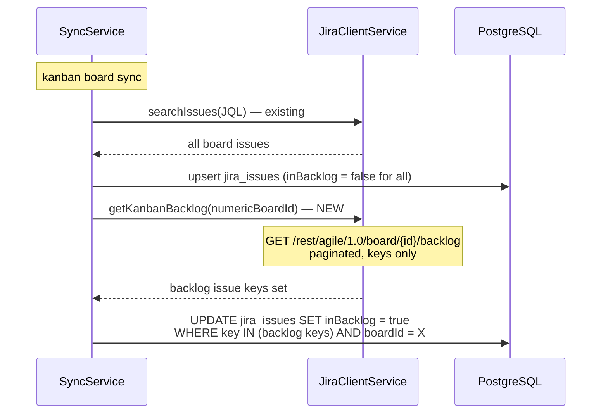
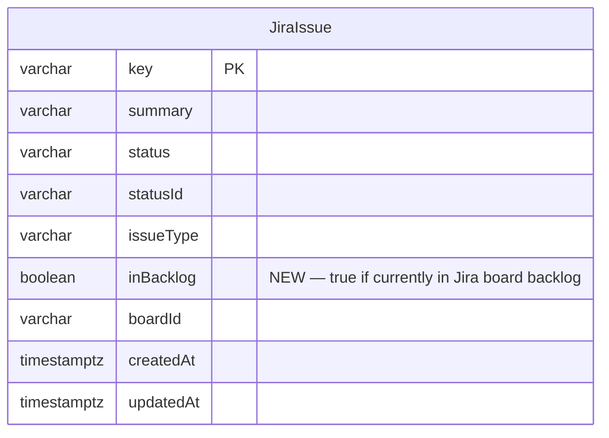

# 0067 — Kanban Backlog Membership via Jira Agile Backlog API

**Date:** 2026-05-15
**Status:** Accepted
**Author:** Architect Agent
**Related ADRs:** (pending acceptance)

## Problem Statement

The current kanban backlog exclusion logic in `filterKanbanIssues` relies on
`backlogStatusIds` (Jira status IDs configured per board) and a changelog-presence
heuristic as a fallback. This approach fails in practice: PLAT uses status ID `10303`
(`To Do`) for both pre-board backlog issues and active board issues whose workflow
returns them to `To Do`. An issue pushed back from `In Progress → To Do` (e.g.
PLAT-1293) has the same `statusId` and has changelogs — it is indistinguishable from
an issue actively selected and queued on the board (e.g. PLAT-1363). The only
authoritative source of truth for whether a kanban issue is on the board or in the
backlog is the Jira Agile API backlog endpoint:
`GET /rest/agile/1.0/board/{boardId}/backlog`.

As validated: the backlog endpoint correctly returns PLAT-1293 (in backlog) and
PLAT-1391 (in backlog) but does NOT return PLAT-1363 (on board, selected) or
PLAT-1410 (on board, unstarted). The current `statusId`-based approach cannot make
this distinction.

## Proposed Solution

During each kanban board sync, fetch the complete set of issue keys that are currently
in the board's backlog from the Jira Agile backlog endpoint, and persist this as an
`inBacklog: boolean` column on `JiraIssue`. All downstream kanban logic (`filterKanbanIssues`,
`getKanbanInFlight`) then uses `issue.inBacklog` as the single, authoritative gate —
replacing the `backlogStatusIds` and changelog-presence heuristics entirely.

### In-flight definition change

With `inBacklog` available, the in-flight definition becomes simply:

```
in-flight = not inBacklog AND not done AND not cancelled AND entered before this week
```

This correctly classifies:
- PLAT-1363 (`inBacklog = false`) → **in-flight** ✓
- PLAT-1293 (`inBacklog = true`) → **excluded** ✓
- PLAT-1391 (`inBacklog = true`) → **excluded** ✓
- PLAT-1410 (`inBacklog = false`) → **on board** (may appear in pulled-in once it enters)

### Data flow



### Schema change



`inBacklog` defaults to `false`. All issues start as `false` when upserting from the
JQL scan; the backlog sync pass then sets it to `true` for the backlog subset.

### New `JiraClientService` method

```typescript
async getKanbanBacklog(
  boardId: string,            // numeric Jira board ID
  startAt = 0,
): Promise<{ issues: Array<{ key: string }> ; total: number; maxResults: number }> {
  const url = `${this.baseUrl}/rest/agile/1.0/board/${boardId}/backlog`
    + `?startAt=${startAt}&maxResults=100&fields=summary`;
  return this.fetchWithRetry(url);
}
```

Paginated — loop until all keys are retrieved. `fields=summary` minimises payload;
only `key` is used.

### `syncKanbanIssuesWithConfig` changes

After the existing JQL upsert, add a backlog sync pass:

```typescript
// 1. Reset inBacklog for all issues on this board
await this.issueRepo.update({ boardId }, { inBacklog: false });

// 2. Fetch all backlog keys from Jira
const backlogKeys = await this.fetchKanbanBacklogKeys(numericBoardId);

// 3. Mark backlog issues
if (backlogKeys.length > 0) {
  await this.issueRepo
    .createQueryBuilder()
    .update(JiraIssue)
    .set({ inBacklog: true })
    .where('key IN (:...keys)', { keys: backlogKeys })
    .andWhere('boardId = :boardId', { boardId })
    .execute();
}
```

Step 1 (reset) is critical — it clears stale `inBacklog = true` for issues that were
moved from backlog to board since the last sync.

### `filterKanbanIssues` simplification

Replace the current `backlogStatusIds` + changelog heuristic with a single `inBacklog`
check:

```typescript
// Before (complex, unreliable):
if (backlogStatusIds.length > 0) {
  if (issue.statusId !== null) {
    if (backlogStatusIds.includes(issue.statusId)) return false;
  } else {
    if (!issueKeysWithStatusChangelog.has(issue.key)) return false;
  }
} else {
  if (!issueKeysWithStatusChangelog.has(issue.key)) return false;
}

// After (single authoritative check):
if (issue.inBacklog) return false;
```

`FilterKanbanIssuesArgs` drops `backlogStatusIds` and `issueKeysWithStatusChangelog`.
`BoardConfig.backlogStatusIds` and the related settings UI field become redundant and
can be deprecated in a follow-up.

### `getKanbanInFlight` simplification

`inBacklog` is already enforced upstream by `filterKanbanIssues` — `filteredIssues`
passed to `getKanbanInFlight` will never contain backlog issues. No change needed to
the function signature or body.

## Alternatives Considered

### Alternative A — Keep `backlogStatusIds`, fix with `backlogStatusNames`

Add a `backlogStatusNames` config field so operators can specify status names (not IDs)
for backlog statuses, giving a second check path when `statusId` is null or reused.

**Ruled out:** Still fundamentally wrong for the PLAT case. `To Do` (ID 10303) is
legitimately used for both backlog and board-selected issues. No status-name or
status-ID check can distinguish them — the Jira board membership model is the only
authoritative signal.

### Alternative B — Infer from changelog direction

If the most recent status transition was `X → To Do` where `X` was an active status
(In Progress, Pending), treat it as "returned to backlog"; if there is no return
transition, treat it as "freshly selected".

**Ruled out:** Brittle and incorrect. PLAT-1363 ends with `Pending → To Do` — that
would be classified as "returned to backlog" under this heuristic, but it is actually
still on the board. The changelog direction cannot reliably encode backlog membership.

### Alternative C — Store numeric board ID in `BoardConfig`

Cache the numeric board ID in `BoardConfig` to avoid re-resolving it each sync for the
backlog API call.

**Considered but deferred:** `resolveNumericBoardId()` already exists and is called
for every scrum sync. Reusing it for kanban is one additional API call per sync and
the result can be re-used within the same sync invocation. Not worth the schema
complexity of adding a new persisted field right now. Can be optimised in a future ADR.

## Impact Assessment

| Area | Impact | Notes |
|---|---|---|
| Database | Migration required | Add `inBacklog boolean NOT NULL DEFAULT false` to `jira_issues` |
| API contract | None | `inBacklog` is an internal field — not exposed via any public API response |
| Frontend | None | No frontend changes needed |
| Tests | New unit tests | `getKanbanBacklog` client method; backlog sync pass; updated `filterKanbanIssues` tests |
| External API | New endpoint | `GET /rest/agile/1.0/board/{id}/backlog` — paginated. Rate limit risk: one extra paginated call per kanban board per sync. For PLAT with ~1000 issues this is ~10 extra requests per sync. Within existing throttle limits (max 5 concurrent, 100ms interval). |
| Infrastructure | None | |
| Observability | None | |
| Security / Compliance | None | Internal data only |

## Open Questions

None.

## Acceptance Criteria

- `JiraIssue` entity has an `inBacklog: boolean` column, default `false`
- A TypeORM migration is provided with both `up()` and `down()`
- `SyncService.syncKanbanIssuesWithConfig` calls the Jira backlog endpoint after
  the JQL issue upsert and sets `inBacklog = true` for all keys returned by the
  backlog endpoint
- Before setting backlog keys, all issues for the board are reset to `inBacklog = false`
  (stale backlog membership is cleared on every sync)
- `JiraClientService` has a new `getKanbanBacklog(boardId, startAt?)` method that
  calls `GET /rest/agile/1.0/board/{id}/backlog` with pagination
- `filterKanbanIssues` uses `issue.inBacklog` as the sole backlog exclusion check —
  `backlogStatusIds` and `issueKeysWithStatusChangelog` parameters are removed
- `getKanbanInFlight` is unchanged (backlog exclusion handled upstream by `filterKanbanIssues`)
- For PLAT: PLAT-1293 and PLAT-1391 have `inBacklog = true` after sync; PLAT-1363
  and PLAT-1410 have `inBacklog = false`
- PLAT-1293 does NOT appear in the in-flight count or item list for any week
- PLAT-1363 DOES appear in the in-flight count and item list for weeks where it entered
  the board before that week
- `backlogStatusIds` board config field is retained in the schema (not removed) but
  is no longer used by `filterKanbanIssues` — it is marked deprecated in the settings UI
- Scrum boards are entirely unaffected — `inBacklog` is always `false` for scrum issues
  and the backlog sync pass only runs for `boardType === 'kanban'`
- All existing kanban metric tests continue to pass
