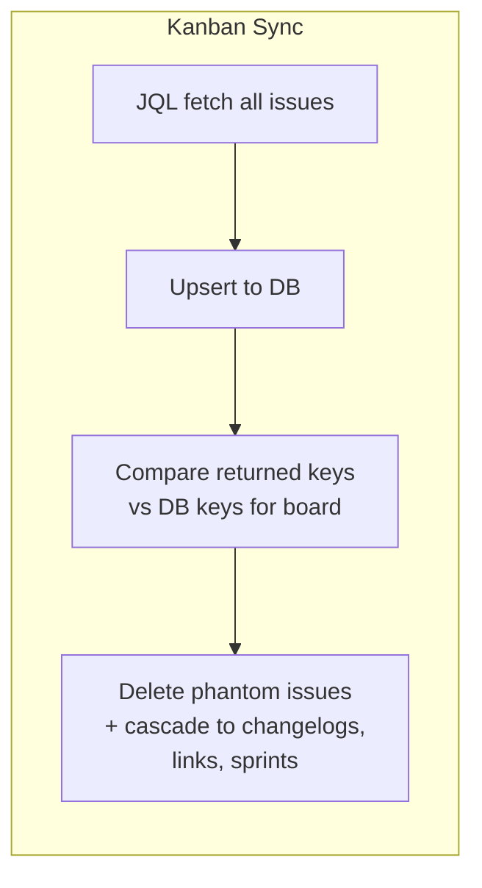

# 0068 — Sync Deleted Jira Issues: Reconcile DB Against JQL Response

**Date:** 2026-05-15
**Status:** Accepted
**Author:** Architect Agent
**Related ADRs:** ADR 0048 (Sync includes cancelled issues)

## Problem Statement

The kanban sync uses `issueRepo.upsert()` — it creates or updates issues but never
deletes them. If an issue is deleted in Jira after being synced, it persists in the
DB indefinitely. This produces phantom issues that inflate metric counts.

Confirmed case: PLAT-1403 was deleted in Jira but exists in our DB with `status = Done`
and a done-transition in W20. It is counted in `completedCount` for W20, making the
pulse and week-detail show 14 completions when the correct number is 13.

The same problem will exist for scrum boards — deleted issues remain in `jira_issues`
and continue to affect sprint membership and metrics.

## Proposed Solution

At the end of each board sync, reconcile the DB against the full set of keys returned
by Jira and delete any issue not present in the response.

### Kanban

The kanban JQL `project = PLAT ORDER BY updated DESC` already fetches every current
issue for the board. After upserting, compare the returned keys against all keys in the
DB for that board and delete the difference.

```typescript
// After upsert
const returnedKeys = new Set(allIssues.map(i => i.key));
const dbKeys = await this.issueRepo.find({
  where: { boardId },
  select: ['key'],
});
const deletedKeys = dbKeys
  .map(i => i.key)
  .filter(k => !returnedKeys.has(k));

if (deletedKeys.length > 0) {
  await this.changelogRepo.delete({ issueKey: In(deletedKeys) });
  await this.issueLinkRepo.delete({ sourceIssueKey: In(deletedKeys) });
  await this.issueSprintRepo.delete({ issueKey: In(deletedKeys) });
  await this.issueRepo.delete(deletedKeys); // parent row last
}
```

### Scrum

The scrum JQL `project = X AND sprint is not EMPTY` fetches all issues that have ever
been in a sprint. Deletion reconciliation is slightly riskier here — an issue that was
removed from all sprints would appear deleted from the JQL response but might still be
valid history. A safer approach: only delete scrum issues that were explicitly deleted
in Jira (i.e. a 404 on the Jira issue API), not just absent from the JQL response.

Scrum deletion detection is deferred to a follow-up proposal.

### Cascade deletes

When deleting a `jira_issue`, also delete:
- `jira_changelogs` where `issueKey = key`
- `jira_issue_links` where `sourceIssueKey = key`
- `jira_issue_sprints` where `issueKey = key`

These tables do not have foreign key constraints to `jira_issues` so cascades must be
handled explicitly in the sync service.



## Alternatives Considered

### Alternative A — Soft delete (mark inDeleted flag)

Add an `inDeleted` boolean and filter it everywhere rather than hard deleting.

**Ruled out:** Adds filter complexity to every query. Hard delete is correct — a deleted
Jira issue is gone and should not affect any metric.

### Alternative B — Only reconcile on full sync, not incremental

Only delete when performing a full sync (all issues), not when syncing a subset.

**Not applicable:** Kanban sync already fetches all issues via JQL on every sync run.

## Impact Assessment

| Area | Impact | Notes |
|---|---|---|
| Database | Rows deleted | Cascade to changelogs, issue_links, issue_sprints |
| API contract | None | No response shape changes |
| Frontend | None | |
| Tests | New unit tests | Reconciliation logic in SyncService |
| External API | None | No new Jira calls |
| Infrastructure | None | |
| Observability | Log count of deleted issues per sync | |
| Security / Compliance | None | Internal data only |

## Open Questions

None.

## Acceptance Criteria

- After a kanban sync, any `jira_issue` with `boardId = X` that was not returned by
  the JQL scan is deleted from the DB
- Associated `jira_changelogs`, `jira_issue_links`, and `jira_issue_sprints` rows are
  also deleted for the same keys
- PLAT-1403 is absent from the DB after the next PLAT sync
- Deletion count is logged at INFO level per sync run
- Scrum boards are not affected by this change (deferred)
- Existing issue and changelog data for non-deleted issues is unchanged
