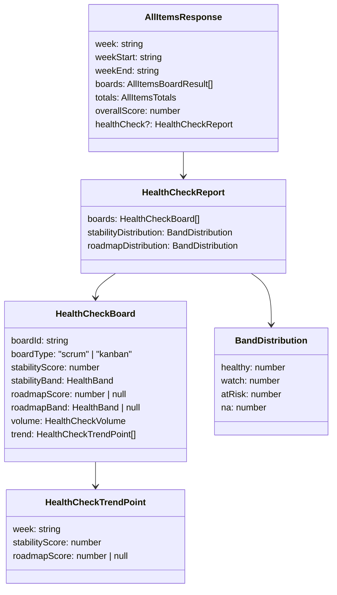

# 0071 — Engineering Health Check Panel

**Date:** 2026-07-28
**Status:** Accepted
**Author:** Architect Agent
**Related ADRs:** ADR 0065 (this proposal's decision); ADR 0062 (Kanban stability — throughput balance), ADR 0063 (Kanban pulse decouple completed from entry date), ADR 0070-derived scrum stability (proposal 0070).

## Problem Statement

Engineering leadership needs a durable weekly **health check** for two dimensions —
**stability** (did teams do what they planned?) and **roadmap delivery** (was completed
output planned work?) — suitable for exec reporting. The existing Pulse report
(`all-items` module) already computes per-board `stabilityScore` and
`roadmapAlignmentScore`, but presents them as isolated single-week ratios with no volume
context, no trend, and an org `overallScore` that is a mean-of-ratios in which quiet or
empty boards contribute 100 (so a quiet week looks "healthier" than a busy one). Presented
to execs unmodified, these numbers are easy to misread and invite cross-team ranking that
would incentivise gaming (avoid support tickets, keep boards quiet, over-link to roadmap).

## Proposed Solution

Add a **Health Check** section to the existing `all-items` feature, rendered **above** the
Pulse report on the same `/all-items` page, visible **only for completed (non-current)
weeks**. It reuses the existing per-board `stabilityScore` / `roadmapAlignmentScore` /
`summary` computed by `AllItemsService`, wrapping them with:

1. **Volume context** beside each score (Scrum: committed / added / completed; Kanban:
   pulled-in / completed).
2. **RAG banding** — `≥85` healthy, `70–<85` watch, `<70` at-risk — via a shared pure
   helper.
3. **A rolling 4-week trend** (selected week + prior 3), computed on-the-fly by reusing
   the existing per-board calculation for each prior week. No persistence, no schema
   change.
4. **An org distribution** — counts of boards per RAG band for stability and roadmap
   delivery — instead of a single averaged org score.

### Affected components

- **`backend/src/all-items/all-items.service.ts`** — add a `buildHealthCheck()` step that
  runs **only when the requested week is completed**. It refactors the existing
  per-board computation so the two headline scores + volume for a `(board, week)` can be
  produced for the current and 3 prior weeks, then bands and aggregates them.
- **`backend/src/all-items/dto/all-items-response.dto.ts`** — add an optional
  `healthCheck?: HealthCheckReport` field to `AllItemsResponse` (additive, non-breaking).
- **`backend/src/all-items/all-items.controller.ts`** — no signature change; the service
  decides whether to populate `healthCheck` based on the week.
- **`backend/src/lib/health-check-bands.ts`** *(new, pure)* — `classifyHealthBand(score):
  'healthy' | 'watch' | 'at-risk'` and distribution helpers. Pure functions, no DB.
- **`frontend/src/lib/api.ts`** — extend the `AllItemsResponse` type with the optional
  `healthCheck` shape (no new fetch wrapper — same endpoint).
- **`frontend/src/app/all-items/page.tsx`** — render a new `HealthCheckPanel` above the
  Pulse content, gated on `!isCurrentWeek && data.healthCheck` (the page already computes
  `isCurrentWeek`).

### "Completed week" determination

The frontend already treats a week as current when `weekParam === currentIsoWeek()`. The
backend needs the same notion server-side to decide whether to populate `healthCheck`. The
service computes the current ISO week from the configured `TIMEZONE` (already read in
`getAllItems`) using the existing `isoWeekKeyToDates` helper: a week is **completed** when
its `weekEnd` is strictly before "now". The panel is omitted (field absent) for the
current or any future week.

### Data flow

```mermaid
flowchart TD
    UI["/all-items page"] -->|GET /api/all-items?week=W| CTRL[AllItemsController]
    CTRL --> SVC[AllItemsService.getAllItems]
    SVC --> PULSE[Per-board Pulse compute (unchanged)]
    SVC --> ISCOMPLETE{week completed?}
    ISCOMPLETE -->|no| RESP[Response: boards, totals, overallScore]
    ISCOMPLETE -->|yes| HC[buildHealthCheck: reuse per-board compute for W, W-1, W-2, W-3]
    HC --> BAND[classifyHealthBand + distribution]
    BAND --> RESP2[Response + healthCheck section]
    RESP --> UI
    RESP2 --> UI
    UI -->|healthCheck present| PANEL[HealthCheckPanel above Pulse]
    UI -->|absent| PULSEONLY[Pulse only]
```

### Response shape (additive)



`roadmapScore`/`roadmapBand` are `null` when a board completed nothing that week
(mirrors the existing Pulse `n/a`). Such boards count toward `na` in the distribution and
are excluded from healthy/watch/at-risk — they neither inflate nor deflate the picture.
Scrum and Kanban volume are distinct shapes; the frontend labels them separately and never
sums them.

## Alternatives Considered

### Alternative A — Persist weekly snapshots in a new entity

Write a `HealthCheckSnapshot` (like `DoraSnapshot`) post-sync and read trends from it.

**Ruled out for v1:** schema change + Lambda/post-sync wiring for a bespoke, explicitly
deletable report. On-the-fly computation over 4 weeks reuses read-only queries already
performed per board and avoids new storage, migrations, and infra. Can be revisited if
latency proves unacceptable.

### Alternative B — Separate `GET /api/all-items/health-check` endpoint

**Ruled out:** the panel is tightly coupled to the Pulse page and always displayed
alongside it. A second endpoint means two requests and duplicate week/board plumbing for
no separation benefit. The additive field keeps it one request, one page.

### Alternative C — Single averaged org health score

**Ruled out explicitly:** a mean-of-ratios rewards quiet/empty boards and invites
ranking. A RAG distribution communicates "where to look" without a gameable headline
number. This is the core motivation of the feature.

## Impact Assessment

| Area | Impact | Notes |
|---|---|---|
| Database | None | No new entity, no migration; read-only reuse of existing queries |
| API contract | Additive | Optional `healthCheck` field on existing `GET /api/all-items` response; absent for current/future weeks |
| Frontend | New component | `HealthCheckPanel` above Pulse on `/all-items`; gated on `!isCurrentWeek && healthCheck` |
| Tests | New unit tests | Band classifier, distribution aggregation, completed-week gating, 4-week trend, scrum vs kanban volume; frontend panel + gating tests |
| External API | No new calls | Uses already-synced Jira data in Postgres |
| Infrastructure | None | No new resource, no IAM/network change |
| Observability | None | No new log fields required (bespoke read path) |
| Security / Compliance | None | No new data class, no new exposure; same WAF-gated endpoint (ADR 0034); all data internal |

## Performance note

`buildHealthCheck` runs the per-board computation for up to 4 weeks × N boards, only on
completed-week requests. Boards are already processed in parallel (`Promise.all`); prior
weeks add read-only queries (issues, changelogs, memberships) already bounded per board.
The current-week request path (the common case) is unchanged. If latency is material, the
trend can be memoised within the request or reduced to the two headline scores (already
its scope).

## Open Questions

None — resolved during intake:
- Completed-week definition follows the existing Pulse current-week gate (server-derived
  from configured `TIMEZONE`).
- Trend computed on-the-fly (Alternative A deferred).
- Banding fixed at ≥85 / 70–<85 / <70.
- Delivered via additive field on the existing endpoint.

## Acceptance Criteria

- [ ] `GET /api/all-items?week=W` includes a `healthCheck` object **only when W is a
      completed week**; the field is absent for the current or a future week.
- [ ] `healthCheck.boards[]` contains, per board: `stabilityScore` + `stabilityBand`,
      `roadmapScore`/`roadmapBand` (null when nothing completed), a `volume` object
      (scrum: committed/added/completed; kanban: pulledIn/completed), and a `trend` array
      of the selected week + 3 prior weeks.
- [ ] `stabilityBand`/`roadmapBand` are classified as `healthy` (≥85), `watch` (70–<85),
      `at-risk` (<70) by a shared pure helper in `backend/src/lib/health-check-bands.ts`.
- [ ] `healthCheck.stabilityDistribution` and `roadmapDistribution` report counts per band
      (`healthy`/`watch`/`atRisk`/`na`); boards with a null roadmap score count only toward
      `na`.
- [ ] Scrum and Kanban stability values are represented with distinct volume shapes and are
      never summed or averaged into a single cross-board-type figure.
- [ ] The frontend renders a `HealthCheckPanel` **above** the Pulse report on `/all-items`
      when `!isCurrentWeek` and `healthCheck` is present; it is **hidden** on the current
      week with the Pulse report rendering unchanged.
- [ ] No existing Pulse `summary` count, `healthScore`, `totals`, or `overallScore` value
      changes for any week (verified by unchanged existing tests).
- [ ] New backend unit tests cover: completed-week gating, band classification boundaries
      (69/70/84/85), distribution aggregation incl. `na`, and the 4-week trend.
- [ ] New frontend tests cover: panel visibility gating (current vs completed week) and
      rendering of scores + volume + distribution.
