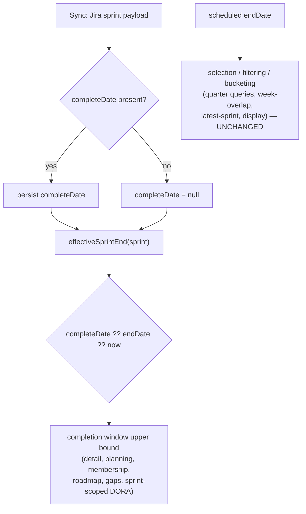
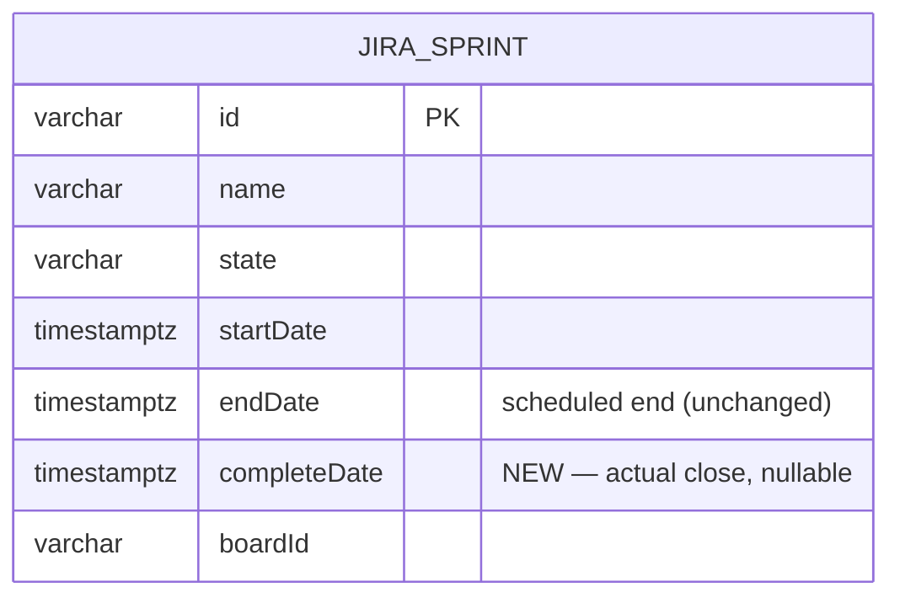

# 0072 — Use Sprint Actual Close Time (completeDate) for Completion & Metric Windows

**Date:** 2026-07-28
**Status:** Accepted
**Author:** Architect Agent
**Related ADRs:** ADR 0066 (this proposal's decision); ADR 0006 (sprint membership reconstructed from changelog).

## Problem Statement

Sprint completion and every sprint-scoped metric window bound on the **scheduled**
`sprint.endDate`, but teams frequently close sprints *after* their scheduled end. Jira
returns the actual close time as `completeDate`, which we currently discard
(`sync.service.ts:636` maps only `s.endDate`; the `JiraSprint` entity/table has no
`completeDate` column, even though `jira.types.ts:15` already declares the field). As a
result, work completed between the scheduled end and the real close is silently excluded:
sprint **DATA/4129** (`endDate` 2026-07-02T16:00Z, `completeDate` 2026-07-06T00:12Z) shows
`completedInSprintCount = 0` while Jira's own burndown (which uses `completeDate`) shows
all 8 issues finishing as the sprint closed. Measured on the local DB, **717 issues across
81 closed sprints on all 5 scrum boards** are currently mis-excluded.

## Proposed Solution

Persist Jira's `completeDate` and adopt a single **effective sprint end** =
`completeDate ?? endDate` (then the existing `?? now` fallback for active sprints) as the
upper bound of every **completion / membership / metric window**. Sprint
**selection/filtering/bucketing** by scheduled date is deliberately left on `endDate`.

### 1. Schema + sync (data layer)

- Add nullable `completeDate: timestamptz` to `JiraSprint` entity + a TypeORM migration
  (`up()` adds the column, `down()` drops it).
- `SyncService.syncSprints` maps `sprint.completeDate = s.completeDate ? new Date(...) : null`.
- `completeDate` repopulates on the next full sync per board (no backfill script).

### 2. Shared helper (single source of truth)

New pure helper `backend/src/lib/sprint-window.ts`:

```ts
// Effective end of a sprint's activity window.
// completeDate (actual close) takes priority over endDate (scheduled);
// falls back to `now` for active sprints with neither set.
export function effectiveSprintEnd(
  sprint: { completeDate?: Date | null; endDate?: Date | null },
  now: Date = new Date(),
): Date {
  return sprint.completeDate ?? sprint.endDate ?? now;
}
```

Every consumer imports this — the `?? ` fallback is never re-inlined.

### 3. Consumers — change vs leave

The audit below is authoritative for implementation. **Change** = replace the
completion/window upper bound with `effectiveSprintEnd(sprint)`. **Leave** = keep
`endDate` (selection/filtering/display by scheduled date).

| File | Line(s) | Usage | Action |
|---|---|---|---|
| `sprint/sprint-detail.service.ts` | 470 `sprintWindowEnd` | completion window upper bound | **Change** + add `SPRINT_GRACE_PERIOD_MS` |
| `planning/planning.service.ts` | 222–235 `upperBound` | completed-transition bound (closed sprint) | **Change** (grace already applied) |
| `sprint-membership/sprint-membership.service.ts` | 235 `sprintEnd` | membership-ended cutoff | **Change** |
| `roadmap/roadmap.service.ts` | 325, 1061 `sprintEnd` | in-sprint roadmap classification | **Change** |
| `gaps/gaps.service.ts` | 270 `windowEnd` | closed-sprint activity window | **Change** |
| `metrics/metrics.service.ts` | 216, 468, 524 | DORA window end when scoped to a specific sprint | **Change** |
| `roadmap/roadmap.service.ts` | 171 `WHERE s.endDate <= :end` | quarter sprint selection | **Leave** |
| `planning/planning.service.ts` | 131 `WHERE s.endDate <= :end` | quarter sprint selection | **Leave** |
| `all-items/all-items.service.ts` | 757 sprint-overlaps-week query | week selection | **Leave** |
| `metrics/metrics.service.ts` | 376, 389–390, 399, 427 | quarter range / latest-sprint selection | **Leave** |
| `sprint-report/sprint-report.service.ts` | 186 | reads `planning.completed` / detail summary | **No change** (fix propagates); 286/306/348 are display — **Leave** |
| `sprint/sprint-detail.service.ts` | 624/644, `support:570` | displayed scheduled `endDate` | **Leave** (see Open Q1) |

### Decision flow



### Schema change



## Alternatives Considered

### Alternative A — Completion-windowing only (narrow scope)
Change just `sprint-detail` + `planning`. **Ruled out** at user's direction: membership,
roadmap, gaps and sprint-scoped DORA share the same conceptual "when did the sprint end"
and would remain inconsistent (e.g. Planning says an issue completed in-sprint while
Roadmap classifies it out-of-window). Broader scope gives one coherent definition.

### Alternative B — Overwrite `endDate` with `completeDate` on sync
Simplest (no new column). **Ruled out:** destroys the scheduled-vs-actual distinction that
selection/bucketing needs — a sprint closed in the next quarter would move quarters and
distort period reports. We must retain both dates.

### Alternative C — Backfill script for historical `completeDate`
**Ruled out for now:** the daily sync repopulates `completeDate` for all closed sprints on
its next run; a bespoke script is redundant. Revisit only if immediate correction is
required before the next sync.

## Impact Assessment

| Area | Impact | Notes |
|---|---|---|
| Database | Migration required | Nullable `completeDate` column on `jira_sprints`; `up()`+`down()` |
| API contract | None (behavioural) | Same endpoints/shapes; completion counts change for late-closed sprints. `completeDate` exposure deferred (Open Q1) |
| Frontend | None | Sprint Detail "Completed" ✓ populates correctly with no FE change; tooltip becomes accurate |
| Tests | New + updated unit tests | Shared helper; DATA/4129 regression (→8); per-service window tests; assert selection queries still use `endDate` |
| External API | No new calls | `completeDate` already returned by the existing `getSprints` call |
| Infrastructure | None | — |
| Observability | None | — |
| Security / Compliance | None | Internal data class; no new exposure |

## Open Questions

1. Should responses that currently expose the scheduled `endDate` (Sprint Detail header,
   Sprint Report list) **also** expose `completeDate` so the UI can flag "closed late"?
   **Resolved at sign-off (accepted):** yes — add `completeDate` to those responses
   (additive, non-breaking); any UI badge deferred to a later change.
2. `metrics.service.ts` sprint-scoped DORA: confirmed lines 216/468/524 are the
   sprint-completion window ends (change); 376/389–390/399/427 are quarter-range/selection
   (leave). Flagged for reviewer verification.

## Acceptance Criteria

- [ ] `JiraSprint` has a nullable `completeDate`; a migration adds it with a working
      `down()` that drops it.
- [ ] `SyncService.syncSprints` persists `completeDate` from the Jira response; active
      sprints (no `completeDate`) store `null`.
- [ ] A shared `effectiveSprintEnd(sprint)` helper returns `completeDate ?? endDate ?? now`
      and is the only place the fallback is expressed.
- [ ] Sprint Detail, Planning, Sprint-Membership, Roadmap (in-sprint), Gaps (closed-sprint),
      and sprint-scoped DORA use `effectiveSprintEnd` as the completion/window upper bound.
- [ ] Sprint Detail completion applies `SPRINT_GRACE_PERIOD_MS`, matching Planning; the
      "Completed" tooltip is now accurate.
- [ ] For DATA/4129 after re-sync, `completedInSprintCount = 8`
      (DATA-413/414/415/416/427/430/431/432); DATA-423 (To Do) is not completed.
- [ ] Selection/filtering/bucketing queries still bound on `endDate` — quarter membership
      and week-overlap results are unchanged (covered by a test asserting the query uses
      `endDate`).
- [ ] A sprint with `completeDate = null` behaves exactly as before the change.
- [ ] All existing sprint/planning/roadmap/gaps/metrics tests pass or are updated with a
      documented reason for each expected-value change.
