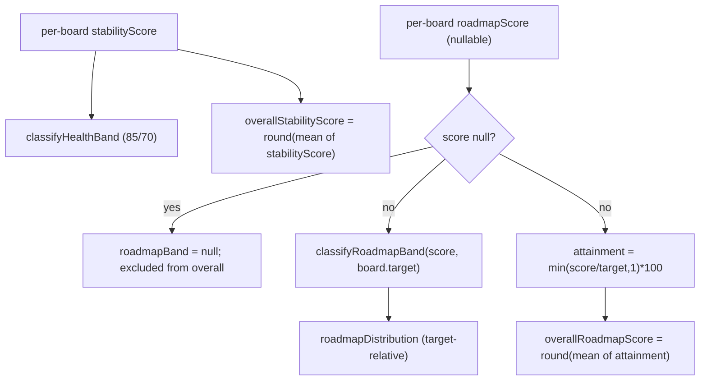
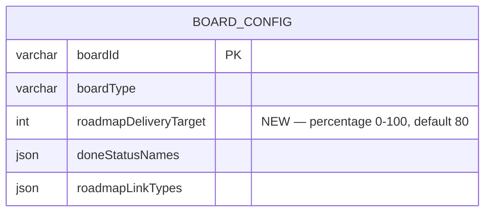

# 0073 — Health Check Org Overall Scores & Per-Team Roadmap Targets

**Date:** 2026-07-28
**Status:** Accepted
**Author:** Architect Agent
**Related ADRs:** ADR 0067 (this proposal's decision); ADR 0065 (Engineering Health Check on-the-fly trend + RAG distribution); ADR 0003 (per-board configurable rules in BoardConfig).

## Problem Statement

The Engineering Health Check (feature 0014 / ADR 0065) reports per-board stability and
roadmap-delivery scores plus a RAG distribution, but has no single org-level headline for
each dimension and grades roadmap delivery against one global threshold (85/70). Teams have
different roadmap-delivery expectations — PLAT targets ~50% (more reactive/unplanned work),
product teams ~80% — so the global threshold mislabels PLAT as "at-risk" for meeting its
actual goal and drags any org average down unfairly. We need (a) org overall scores for
exec reporting and (b) per-team roadmap targets that drive banding relative to each team.

## Proposed Solution

Add a per-board `roadmapDeliveryTarget` to `BoardConfig` and use it to (1) make roadmap RAG
banding target-relative and (2) compute an org overall roadmap score as mean attainment
vs target. Also add an org overall stability score (simple mean). All additive to the
existing `healthCheck` payload; no change to the underlying per-board score calculations.

### 1. Config (data layer)

- `BoardConfig.roadmapDeliveryTarget: number` — integer percentage, default **80**;
  migration seeds/defaults 80 and sets PLAT to **50**.
- `UpdateBoardConfigDto` gains an optional `roadmapDeliveryTarget` validated
  `@IsInt() @Min(0) @Max(100)`; the boards settings page can edit it.

### 2. Banding (shared helper)

`backend/src/lib/health-check-bands.ts` gains a target-aware roadmap classifier; stability
keeps the existing fixed-threshold `classifyHealthBand`:

```ts
export const ROADMAP_WATCH_MARGIN = 15;

// Roadmap banding relative to a per-team target:
//   healthy   score >= target
//   watch     score >= target - ROADMAP_WATCH_MARGIN
//   at-risk   below
export function classifyRoadmapBand(score: number, target: number): HealthBand {
  if (score >= target) return 'healthy';
  if (score >= target - ROADMAP_WATCH_MARGIN) return 'watch';
  return 'at-risk';
}

// Attainment vs target, capped at 100 so beating the target doesn't inflate the mean.
export function roadmapAttainment(score: number, target: number): number {
  if (target <= 0) return 100;
  return Math.min(Math.round((score / target) * 100), 100);
}
```

Stability continues to use `classifyHealthBand` (85/70). Roadmap now uses
`classifyRoadmapBand(score, target)`.

### 3. Health Check assembly (`AllItemsService.buildHealthCheck`)

- Each `HealthCheckBoard` gains `roadmapDeliveryTarget: number`; `roadmapBand` is computed
  via `classifyRoadmapBand(roadmapScore, target)` (null score → null band, unchanged).
- `HealthCheckReport` gains:
  - `overallStabilityScore: number` = `round(mean(board.stabilityScore))`.
  - `overallRoadmapScore: number | null` = `round(mean(roadmapAttainment(score, target)))`
    over boards whose `roadmapScore` is non-null; `null` when every board is null.
- The RAG `roadmapDistribution` now reflects target-relative bands (bands come from
  `classifyRoadmapBand`), so the distribution automatically respects each team's target.

### 4. Frontend

- `frontend/src/lib/api.ts`: extend `HealthCheckBoard` with `roadmapDeliveryTarget` and
  `HealthCheckReport` with `overallStabilityScore` / `overallRoadmapScore`.
- `HealthCheckPanel`: render the two org overall scores in the header; show the target next
  to each board's roadmap score (e.g. `78% (target 80%)`).
- **UI transparency (tooltips):** the panel must explain how the scores work via tooltips —
  (a) roadmap score/band tooltip states the team's target and the banding rule
  (`healthy ≥ target, watch ≥ target−15, at-risk below`); (b) org overall roadmap tooltip
  states it is the mean of each team's attainment vs its own target, capped at 100%, with
  no-completion teams excluded; (c) org overall stability tooltip states it is the simple
  mean of team stability scores (fixed 85/70 banding).
- Board settings page: add a numeric input for `roadmapDeliveryTarget` (0–100).

### Banding & scoring flow



### Schema change



## Alternatives Considered

### Alternative A — Target as an arithmetic weight in the average
Multiply each board's contribution by its target. **Ruled out:** mathematically opaque,
hard to explain to execs, and doesn't express the real intent ("grade each team against
its own bar"). Attainment-vs-target is the clear expression.

### Alternative B — Global config / env var for targets
Single target with no per-board override, or per-board via YAML config baked into the
image. **Ruled out:** the PLAT=50 vs others=80 requirement is inherently per-board and
should be runtime-editable by the team via the existing settings UI, consistent with all
other per-board rules living in `BoardConfig` (ADR 0003).

### Alternative C — Raw mean for org roadmap number
Org roadmap = simple mean of raw roadmap %s. **Ruled out:** PLAT's legitimate 50% target
permanently drags the org number down; attainment-vs-target treats a team meeting its goal
as 100%, which is the fair exec-reporting semantic.

## Impact Assessment

| Area | Impact | Notes |
|---|---|---|
| Database | Migration required | Add `roadmapDeliveryTarget int NOT NULL DEFAULT 80` to `board_configs`; seed PLAT=50 |
| API contract | Additive | `healthCheck` gains org scores + per-board target; `UpdateBoardConfigDto` gains optional field; board config GET returns it |
| Frontend | Component + settings change | Panel renders org scores + target; board settings adds a numeric input |
| Tests | New + updated | Band helper (target boundaries), attainment, org means (null handling), DTO validation, panel render, settings input |
| External API | No new calls | Uses already-synced data |
| Infrastructure | None | Schema migration only |
| Observability | None | — |
| Security / Compliance | None | Internal config value (0–100); validated; no new exposure or data class |

## Open Questions

None — resolved at intake (banding threshold not weight; attainment for org number;
BoardConfig + settings UI; stability stays 85/70; watch = target − 15).

## Acceptance Criteria

- [ ] `BoardConfig.roadmapDeliveryTarget` exists, integer, default 80; migration seeds
      PLAT=50 and has a working `down()`.
- [ ] `UpdateBoardConfigDto.roadmapDeliveryTarget` is optional, validated int 0–100;
      `GET`/`PUT /api/boards/:id/config` round-trip the value.
- [ ] `classifyRoadmapBand(score, target)` returns `healthy` (≥target), `watch`
      (≥target−15), `at-risk` (below); `classifyHealthBand` (stability, 85/70) unchanged.
- [ ] `roadmapAttainment(score, target)` = `min(round(score/target*100), 100)`;
      returns 100 when target ≤ 0.
- [ ] Each `healthCheck.boards[]` entry includes `roadmapDeliveryTarget`, and `roadmapBand`
      is computed relative to that target.
- [ ] `healthCheck.overallStabilityScore` = rounded mean of board `stabilityScore`.
- [ ] `healthCheck.overallRoadmapScore` = rounded mean of per-board attainment over
      non-null boards; `null` when all boards are null.
- [ ] `roadmapDistribution` reflects target-relative bands (PLAT at 55% with target 50 →
      healthy, not at-risk).
- [ ] Panel shows the two org overall scores and each board's target beside its roadmap
      score; board settings can edit the target.
- [ ] Tooltips explain the calculations: roadmap band/score tooltip states the team target
      and banding rule; org roadmap tooltip states "mean attainment vs each team's target,
      capped at 100%, teams with no completions excluded"; org stability tooltip states
      "simple mean of team stability scores".
- [ ] New backend + frontend unit tests cover all the above; existing Health Check tests
      pass or are updated with a documented reason.
