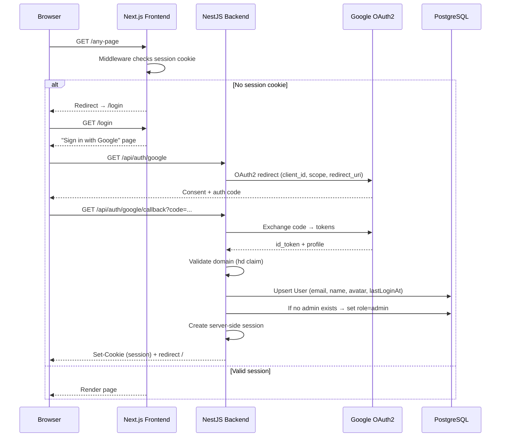
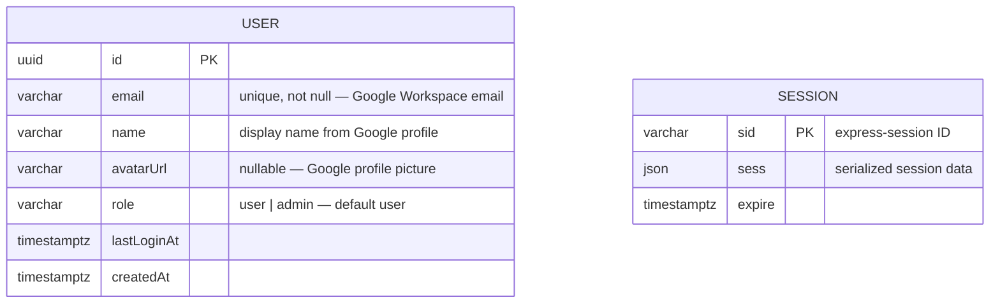

# 0074 — Google SSO Authentication & Role-Based Access Control

**Date:** 2026-07-28
**Status:** Accepted
**Author:** Architect Agent
**Related ADRs:** Supersedes ADR 0020 (no application-level auth), supersedes ADR 0034 (WAF IP-allowlist as sole access control); will produce new ADR (proposed 0068).

## Problem Statement

The application has no user-level authentication (ADR 0020). Access is gated exclusively by
a CloudFront WAF IP-allowlist (ADR 0034) that requires VPN access. This prevents remote
use without VPN, provides no audit trail of who accessed what, offers no per-user
permissions, and cannot restrict sensitive operations (board config, sync trigger) to
administrators. Google Workspace SSO is the natural identity provider — the team already
authenticates via it — and replacing the WAF with application-level auth enables flexible
access, role-based controls, and user accountability.

## Proposed Solution

### Architecture overview

### Components affected

| Layer | Component | Change |
|---|---|---|
| Backend | New `auth` module | Google strategy, session serializer, login/callback/logout/me controllers |
| Backend | New `users` module | `User` entity, CRUD service, role-management endpoints (admin-only) |
| Backend | `AppModule` | Register `PassportModule`, `express-session`, global `AuthGuard` |
| Backend | Existing controllers | No change needed — global guard covers all; `@Public()` decorator for opt-out |
| Frontend | New `/login` page | "Sign in with Google" button |
| Frontend | `middleware.ts` | Check session cookie; redirect unauthenticated to `/login` |
| Frontend | Settings page | Gated to admin; add user-list tab |
| Frontend | Layout/sidebar | Hide Settings for non-admin; add user avatar + logout in header |
| Infra | WAF module | **Deleted** — entire `modules/waf/` removed |
| Infra | CDN module | `web_acl_id` removed from both CloudFront distributions |
| Infra | Secrets module | Add `GOOGLE_CLIENT_ID` + `GOOGLE_CLIENT_SECRET` |
| Infra | `prod/main.tf` | Remove `module "waf"` block; add Google OAuth secrets |

### New entity: `User`

`connect-pg-simple` manages the `session` table automatically (auto-creates on first use).
The `User` entity is managed by TypeORM with a standard migration.

### Auth flow details

1. **Login:** `GET /api/auth/google` → Passport redirects to Google.
2. **Callback:** `GET /api/auth/google/callback` → Passport validates, extracts `email`,
   `name`, `picture`, and the `hd` (hosted domain) claim.
3. **Domain check:** `hd` must equal `GOOGLE_ALLOWED_DOMAIN` (from `ConfigService`);
   reject with 403 if not.
4. **User upsert:** find-or-create user by email; update `name`, `avatarUrl`, `lastLoginAt`.
5. **Auto-admin:** if `count(role='admin') === 0` → set this user's role to `admin`.
6. **Session:** serialize user id into the session; `req.user` populated on subsequent
   requests via session deserializer.
7. **Logout:** `POST /api/auth/logout` → destroy session, clear cookie.

### Guards

- **`AuthGuard` (global, APP_GUARD):** checks `req.isAuthenticated()`. Endpoints decorated
  `@Public()` are exempt. Returns 401 if unauthenticated.
- **`AdminGuard`:** checks `req.user.role === 'admin'`. Applied on:
  - `PUT /api/boards/:id/config`
  - `POST /api/sync`
  - `GET/PUT /api/users`, `PATCH /api/users/:id/role`
  Returns 403 if not admin.
- **Unguarded endpoints:** `/health`, `/api-docs`, `/api/auth/*`.

### Frontend auth

- `middleware.ts`: on every request, check for the session cookie (name from env,
  default `fragile.sid`). If missing → redirect to `/login`. Bypass for `/login`,
  `/api/*`, `/_next/*`, `/favicon.ico`.
- `/login` page: renders "Sign in with Google" button that navigates to
  `GET /api/auth/google`.
- **Admin gating:** `GET /api/auth/me` returns `{ email, name, role, avatarUrl }`.
  Frontend calls this on layout mount; if `role !== 'admin'`, the Settings nav item is
  hidden and navigating to `/settings` redirects to `/`.
- Header: user avatar/name + logout button (`POST /api/auth/logout`).

### Session configuration

| Setting | Value |
|---|---|
| Store | `connect-pg-simple` (Postgres, same DB) |
| Cookie name | `fragile.sid` |
| Cookie flags | `httpOnly: true`, `secure: true` (HTTPS via CloudFront), `sameSite: 'lax'` |
| Max age | 7 days (configurable via `SESSION_MAX_AGE_MS`) |
| Secret | `SESSION_SECRET` env var (random 64-byte hex; from Secrets Manager in prod) |
| Rolling | `true` (extends on activity) |

### Infrastructure changes (WAF removal + secrets)

**Removal:**
1. Delete `infra/terraform/modules/waf/` (3 files).
2. Remove `module "waf"` from `environments/prod/main.tf`.
3. Remove `web_acl_arn` input from `module "cdn"` call.
4. Remove `variable "allowed_cidrs"` from `environments/prod/variables.tf`.
5. Remove `allowed_cidrs` from `environments/prod/terraform.tfvars`.
6. Remove `variable "web_acl_arn"` from `modules/cdn/variables.tf`.
7. Remove `web_acl_id` from both CloudFront distributions in `modules/cdn/main.tf`.

**Addition (secrets module):**
- Add `GOOGLE_CLIENT_ID`, `GOOGLE_CLIENT_SECRET`, `SESSION_SECRET` to the secrets module
  (Secrets Manager, referenced by ARN in ECS task definition).

### New dependencies

| Package | Purpose | Licence | Weekly DL |
|---|---|---|---|
| `@nestjs/passport` | Passport integration for NestJS | MIT | 1.3M |
| `passport` | Authentication middleware | MIT | 4.5M |
| `passport-google-oauth20` | Google OAuth2 strategy | MIT | 300k |
| `express-session` | Server-side session middleware | MIT | 3.5M |
| `connect-pg-simple` | Postgres session store | MIT | 90k |
| `@types/passport-google-oauth20` | Types | MIT | — |
| `@types/express-session` | Types | MIT | — |

All MIT, actively maintained, widely used.

## Alternatives Considered

### Alternative A — JWT-based stateless auth
Issue our own JWTs after Google login. **Ruled out:** adds refresh-token rotation
complexity, token revocation is non-trivial (need a denylist or short expiry + refresh),
and the app is server-rendered (cookies are natural). Server-side sessions are simpler and
more secure for this use case.

### Alternative B — NextAuth.js (frontend-driven auth)
Handle the full OAuth flow in Next.js. **Ruled out:** splits auth between frontend and
backend; the backend still needs to validate sessions for API protection. Centralising auth
in the backend (Passport) with a session cookie shared by both layers is simpler and avoids
duplicating auth logic.

### Alternative C — Keep WAF + add auth (defense in depth)
Leave the WAF in place as a secondary layer. **Ruled out by user:** the VPN requirement
is the problem being solved. Auth replaces WAF as the access control gate. If WAF is
desired later as defense-in-depth (e.g. rate limiting), it can be re-added without the
IP-allowlist rule.

## Infrastructure Addendum

### Resources
- **Destroyed:** `aws_wafv2_web_acl.main`, `aws_wafv2_ip_set.allowed` (WAF module).
- **Created:** 3 new Secrets Manager secrets (`google-client-id`, `google-client-secret`,
  `session-secret`). Referenced in ECS task definition environment.

### Cost Estimate
- WAF removal saves ~$5/mo (WebACL + rule charges).
- 3 Secrets Manager secrets add ~$1.20/mo.
- Net: negligible (<$5/mo saving).

### Failure Modes & Blast Radius
- **Google OAuth outage:** users cannot log in; existing sessions continue to work until
  expiry. Impact: login blocked, read access continues for active sessions. Mitigated by
  7-day session max-age.
- **Session DB failure:** all users logged out (session lookup fails). Same blast radius as
  any Postgres failure — the app is already entirely dependent on Postgres.
- **WAF removal risk:** the app becomes publicly reachable on the internet (via CloudFront
  URL). Auth is the sole access gate. If auth has a bug, the app is exposed. Mitigated by:
  domain restriction on Google OAuth, session-cookie flags, global auth guard with explicit
  opt-out only.

### Identity & Access
- **New secrets:** `google-client-id`, `google-client-secret`, `session-secret` in Secrets
  Manager. ECS task role gets `secretsmanager:GetSecretValue` on these 3 ARNs (read-only,
  resource-scoped). No `*` action or resource.
- **No new IAM roles.** Existing ECS task role extended with 3 secret read permissions.

### State & Locking
- Same S3 + DynamoDB lock backend (`environments/prod/backend.tf`). WAF resources are
  stateful but have no data preservation concern (they're firewall rules, not data).

### Rollback Plan
- If auth is broken post-deploy: re-apply the WAF module (git revert the infra change) to
  restore IP-allowlist access while auth is debugged. The WAF module and `allowed_cidrs`
  still exist in git history.
- Session table can be dropped safely (just logs everyone out).
- User table can be dropped (roles lost but recreatable on next login via auto-admin).

## Open Questions

None — resolved at intake (session mechanism, OAuth library, frontend approach, WAF scope,
domain restriction, admin gate on settings + sync).

## Acceptance Criteria

- [ ] Unauthenticated requests to any endpoint (except `/health`, `/api-docs`,
      `/api/auth/*`) receive 401; browser is redirected to `/login`.
- [ ] A `@mypassglobal.com` Google user can complete SSO and access read-only views.
- [ ] A non-`@mypassglobal.com` user is rejected at callback with 403 ("domain not
      allowed").
- [ ] The first user to log in (when `count(role='admin') = 0`) is auto-promoted to admin.
- [ ] Subsequent new users are created with role `user`.
- [ ] Admin-only endpoints (`PUT /api/boards/:id/config`, `POST /api/sync`,
      `GET/PATCH /api/users`) return 403 for `role='user'`.
- [ ] Settings nav is hidden for non-admin; `/settings` redirects non-admin to `/`.
- [ ] Settings includes a user-list view: email, name, role, lastLoginAt; admin can change
      roles.
- [ ] `POST /api/auth/logout` destroys session and clears cookie.
- [ ] Terraform plan shows: WAF resources destroyed, 3 secrets created, `web_acl_id`
      removed from CloudFront distributions.
- [ ] `User` entity + migration (`up`/`down`); session table managed by `connect-pg-simple`.
- [ ] `GOOGLE_CLIENT_ID`, `GOOGLE_CLIENT_SECRET`, `GOOGLE_ALLOWED_DOMAIN`,
      `SESSION_SECRET` read via `ConfigService`; added to `.env.example`.
- [ ] ADR 0020 marked `Superseded by [0068]`; ADR 0034 marked `Superseded by [0068]`.
- [ ] New backend tests: auth guard (401 unauthed), admin guard (403 non-admin), domain
      validation, auto-admin logic, user upsert.
- [ ] New frontend tests: middleware redirect, settings admin gating.
