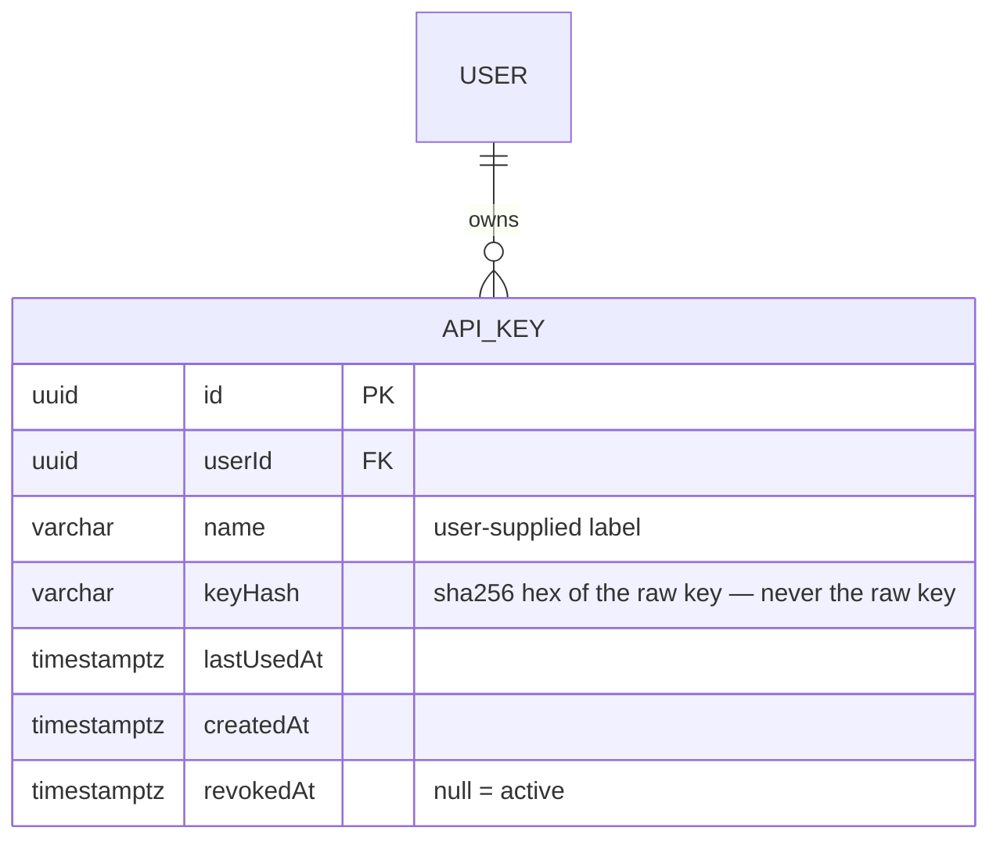

# 0075 — Remove Custom Reports & Add API-Key Authentication

**Date:** 2026-07-28
**Status:** Accepted
**Author:** Architect Agent
**Related ADRs:** Supersedes ADR 0057, 0058, 0059 (custom reports); extends ADR 0068 (Google SSO auth); ADR 0069 records the decision.

## Problem Statement

The Custom Reports feature (ADRs 0057–0059) is no longer wanted; it is a large,
self-contained surface (a NestJS domain, 4 entities/tables, 15 frontend files, 13 MCP
tools) whose ongoing maintenance is not justified. Separately, feature 0017 put a Google
SSO session-cookie guard on every API endpoint, which broke the MCP server — it has no
browser session and can no longer read the API. We need a machine-auth path that does not
expose the API publicly (the WAF was removed in ADR 0068).

## Proposed Solution

Two independent changes shipped together.

### Part A — Remove Custom Reports

Delete the entire feature: backend `custom-reports` module + 4 entities, frontend
`/reports` pages/components/lib/store + `api.ts` blocks + sidebar entry, the 13 MCP tools,
and the docs (proposals 0056–0058, ADRs 0057–0059, features 0008–0010). A new
forward-only migration drops the four tables (recreated empty on `down`). The two original
custom-report migrations are **not** edited (never edit applied migrations).

Drop order (FK-safe): `custom_report_filters` → `custom_report_data_points` →
`custom_report_widgets` → `custom_reports`.

### Part B — API-Key Authentication

A new `ApiKey` entity and `api-keys` module let a logged-in user mint personal API keys.
The global `AuthenticatedGuard` is extended to accept a key as an alternative to the
session cookie.

```mermaid
sequenceDiagram
    participant MCP as MCP server
    participant API as NestJS API
    participant DB as PostgreSQL

    MCP->>API: GET /api/metrics/dora (Authorization: Bearer <key>)
    API->>API: AuthenticatedGuard — no session cookie
    API->>API: extract Bearer key → sha256(key)
    API->>DB: SELECT api_key WHERE keyHash = ? AND revokedAt IS NULL
    alt key found
        API->>DB: load owning User; UPDATE lastUsedAt
        API->>API: req.authUser = { sub, email, name, role }
        API-->>MCP: 200 OK (data)
    else not found / revoked
        API-->>MCP: 401 Unauthorized
    end
```

**Key lifecycle & storage:**



- **Generation:** `POST /api/keys { name }` → generate 32 random bytes → raw key =
  `frg_<base64url>`; store `sha256(raw)` as `keyHash`; return the raw key **once** in the
  response. It is never retrievable again.
- **Verification (guard):** if no session, read `Authorization: Bearer <key>`, compute
  `sha256`, look up a non-revoked `ApiKey`, load the owning `User`, populate `req.authUser`
  with the user's `{ sub, email, name, role }`, and update `lastUsedAt` (fire-and-forget).
- **Role:** the key inherits the owner's current role at request time (looked up live), so
  demoting a user immediately weakens their keys. `AdminGuard` still gates admin routes.
- **Management endpoints** (`POST/GET/DELETE /api/keys`) require a **session**, not a key —
  a leaked read key cannot mint or list keys. Enforced with a `@SessionOnly()` marker the
  guard honours (reject Bearer-key auth on these routes).

### Part C — MCP read-only

`custom-reports.ts` was the only consumer of the MCP client's write helpers. Remove
`apiPost`, `apiPut`, `apiPatch`, `apiDelete` from `apps/mcp/src/client.ts`; only `apiGet`
remains, making the server structurally read-only. The client already sends
`API_KEY` as `Authorization: Bearer` — keep and document it (Claude Desktop / Cursor
config + root README + MCP README show `API_KEY` as required).

### New files / modules

- `backend/src/database/entities/api-key.entity.ts` (`ApiKey`)
- `backend/src/migrations/1778000000000-DropCustomReports.ts`
- `backend/src/migrations/1778100000000-CreateApiKeys.ts`
- `backend/src/api-keys/` — module, controller, service, `create-api-key.dto.ts`, specs
- `backend/src/auth/decorators/session-only.decorator.ts`
- Frontend: API-keys management UI (in Settings) + `api.ts` typed wrappers

## Alternatives Considered

### Alternative A — Make read endpoints fully `@Public()`
Simplest, but with the WAF gone this exposes all engineering metrics to anyone who can
reach the URL. **Ruled out** by the user in favour of authenticated key access.

### Alternative B — A single shared static API key in env/Secrets Manager
One `MCP_API_KEY` for the whole MCP integration. Simpler (no entity/UI), but no per-user
attribution, no self-service revocation, and rotating it breaks every client at once.
**Ruled out** — per-user keys give accountability and independent revocation.

### Alternative C — Store keys in plaintext for re-display
Better UX (copy again later). **Ruled out** — a DB leak would expose usable credentials.
Hash-only, show-once is the standard secure pattern.

## Impact Assessment

| Area | Impact | Notes |
|---|---|---|
| Database | Migration required | Drop 4 custom_report tables; create `api_keys` table |
| API contract | Breaking (removal) + Additive | `/api/custom-reports/*` removed; `/api/keys` added; auth guard now also accepts Bearer keys |
| Frontend | Page/component removal + new UI | `/reports` removed; API-keys management added to Settings |
| Tests | New + removed | Remove custom-report specs; add api-keys service/guard tests |
| External API | No new calls | — |
| Infrastructure | None | No new cloud resources; secrets unchanged |
| Observability | Minor | Log key *use* (by key id/user, never the raw key); no new alerts |
| Security / Compliance | New credential class | `api_keys.keyHash` is a hashed credential; new attack surface (key auth) — mitigated by hash-only storage, session-only key management, live role lookup, revocation |

## Open Questions

None — resolved at intake (hash-only + show-once; per-user role inheritance; session OR
key on guarded endpoints; `Authorization: Bearer` transport; key management is session-only).

## Acceptance Criteria

- [ ] `backend/src/custom-reports/` and the 4 entities are deleted; `entities/index.ts` and `app.module.ts` no longer reference them; backend compiles.
- [ ] Migration `1778000000000-DropCustomReports` drops the 4 tables FK-safe in `up()` and recreates them in `down()`.
- [ ] Frontend `/reports`, `components/custom-reports/`, related `lib/` + `store/` files, `api.ts` custom-report blocks, and the "Reports" sidebar entry are removed; frontend compiles + tests pass.
- [ ] The 13 custom-report MCP tools are removed + unregistered; MCP builds + tests pass.
- [ ] `apps/mcp/src/client.ts` exports only `apiGet` (no write helpers).
- [ ] `ApiKey` entity + `1778100000000-CreateApiKeys` migration (`up`/`down`); FK to `users`.
- [ ] `POST /api/keys` returns the raw key once; DB stores only `sha256(key)`; `GET /api/keys` returns metadata only; `DELETE /api/keys/:id` sets `revokedAt`.
- [ ] `AuthenticatedGuard` accepts `Authorization: Bearer <valid key>` with no session (200); revoked/unknown key → 401; the key's user role drives `AdminGuard` (user-role key → 403 on admin route, admin-role key → 200).
- [ ] `/api/keys` endpoints reject Bearer-key auth (session-only) → a key cannot mint/list keys.
- [ ] Frontend: a logged-in user can create (raw key shown once + copy), list (metadata), and revoke their own keys.
- [ ] MCP `README.md`, root `README.md`, and Claude/Cursor config examples show `API_KEY` as required in the `env` block.
- [ ] No references to custom reports remain (grep-clean); docs removed and indexes/CLAUDE.md updated.
- [ ] New backend tests cover: key hashing/verification, revoked-key rejection, session-only key management, role inheritance via key.
