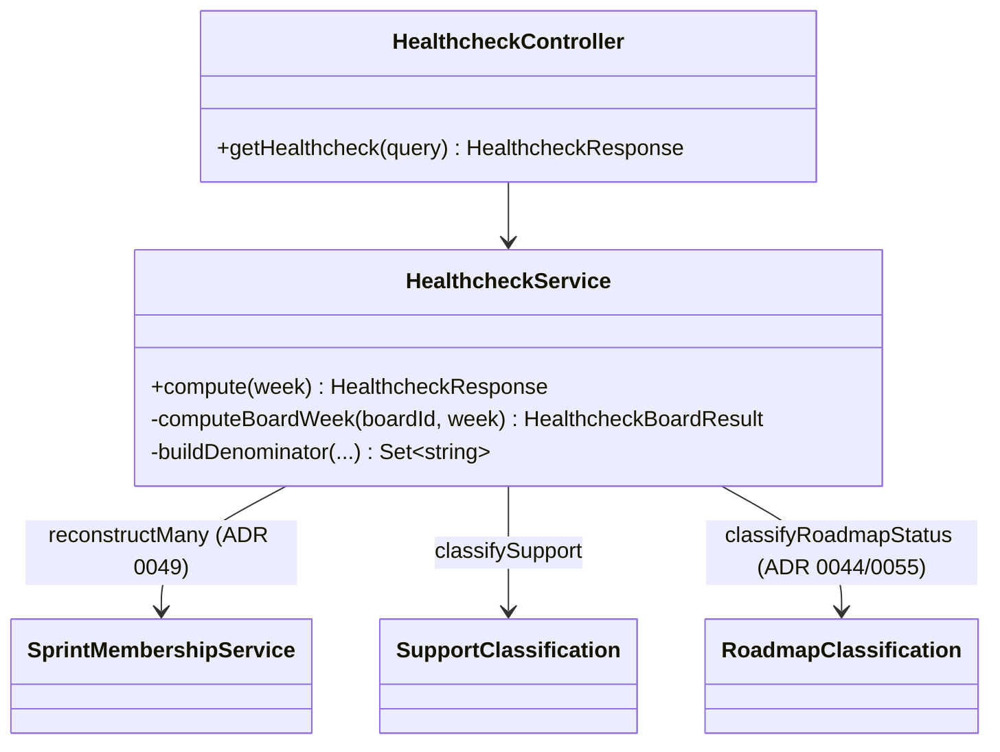
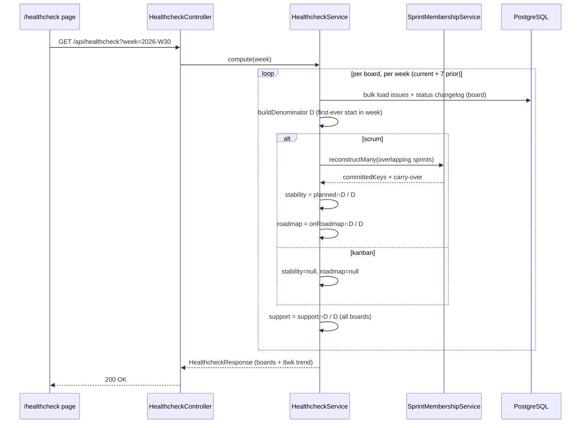

# 0076 — Healthcheck Report (replaces Pulse)

**Date:** 2026-08-03
**Status:** Accepted
**Author:** Architect Agent
**Related ADRs:** _(to be produced on acceptance — see Decision section)_
**Related feature:** docs/features/0019-healthcheck-report.md

> **Amendment (2026-08-03, ADR 0074):** The Healthcheck is **org-wide**, not per-board.
> Each dimension's score is **pooled** — `score = (100 / Σdenominator) * Σnumerator` — using a
> per-dimension denominator (Stability & Roadmap pool scrum boards only; Support pools all
> boards). The response exposes only the three org scores + one 8-week org trend; per-board
> results are removed from the API, frontend, and MCP payload. The per-board scoring core
> (`computeBoardHealthcheck`) is retained internally as the pooling input.

## Problem Statement

The current "Pulse" report is implemented as the `all-items` NestJS module (route
`/all-items`, MCP tool `get_pulse_report`) with a separately-bolted-on "Health Check" panel
(proposals 0071/0073, ADR 0065/0067). Its scoring mixes several denominators — committed∪added
sprint unions, a separate roadmap-alignment denominator, kanban board-entry sets — and layers
a CSS-bar sparkline (`TrendBars`) that is not a real chart. The model is hard to reason about,
inconsistent between the panel and the underlying report, and the `all-items.service.ts` has
grown to 1126 lines. We want a single, honest model: **one denominator per board/week — the
work the team actually started that week — and three numerators expressed as a percentage of
that same base.**

## Proposed Solution

Introduce a new backend `healthcheck` module and a new frontend `/healthcheck` page, and
**fully remove** the `all-items` module, `/all-items` page/route, `HealthCheckPanel`, the
`all-items`/`healthCheck` api.ts wrappers, and the `get_pulse_report` MCP tool. No persistence
and no Zustand store — live-computed, URL-param driven (matching current Pulse behaviour).

### Core model

For a selected ISO-week `[weekStart, weekEnd]` (local timezone via `iso-week.ts`), per board:

**Denominator `D` — "started this week":** the set of the board's non-Epic/non-subtask issues
(ADR 0018) whose **first-ever** transition into a "start" status falls within the week.
- Scrum: first-ever transition into an `inProgressStatusNames` status (reuse `detectStarted`
  logic — first-ever, not any).
- Kanban: first-ever transition into a `boardEntryStatuses` status (reuse
  `buildKanbanBoardEntryDateMap`).

**Three scores**, each `= (100 / |D|) * numerator`, in `[0,100]`, or **N/A (null)** when `|D| = 0`:

| Score | Boards | Numerator = count of `D` tickets that… |
|---|---|---|
| **Stability** | scrum only (Kanban → N/A) | were **planned**: committed at start of, OR carried over into, the sprint active on that board **at the ticket's in-progress moment** |
| **Roadmap** | scrum only (Kanban → N/A) | are **on roadmap**: `classifyRoadmapStatus` returns `in-scope` or `linked` |
| **Support** | all boards | are **support**: authoritative signal — support epic OR support label OR TTB support link |

No blended/overall score — three independent scores per board (confirmed with requester).

### Stability — "sprint active at the in-progress moment"

This resolves the week-overlaps-two-sprints case precisely. For each scrum ticket in `D`:

1. Take its first-ever in-progress transition timestamp `t` (already computed for `D`).
2. Find the sprint on that board whose `[startDate, effectiveSprintEnd]` window contains `t`
   (reuse `effectiveSprintEnd` from `lib/sprint-window.ts`). If `t` predates the sprint start
   but the ticket is a carry-over, the carry-over rule below still applies to that sprint.
3. Reconstruct that sprint's membership via `SprintMembershipService.reconstructMany` (ADR 0049).
4. The ticket is **planned** iff it ∈ `committedKeys` for that sprint (committed at start),
   **or** it is a carry-over from the immediately prior closed sprint (ADR 0039 —
   `isCarryOverFromSprint`).

Because `D` tickets on a board may map to one of two overlapping sprints, we reconstruct
membership for all sprints overlapping the week in one `reconstructMany` pass (no N+1), then
look each ticket up against the sprint that contained its transition timestamp.

### Roadmap — membership, not delivery

The spec says "number of these tickets **which were on roadmap**" — a membership test, not a
delivery test. We therefore use the full `classifyRoadmapStatus` (`roadmap-classification.ts`)
and count `in-scope | linked` (a roadmap link exists), **not** the completion-gated
`isDeliveredOnRoadmap` that the old Pulse used. Epic link + direct link resolution reused
as-is (ADR 0044/0055; `roadmap-link-utils.ts`, `resolve-epic-ideas.ts`).

### Support — authoritative classification

Reuse the authoritative support signals (support epic OR support label OR TTB support link,
per ADR 0045/0047/0061) as implemented in `support.service`. To avoid duplicating the inline
logic that lived in `all-items.service.ts`, extract a small pure classifier
`classifySupport(issue, links, config)` into `backend/src/support/support-classification.ts`
and have both `support.service` and the new `healthcheck.service` consume it. (Refactor of
existing behaviour — no behavioural change to the support report; reviewer traces this.)

### Trend

Recompute the three scores for the trailing **8 weeks** (oldest→newest) per board, in bulk.
Response carries a `trend: HealthcheckTrendPoint[]` per board:

```
interface HealthcheckTrendPoint {
  week: string;               // ISO week key, e.g. "2026-W30"
  stability: number | null;   // null = N/A (kanban, or |D|=0)
  roadmap: number | null;
  support: number | null;
}
```

Frontend renders a Recharts `LineChart` (mirroring sprint-report's `TrendChart`): three
`<Line>` series with `connectNulls={false}` so N/A weeks render as gaps, `YAxis domain [0,100]`,
`XAxis dataKey="week"`.

### API contract

```
GET /api/healthcheck?week=YYYY-Www
```

`week` optional; defaults to the last completed ISO week. Response:

```
interface HealthcheckResponse {
  week: string;
  boards: HealthcheckBoardResult[];
}
interface HealthcheckBoardResult {
  boardId: string;
  boardType: 'scrum' | 'kanban';
  denominator: number;                 // |D|
  stability: HealthcheckScore;         // { score: number | null; numerator: number | null }
  roadmap: HealthcheckScore;
  support: HealthcheckScore;
  trend: HealthcheckTrendPoint[];      // 8 points, oldest→newest, includes current week
}
```

### Module structure



### Request flow



### Removal (full replacement)

- Backend: delete `backend/src/all-items/` (module, controller, service, DTOs) and unregister
  from `app.module.ts`.
- Frontend: delete `frontend/src/app/all-items/`, `components/ui/health-check-panel.tsx`,
  `lib/health-check-bands.ts`; remove `getAllItems` + all `AllItems*`/`HealthCheck*` types from
  `lib/api.ts`; replace sidebar entry `Pulse → Healthcheck` (`/healthcheck`).
- MCP: delete `apps/mcp/src/tools/pulse.ts` + its test; register `get_healthcheck_report`
  (`tools/healthcheck.ts`) hitting `/api/healthcheck`; unregister `get_pulse_report` in
  `server.ts`.

## Alternatives Considered

### Alternative A — Rename `all-items` in place, keep the route
Least churn, keeps the MCP tool name for compatibility. Ruled out: the requester explicitly
asked for full replacement, and the existing 1126-line service mixes denominators that don't
match the new single-denominator model — rebuilding is cleaner than surgically rewriting.

### Alternative B — Persist Healthcheck results in a new entity (like DoraSnapshot)
Would speed up the 8-week trend. Ruled out for v1: Pulse was already live-computed acceptably,
adding an entity + migration + post-sync computation is scope the requester excluded, and bulk
per-board queries keep the recompute within one changelog scan per board (no N+1).

### Alternative C — Roadmap numerator = delivered-on-roadmap (old Pulse `isDeliveredOnRoadmap`)
Matches old Pulse. Ruled out: the spec is a membership question ("were on roadmap"), so a
completion gate would under-count in-flight roadmap work. Using `classifyRoadmapStatus`
`in-scope|linked` answers the actual question.

## Impact Assessment

| Area | Impact | Notes |
|---|---|---|
| Database | None | No new entity; live-computed. No migration. |
| API contract | Breaking | `/api/all-items` removed; `/api/healthcheck` added. Internal app only (ADR 0020). |
| Frontend | New page + removals | New `/healthcheck` page + Recharts trend; delete `/all-items`, `HealthCheckPanel`. |
| Tests | New + deleted | New unit tests for `HealthcheckService` scoring (scrum/kanban/N-A/carry-over) + `classifySupport` + integration test for `/api/healthcheck`; delete `all-items`/pulse tests. |
| External API | No new calls | Reuses cached Jira data in Postgres (ADR 0002). |
| Infrastructure | None | No new resources; no IaC change. |
| Observability | None | NestJS Logger as usual; no new fields. |
| Security / Compliance | None | Internal data only; no auth change (ADR 0020); no new attack surface. |

## Open Questions

- **Band thresholds (RAG colour):** Do the three scores need coloured bands, and if so what
  thresholds? Proposal default: reuse `BoardConfig.roadmapDeliveryTarget` for the Roadmap
  score's "good" threshold; for Stability and Support, apply simple fixed bands
  (Stability: ≥80 good / ≥60 fair / else poor; Support treated as burden — lower is better —
  ≤20 good / ≤40 fair / else high). Confirm or override at review; final values recorded in ADR.

## Acceptance Criteria

- `GET /api/healthcheck?week=YYYY-Www` returns 200 with shape `HealthcheckResponse`; omitting
  `week` defaults to the last completed ISO week.
- For a scrum board, `denominator` equals the count of the board's non-Epic/non-subtask issues
  whose **first-ever** transition into an `inProgressStatusNames` status is within
  `[weekStart, weekEnd]`.
- For a kanban board, `denominator` uses first-ever `boardEntryStatuses` transition in the week;
  `stability.score` and `roadmap.score` are `null` (N/A), and `support.score` is computed.
- Stability numerator counts a `D` ticket iff, for the sprint whose window contains the ticket's
  in-progress timestamp, the ticket ∈ `committedKeys` OR is a carry-over from the immediately
  prior closed sprint (ADR 0039).
- Roadmap numerator counts a `D` ticket iff `classifyRoadmapStatus` returns `in-scope` or `linked`.
- Support numerator counts a `D` ticket iff `classifySupport` matches (epic OR label OR TTB link),
  and `classifySupport` produces identical results to the existing support-report classification
  for the same inputs (regression test).
- Each score equals `(100 / denominator) * numerator`; when `denominator === 0` the score is `null`.
- Response includes a `trend` of 8 `HealthcheckTrendPoint`s per board (oldest→newest, incl.
  current week); N/A dimensions are `null`.
- Frontend `/healthcheck` renders per-board Stability/Roadmap/Support and a Recharts `LineChart`
  with three lines and `connectNulls={false}`; week nav `←`/`→`/`Latest` updates the `week` URL param.
- After merge, no source references `all-items`, `AllItems*`, `HealthCheckPanel`,
  `get_pulse_report`, or the `/all-items` route; MCP exposes `get_healthcheck_report`.
- All new/changed backend and frontend tests pass; no N+1 (membership + changelog fetched in bulk).

## Decision

On acceptance, produce ADRs via the `decision-log` skill:
- **ADR (Healthcheck model):** single-denominator (first-ever start-in-week) three-score model
  replacing the Pulse `all-items` report; supersedes the Pulse-specific parts of ADR 0062/0065/0067.
- **ADR (Stability sprint resolution):** committed-OR-carry-over against the sprint active at the
  ticket's in-progress moment.
- **ADR (Support classifier extraction):** shared `classifySupport` in `support/`.
- Any RAG band thresholds agreed at review.
