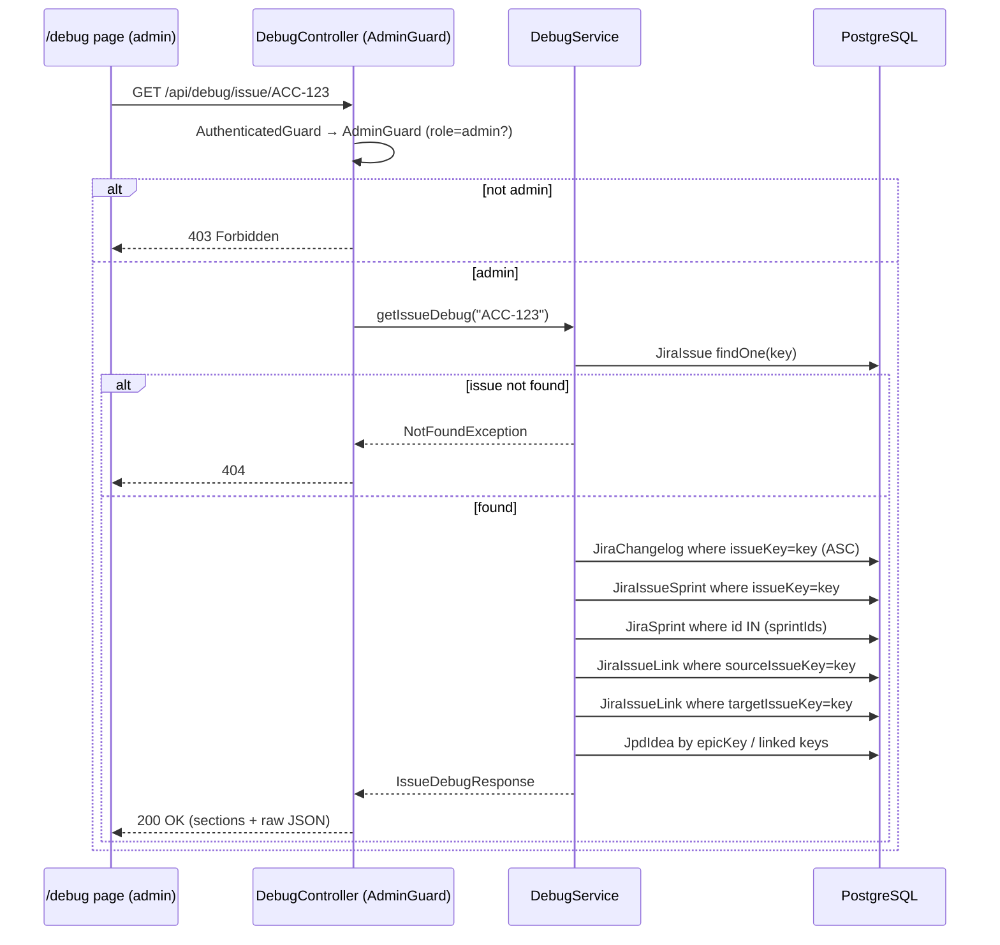
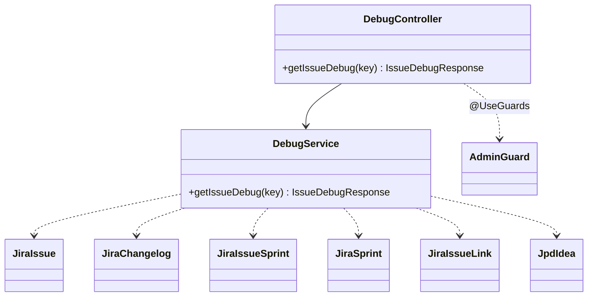

# 0077 — Ticket Debug Page

**Date:** 2026-08-03
**Status:** Accepted
**Author:** Architect Agent
**Related ADRs:** _(to be produced on acceptance — see Decision section)_
**Related feature:** docs/features/0020-ticket-debug-page.md

## Problem Statement

When a metric looks wrong for a specific ticket, there is no in-app way to inspect the raw
data the app has mirrored for that key — diagnosis currently requires querying Postgres by
hand. We need an admin-only, read-only debug view that shows everything stored for a given
issue key (`JiraIssue` plus its `JiraChangelog`, `JiraIssueSprint`, `JiraIssueLink`, and any
linked `JpdIdea`), so an operator can verify exactly what the calculations operate on.

## Proposed Solution

Add a new NestJS `debug` module with a single read-only endpoint, and a new admin-only
`/debug` frontend page. No schema change, no new dependency, no live Jira calls — the
endpoint reads only the Postgres mirror.

### Backend

- **Module:** `backend/src/debug/` — `DebugModule`, `DebugController`, `DebugService`.
  - `DebugController` is `@Controller('api/debug')`, guarded with `@UseGuards(AdminGuard)`
    (same pattern as `UsersController`/`SyncController`/`BoardsController`). The global
    `AuthenticatedGuard` (APP_GUARD) runs first and attaches `authUser`; `AdminGuard` then
    enforces `role === 'admin'` → 403 otherwise.
  - `GET /api/debug/issue/:key` → `DebugService.getIssueDebug(key)`.
  - Thin controller; all data-gathering in `DebugService`.
- **DebugService** performs a fixed set of scoped, key-bounded queries (no N+1, no live Jira):
  1. `JiraIssue` by primary key `key`. If absent → `NotFoundException` (404).
  2. `JiraChangelog` where `issueKey = key`, ordered by `changedAt ASC` (all fields, incl.
     status and Sprint transitions).
  3. `JiraIssueSprint` where `issueKey = key`; then load the referenced `JiraSprint` rows in
     one `In([...sprintIds])` query and attach their details.
  4. `JiraIssueLink` where `sourceIssueKey = key` **and** (separately) `targetIssueKey = key`,
     returned as `linksAsSource` / `linksAsTarget`.
  5. Roadmap ideas: if `issue.epicKey` is set, the `JpdIdea` linked via that epic; plus any
     `JpdIdea` reachable via the direct issue links already loaded. Returned as
     `roadmapIdeas` with the match reason (`epic` | `direct`).
- **Registration:** add `DebugModule` to `AppModule` imports; register the relevant entities
  via `TypeOrmModule.forFeature([...])` in the module.
- **DTO:** a response interface `IssueDebugResponse` in `debug/dto/`.

### Frontend

- **Page:** `frontend/src/app/debug/page.tsx` — a key input (text field + submit), then on
  success renders structured sections:
  - **Issue** — all `JiraIssue` fields.
  - **Changelog** — table of `field`, `from`, `to`, `changedAt`.
  - **Sprint memberships** — table of sprint id/name/state/dates.
  - **Links** — source links and target links.
  - **Roadmap ideas** — any matched ideas with match reason.
  - **Raw JSON** — collapsible `
` block containing the full payload for copy/paste.
- Unknown key (404) → clear "No stored data for <key>" empty state (not an error card).
- **api.ts:** typed `getIssueDebug(key)` wrapper + the `IssueDebugResponse` types.
- **Sidebar:** add a `DEBUG_ITEM` rendered in the bottom User section, gated by `isAdmin`
  (same as Settings/Users). Route `/debug`.

### Request flow

### Module relationships

## Alternatives Considered

### Alternative A — Reuse an existing module (e.g. `jira` or `sync`) for the endpoint
Avoids a new module. Ruled out: the debug view spans multiple entities that no single
existing module owns, and bolting a cross-entity dump onto a domain module muddies its
responsibility. A dedicated `debug` module keeps the concern isolated and easy to remove.

### Alternative B — Live Jira fetch (stored + live comparison)
More powerful for "why is Jira different from us" questions. Ruled out for v1: the request is
to see what is *stored*; adding a live call introduces Jira rate-limit and latency concerns
and widens scope. Can be a follow-up.

### Alternative C — Raw JSON only (no structured sections)
Fastest to build. Ruled out: structured sections make the common checks (changelog order,
sprint membership, links) readable at a glance; raw JSON is included as well for completeness.

## Impact Assessment

| Area | Impact | Notes |
|---|---|---|
| Database | None | Read-only; no schema change, no migration. |
| API contract | Additive | New `GET /api/debug/issue/:key` (admin-only). |
| Frontend | New page + sidebar entry | `/debug`, admin-gated; typed api.ts wrapper. |
| Tests | New unit + component | `DebugService` unit tests (found / not-found / links / sprints / roadmap); page/table component tests; sidebar admin-gating test. |
| External API | No new calls | Reads Postgres mirror only (ADR 0002). |
| Infrastructure | None | No new resources. |
| Observability | None | Standard NestJS Logger. |
| Security / Compliance | New endpoint, admin-gated | Reuses `AdminGuard`; internal data class only (no PII). No new auth mechanism, no new data class. |

## Open Questions

- Raw JSON expanded or collapsed by default? **Proposed:** collapsed, with expand + copy.

## Acceptance Criteria

- `GET /api/debug/issue/:key` returns 200 with `{ issue, changelog[], sprintMemberships[],
  linksAsSource[], linksAsTarget[], roadmapIdeas[] }` for a stored key.
- The endpoint returns 404 for an unknown key.
- The endpoint returns 403 for a non-admin or unauthenticated caller (via `AdminGuard`),
  consistent with `/api/users`.
- `changelog` is ordered by `changedAt` ascending and includes both `status` and `Sprint`
  field rows.
- `sprintMemberships` includes the referenced sprint's name/state/start/end.
- `linksAsSource` and `linksAsTarget` are both populated from `JiraIssueLink`.
- `roadmapIdeas` includes any idea linked via `epicKey` or via a direct issue link, each with
  a `matchReason`.
- `DebugService` issues only key-scoped queries (no full-table scans, no per-row/N+1 loops);
  no `JiraClientService` call is made.
- The `/debug` page renders the structured sections plus a collapsible raw JSON block; an
  unknown key shows a "no stored data" empty state.
- The **Debug** sidebar link renders only when `isAdmin` is true and sits in the bottom User
  section; it is absent for non-admins.
- All new backend and frontend tests pass.

## Decision

On acceptance, produce an ADR via the `decision-log` skill recording: the new `debug` module
as an admin-only, read-only cross-entity inspection view of the Postgres mirror (no live Jira,
no schema change), reusing `AdminGuard`.
