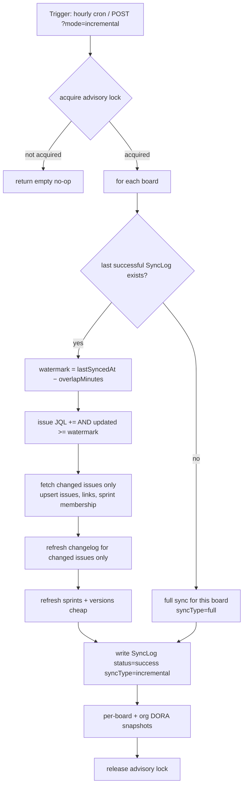
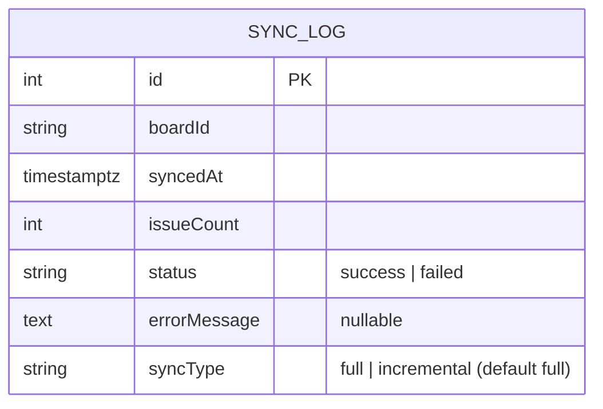

# 0078 — Incremental Jira Sync

**Date:** 2026-08-04
**Status:** Accepted
**Author:** Architect Agent
**Related ADRs:** docs/decisions/0078-incremental-jira-sync.md

## Problem Statement

The Jira sync in `SyncService` is full-only and runs once daily (`0 0 * * *`). Every run
re-fetches every issue for every board, then per issue deletes and re-fetches all changelog
pages, re-persists all issue links, and re-computes sprint membership — regardless of whether
anything changed. Against Jira Cloud's rate limits (max 5 concurrent, 100 ms interval, backoff
on 429) this is slow and makes a large volume of redundant API calls. Because most issues do
not change between runs, the cost is disproportionate to the freshness delivered, and the once-
daily cadence means metrics can be up to 24 hours stale during the working day.

## Proposed Solution

Introduce a second sync **mode** — `incremental` — alongside the existing `full` mode, and a
new hourly cron that runs it. The full sync path is unchanged and remains the daily correctness
backstop.

### Affected components

- **`SyncService`** (`backend/src/sync/sync.service.ts`) — new `syncAll(mode)` parameter,
  watermark computation, per-board mode resolution, and a second registered `CronJob`.
- **`SyncController`** (`backend/src/sync/sync.controller.ts`) — `POST /api/sync?mode=…`.
- **`SyncLog` entity** (`backend/src/database/entities/sync-log.entity.ts`) — new `syncType`
  column.
- **New migration** under `backend/src/migrations/` — adds `syncType` (default `'full'`).
- **`AppConfig`/`ConfigService`** — new `INCREMENTAL_SYNC_OVERLAP_MINUTES` (default 5).

### Sync mode as a parameter

`syncAll()` becomes `syncAll(mode: 'full' | 'incremental' = 'full')`. The advisory-lock
acquire/release, board iteration, snapshot invocation, roadmap sync, and sprint-report
triggering are **unchanged**. Only the per-board issue fetch is affected: `syncBoard` gains an
optional `sinceWatermark?: Date` — when present, the scrum/kanban issue JQL gets an appended
`AND updated >= "<watermark>"` clause; when absent, behaviour is identical to today.

### Watermark computation

Per board, before syncing, the incremental path looks up the most recent `SyncLog` with
`status = 'success'` (of **either** `syncType`) and subtracts the configured overlap buffer:

```
watermark = lastSuccessfulSyncedAt − INCREMENTAL_SYNC_OVERLAP_MINUTES
```

The buffer absorbs clock skew and edge-of-window changes. If **no** prior successful `SyncLog`
exists for the board, the incremental run **falls back to a full sync** for that board (no
watermark clause). The `SyncLog` written by an incremental run records `syncType = 'incremental'`
(or `'full'` when it fell back).

### JQL construction

Existing queries (both already `ORDER BY updated DESC` and request `created,updated`):

- Scrum: `project = "<board>" AND sprint is not EMPTY ORDER BY updated DESC`
- Kanban: `project = <board> ORDER BY updated DESC`

Incremental appends the clause before `ORDER BY`:

- Scrum: `project = "<board>" AND sprint is not EMPTY AND updated >= "<watermark>" ORDER BY updated DESC`
- Kanban: `project = <board> AND updated >= "<watermark>" ORDER BY updated DESC`

The `<watermark>` is formatted in Jira's expected `yyyy-MM-dd HH:mm` form. Upserts keyed by
`JiraIssue.key` merge the changed subset cleanly into existing rows.

### Kanban deletion reconciliation

`reconcileDeletedKanbanIssues` and backlog membership reset depend on a **full** JQL scan to
detect issues deleted in Jira. These run **only** in full mode. Incremental runs skip deletion
reconciliation entirely — the daily full sync remains the mechanism that removes phantom rows.
This is an accepted trade-off (documented in Open Questions and the resulting ADR).

### Cron registration

A second `CronJob` is registered in `onModuleInit` under the name `jira-sync-incremental` with
schedule `0 * * * *` (hourly, on the hour), calling `handleIncrementalCron() → syncAll('incremental')`.
The existing `jira-sync` daily job (`0 0 * * *`) is unchanged and calls `syncAll('full')`. When
both fire at midnight, the existing non-blocking advisory lock (`pg_try_advisory_lock`) causes
the second arrival to find the lock held and return the empty no-op result — no queueing, no
double-sync.

### API

`POST /api/sync?mode=full|incremental` — `mode` defaults to `full` (preserves current
behaviour). Validated via a DTO/enum; invalid values return HTTP 400. The endpoint stays
fire-and-forget HTTP 202 (ADR 0036), keeps its `AdminGuard`, and keeps the 409-on-in-progress
behaviour. `GET /api/sync/status` additionally surfaces `syncType` of the last run per board.

### Flow



### Schema change



## Alternatives Considered

### Alternative A — Persist Jira's `fields.updated` on `JiraIssue` and use `max(jiraUpdatedAt)` as the watermark
More accurate high-water-mark (per-issue Jira timestamp rather than row-write time). Ruled out
for this iteration: it requires a schema change and backfill on the hottest, largest entity
(`jira_issues`), and `mapJiraIssue` changes, for marginal benefit over the `SyncLog` +
overlap-buffer approach. The daily full sync already corrects any drift. Can be revisited if the
buffer proves insufficient.

### Alternative B — Replace the daily full sync with hourly incremental only
Cheapest option, but kanban phantom deletions and any changelog/link drift would accumulate
indefinitely until someone manually ran a full sync, and there would be no periodic correctness
backstop. Rejected — correctness regression outweighs the additional cost of one nightly full run.

### Alternative C — Push/webhook-driven sync from Jira
Jira webhooks would give near-real-time updates without polling. Rejected for this iteration:
requires a new inbound public endpoint (new attack surface behind the WAF, ADR 0034), webhook
registration/secret management, and delivery-reliability handling — a substantially larger
change than the requested hourly incremental. Candidate for a future proposal.

## Impact Assessment

| Area | Impact | Notes |
|---|---|---|
| Database | Migration required | Add `syncType` to `sync_logs`, default `'full'`; `up()` + `down()`. Single entity. |
| API contract | Additive | `POST /api/sync` gains optional `?mode`; default preserves current behaviour. `status` gains `syncType`. |
| Frontend | None (optional) | Existing sync-status view unaffected; surfacing `syncType` is out of scope. |
| Tests | New unit tests | Watermark computation (buffer + status filter), first-run fallback, JQL clause build, mode selection/validation. |
| External API | Reduced calls | Incremental fetches far fewer issues; same `JiraClientService`, same rate-limit guards. No new Jira endpoint. |
| Infrastructure | None | No new cloud resource; runs in existing ECS task; same Lambda snapshot path. |
| Observability | New log fields | Log mode + per-board watermark + issue count; via existing NestJS `Logger`. |
| Security / Compliance | None | No new data class, no new exposure, no auth change; `ConfigService` for new env var. |

## Open Questions

- **Overlap buffer default:** proposed `INCREMENTAL_SYNC_OVERLAP_MINUTES = 5`. Confirm value.
- **Midnight collision:** hourly `0 * * * *` fires at midnight with the daily `0 0 * * *`. Accepted
  behaviour: the advisory lock makes the second a no-op. Confirm no ordering guarantee is needed
  (either running first is correct; a full sync superset-covers an incremental one).
- **Env var name:** confirm `INCREMENTAL_SYNC_OVERLAP_MINUTES`.

## Acceptance Criteria

- `syncAll('incremental')` computes, per board, `watermark = latest SyncLog(status='success').syncedAt − INCREMENTAL_SYNC_OVERLAP_MINUTES`, considering both `syncType` values.
- With a watermark present, the scrum issue JQL equals `project = "<board>" AND sprint is not EMPTY AND updated >= "<watermark>" ORDER BY updated DESC` and the kanban issue JQL equals `project = <board> AND updated >= "<watermark>" ORDER BY updated DESC`.
- For a board with no prior successful `SyncLog`, `syncAll('incremental')` performs a full sync for that board and writes `syncType = 'full'`.
- An incremental run writes a `SyncLog` with `status = 'success'`, `syncType = 'incremental'`, and the count of processed issues.
- Incremental runs refresh changelog, links, and sprint membership only for the returned (changed) issues; untouched issues' rows are not modified.
- Incremental runs do **not** invoke kanban phantom-deletion reconciliation; full runs still do.
- `POST /api/sync?mode=incremental` starts an incremental sync (HTTP 202); `mode=full` or omitted starts a full sync (unchanged); an invalid `mode` returns HTTP 400.
- The daily `jira-sync` cron (`0 0 * * *`) runs a full sync; a new `jira-sync-incremental` cron (`0 * * * *`) runs an incremental sync; both respect the existing advisory lock (second concurrent arrival is a no-op).
- A TypeORM migration adds `sync_logs.syncType` (default `'full'`) with both `up()` and `down()`; existing rows read as `'full'`.
- DORA snapshots are computed after an incremental sync via the existing Lambda/in-process trigger path.
- Unit tests cover watermark computation (buffer + status filtering), first-run full-sync fallback, JQL clause construction for scrum and kanban, and endpoint mode validation. No test performs real network I/O.
