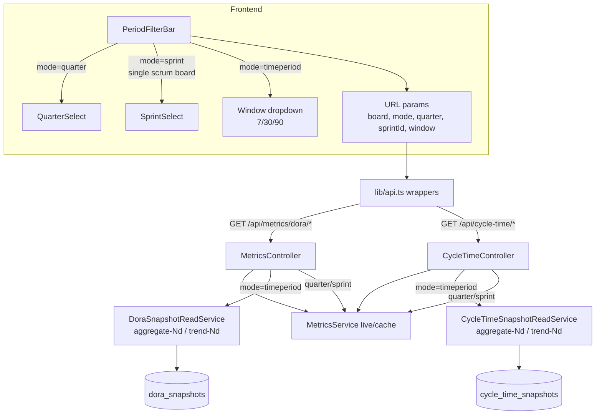
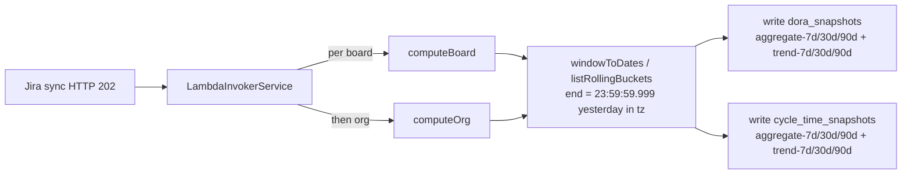
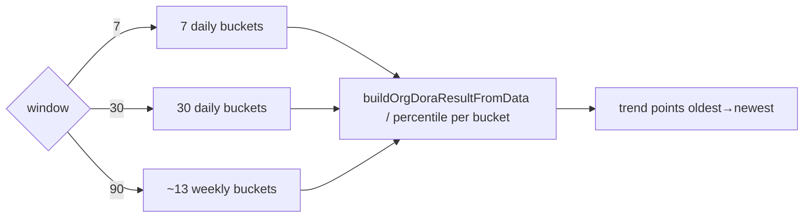
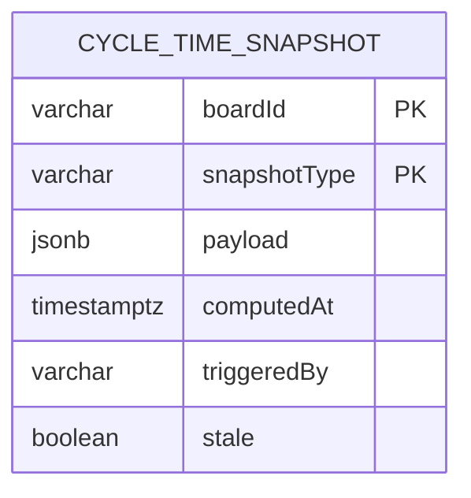

# 0079 — Unified Reporting Periods for DORA & Cycle Time

**Date:** 2026-08-11
**Status:** Accepted
**Author:** Architect Agent
**Related ADRs:** 0079, 0080, 0081, 0082 (see docs/decisions/)
**Related feature:** docs/features/0022-unified-reporting-periods-dora-cycle-time.md

## Problem Statement

The DORA metrics page (`frontend/src/app/dora/page.tsx`) and the Cycle Time page
(`frontend/src/app/cycle-time/page.tsx`) expose divergent, inconsistent filtering. DORA uses
a plural `?boards=` multi-select with an "All" chip and a Quarter/Sprint toggle (with no
explicit quarter/sprint dropdowns); Cycle Time uses a singular `?board=` single-select with
no "All", quarter chips only (no Sprint mode), plus an issue-type filter. The two reports
therefore behave differently against the same underlying Jira data, confusing users who
switch between them. Neither report supports a simple rolling window (e.g. "last 30 days")
independent of quarter/sprint boundaries. We need one shared period model across both pages
and a new "Time period" rolling-window option.

## Proposed Solution

### 1. Shared filter model (frontend)

Introduce a single reusable filter bar used by both pages, wrapping the existing but
currently-unused building blocks:

- `frontend/src/components/ui/quarter-select.tsx` (quarter dropdown)
- `frontend/src/components/ui/sprint-select.tsx` (sprint dropdown)
- `frontend/src/components/ui/board-chip.tsx` (board control)

New shared component: `frontend/src/components/ui/period-filter-bar.tsx`. It renders:

- **Board control** — single-select with an explicit **"All"** entry (both pages).
- **Period toggle group** — three options: **Quarter | Sprint | Time period**.
  - Quarter → renders `QuarterSelect` dropdown.
  - Sprint → renders `SprintSelect` dropdown; enabled only when a single **Scrum** board is
    selected (disabled for "All" and Kanban, with a hint), gated via the existing
    `boards-store.ts` `kanbanBoardIds`.
  - Time period → renders a new dropdown with **Last 90 days / Last 30 days / Last 7 days**.

Filter state remains in URL params (consistent with current mechanism via
`useReplaceParams`). A **unified URL schema** is adopted for both pages:

| Param | Values | Meaning |
|---|---|---|
| `board` | board key or `All` | single board or all boards |
| `mode` | `quarter` \| `sprint` \| `timeperiod` | selected period toggle |
| `quarter` | `YYYY-QN` | when `mode=quarter` |
| `sprintId` | sprint id | when `mode=sprint` |
| `window` | `7` \| `30` \| `90` | when `mode=timeperiod` (days) |

**Default when no params present: `mode=timeperiod`, `window=90`** (matches backend
`resolvePeriod` fallback and the confirmed brief).

The unused `frontend/src/store/filter-store.ts` is **not** wired in (kept out of scope);
URL params remain the single source of truth to match existing behaviour.

### 2. API layer (frontend `lib/api.ts`)

- Add `period?: string` (format `YYYY-MM-DD:YYYY-MM-DD`) and `quarter?: string` to
  `DoraAggregateParams` and `DoraTrendParams`; add a `mode: 'timeperiod'` capability by
  translating the time window into a `period` range client-side is **rejected** — instead the
  window is sent as a first-class param (see below) so the backend owns bucket granularity.
- Add `window?: 7 | 30 | 90` to the DORA and Cycle Time param types, and `mode` gains
  `'timeperiod'`.
- **Remove** `issueType` from `CycleTimeQueryParams`, `CycleTimeTrendParams`, and the two
  cycle-time wrappers.

### 3. Backend

**DTOs** (add `window` + `period`, remove `issueType`):

- `DoraAggregateQueryDto`: add `period?` (regex `^\d{4}-\d{2}-\d{2}:\d{4}-\d{2}-\d{2}$`) and
  `window?` (enum `7|30|90`).
- `DoraTrendQueryDto`: add `mode` value `'timeperiod'`; add `window?` (enum `7|30|90`).
- `CycleTimeQueryDto`: add `window?`; **remove** `issueType`.
- `CycleTimeTrendQueryDto`: add `mode` value `'timeperiod'`; add `window?`; **remove**
  `issueType`.

**Window semantics (tz-correct, last full day)** — a time-period window of N days ends at
the **last completed day** in the configured timezone (`this.timezone`, sourced from
`WorkingTimeConfig`/`ConfigService` as today). Concretely, for N days:

- `endDate` = start-of-today-in-tz minus 1 ms → i.e. **23:59:59.999 yesterday** in tz.
- `startDate` = start-of-day in tz, N-1 days before yesterday (so the window spans exactly
  N full calendar days ending yesterday).

Example: "Last 7 days" evaluated on 2026-08-11 (tz Australia/Sydney) covers
`2026-08-04 00:00:00.000` through `2026-08-10 23:59:59.999` local time. This uses the
existing `startOfDayInTz` / `dateParts` helpers in `tz-utils.ts` — no new tz logic.

A new helper `windowToDates(window, tz)` in `period-utils.ts` returns `{ startDate, endDate }`
with the above semantics.

**Period resolution** — extend `resolvePeriod` in `metrics.service.ts` to accept `window`:
when `window` is provided (and no `quarter`/`sprintId`), delegate to `windowToDates(window, tz)`.
The existing implicit 90-day fallback is realigned to the same "ends yesterday" semantics.

**Time-period trend bucketing** — add a `timeperiod` branch to `getDoraTrend` and
`getCycleTimeTrend`. A new helper `listRollingBuckets(window, tz)` in `period-utils.ts`
returns bucket ranges over the window (all bucket boundaries tz-correct via `startOfDayInTz`,
window ending 23:59:59.999 yesterday):

- `window=7` → 7 **daily** buckets
- `window=30` → 30 **daily** buckets
- `window=90` → ~13 **weekly** buckets (last bucket may be short)

Both trend methods already load board data once for a span via `TrendDataLoader.load` /
`cycleTimeService.getCycleTimeObservations` and fan out to `buildOrgDoraResultFromData` /
percentile calc per range — the new branch reuses that exact pattern, substituting rolling
buckets for `listRecentQuarters`.

**Issue-type removal** — drop `issueType` passthrough in `metrics.service.ts`
(`getCycleTime`, `getCycleTimeTrend`) and the `issueTypeFilter` param path in
`cycle-time.service.ts`. Kept as a non-breaking internal default (undefined) or removed
entirely from the service signature (implementation detail for the developer step).

### 3a. Snapshotting time-period windows (DORA + Cycle Time)

Time-period aggregates and trends are **pre-computed and stored**, consistent with ADR 0040,
so the pages read snapshots rather than computing live on every request. Recompute is
triggered **on each Jira sync** (same hook as quarter snapshots today): `computeBoard` (per
board) followed by `computeOrg`, via `LambdaInvokerService` (Lambda in prod, in-process
locally). Because windows end at "yesterday", every daily sync naturally rolls the window
forward; if a day passes with no sync the snapshot may lag one day (acceptable — surfaced via
the existing `X-Snapshot-Age` / staleness metadata).

**DORA snapshots** — reuse the existing `dora_snapshots` table (`snapshotType` is a plain
`varchar` PK component — no DB constraint, so new string values need no migration). Extend
`DoraSnapshotType` with window-suffixed values:

- `aggregate-7d`, `aggregate-30d`, `aggregate-90d`
- `trend-7d`, `trend-30d`, `trend-90d`

Written for both per-board keys and `ORG_SNAPSHOT_KEY` by `InProcessSnapshotService`
(`computeBoard` / `computeOrg`) and the Lambda `snapshot.handler`. The controller
`getDoraAggregate` / `getDoraTrend` map `mode=timeperiod` + `window` → the corresponding
window-suffixed `snapshotType`, mirroring the current quarter/sprint mapping.

**Cycle Time snapshots** — Cycle Time currently has **no** snapshot infrastructure. Introduce
a parallel, minimal store to mirror the DORA pattern:

- New entity `CycleTimeSnapshot` (`cycle_time_snapshots` table): composite PK
  `(boardId, snapshotType)` where `snapshotType ∈ { aggregate-7d, aggregate-30d, aggregate-90d,
  trend-7d, trend-30d, trend-90d }`; `payload jsonb`, `computedAt timestamptz`, `triggeredBy`,
  `stale`. **New migration required** (`up`/`down`).
- New `CycleTimeSnapshotReadService` (mirrors `DoraSnapshotReadService`) used by
  `CycleTimeController` for `mode=timeperiod`.
- Compute step: extend `InProcessSnapshotService` (and the Lambda handler) to also compute
  Cycle Time window aggregates/trends per board and org, calling the existing
  `MetricsService.getCycleTime` / `getCycleTimeTrend` with the `window` param.

**Scope note:** only the three time-period windows are snapshotted for Cycle Time. Quarter and
sprint Cycle Time views remain live-computed (unchanged from today) — this keeps the new
store narrowly scoped to the new feature.

### 4. Diagrams

## Alternatives Considered

### Alternative A — Client-side translation of window → `period` range
The frontend could compute `[now-Ndays, now]` and send the existing `period` range param,
avoiding a new `window` field. Ruled out because the **backend** must own bucket granularity
(daily vs weekly) for the trend, which depends on the window length. A raw date range loses
that semantic, forcing the FE to also dictate bucketing — spreading trend logic across the
boundary. A first-class `window` keeps trend logic server-side (RULES: logic in services).

### Alternative B — Wire up the existing `filter-store.ts` Zustand store
The repo already contains an unused unified filter store. Wiring it in would centralise
state but diverges from both pages' current URL-param approach, breaks shareable/bookmarkable
report URLs, and is a larger refactor than the brief requires. Ruled out to keep URL params
as the single source of truth. The store can be removed or adopted in a later proposal.

### Alternative C — Keep multi-board select on DORA
Preserving DORA's multi-board model while giving Cycle Time single-select would leave the two
pages divergent — the opposite of the goal. The brief explicitly chose single-select + "All"
for both, so DORA drops multi-select.

### Alternative D — Live-compute time periods (no snapshots)
Time-period windows could be computed live on each request (as sprint/historical-quarter views
are today). Ruled out per the confirmed brief: time periods must be snapshotted. Live compute
would also add per-request DB load for the most-used default view (90-day). Snapshotting on
sync keeps reads fast and consistent with ADR 0040.

### Alternative E — Reuse `dora_snapshots` for Cycle Time
Cycle Time windows could be stored as extra `snapshotType` rows in `dora_snapshots`. Ruled out
because the payload shape differs (cycle-time result vs `OrgDoraResult`) and it would overload a
DORA-named table with unrelated data, muddying the read services and staleness semantics. A
dedicated `cycle_time_snapshots` table keeps concerns separated and the read path type-safe.

## Impact Assessment

| Area | Impact | Notes |
|---|---|---|
| Database | New entity + migration | New `cycle_time_snapshots` table (reversible migration). `dora_snapshots` needs no migration — new `snapshotType` string values only. |
| API contract | Additive + Breaking(minor) | Adds `window`/`period` params; **removes** `issueType` from cycle-time endpoints. `issueType` currently only used by Cycle Time UI being removed. Time-period responses served snapshot-backed (may return 202 pending before first sync). |
| Frontend | Component change | New `PeriodFilterBar`; DORA drops multi-board `?boards=`→`?board=`; Cycle Time gains Sprint + Time period, loses issue-type filter. |
| Tests | New + updated unit tests | Backend: `windowToDates` (tz + "ends yesterday"), `listRollingBuckets`, trend timeperiod branch, snapshot compute+read for both stores. Frontend: `PeriodFilterBar`, both pages, api wrappers. |
| External API | No new calls | Reuses cached Postgres data; no new Jira calls. |
| Infrastructure | None | No new cloud resources; reuses existing Lambda/in-process snapshot path. Recompute triggered on existing sync hook. |
| Observability | None | Reuses existing `X-Snapshot-Age` / staleness metadata pattern. |
| Security / Compliance | None | No new data class (snapshots are internal mirrored Jira data), no auth change. |

## Open Questions

None.

## Acceptance Criteria

- `windowToDates(7, tz)` on 2026-08-11 (tz Australia/Sydney) yields
  `startDate = 2026-08-04T00:00:00.000` local and `endDate = 2026-08-10T23:59:59.999` local
  (window ends at the last full day, using the configured timezone).
- After a sync, `dora_snapshots` contains rows for `aggregate-7d/30d/90d` and
  `trend-7d/30d/90d` for each board and for `__org__`.
- After a sync, `cycle_time_snapshots` contains rows for `aggregate-7d/30d/90d` and
  `trend-7d/30d/90d` for each board and for `__org__`.
- `GET /api/metrics/dora/aggregate?mode=timeperiod&window=30` is served from the
  `aggregate-30d` snapshot with `X-Snapshot-Age` set (or 202 pending if no sync has run).
- `GET /api/metrics/dora/trend?mode=timeperiod&window=90&boardId=ACC` returns ~13 weekly
  trend points, oldest→newest; `window=30` and `window=7` return daily points.
- `GET /api/cycle-time/:boardId?mode=timeperiod&window=7` is served from the Cycle Time
  `aggregate-7d` snapshot and covers the last 7 full days.
- `GET /api/cycle-time/trend?mode=timeperiod&window=90` returns weekly buckets; `window=7`/`30`
  return daily buckets.
- `GET /api/cycle-time/:boardId` no longer accepts or applies an `issueType` param
  (param is stripped by the global `ValidationPipe` whitelist; response is unfiltered by type).
- Both pages render an identical period toggle with exactly: Quarter, Sprint, Time period.
- On both pages the Sprint toggle is disabled (with hint) unless a single Scrum board is
  selected; enabling it shows a `SprintSelect` dropdown of that board's sprints.
- Both pages render a single-select board control with an explicit "All" entry; behaviour is
  identical across pages.
- The Cycle Time page renders no issue-type filter control.
- Loading either page with no URL params selects `mode=timeperiod`, `window=90`, and renders
  metrics for the last 90 days.

## Decision

On acceptance, hand off to `decision-log` to create ADRs for:
1. Unified single-select + "All" board model and unified URL param schema across DORA &
   Cycle Time (supersedes the divergent per-page filtering).
2. "Time period" rolling-window reporting mode: window ends at 23:59:59.999 of the last full
   day in the configured timezone; server-owned bucket granularity (7d/30d daily, 90d weekly).
3. Time-period views are snapshotted (recomputed on each sync) for both DORA and Cycle Time;
   introduce `cycle_time_snapshots` as a dedicated store mirroring `dora_snapshots`.
4. Removal of the Cycle Time issue-type filter.
