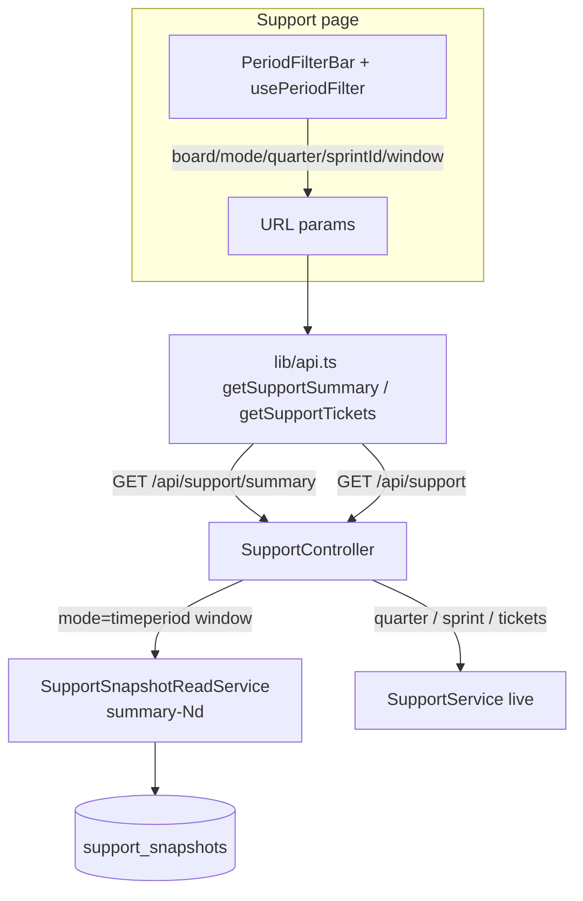
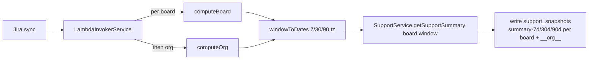
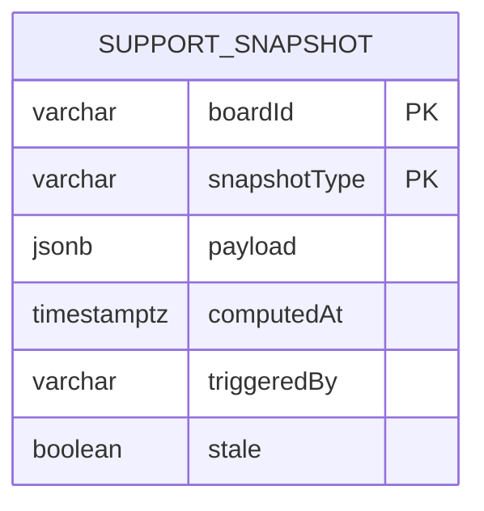

# 0080 — Support report: unified reporting periods & removal of the TTB-linked filter

**Date:** 2026-08-11
**Status:** Accepted
**Author:** Architect Agent
**Related ADRs:** 0083, 0084, 0085 (see docs/decisions/)
**Related feature:** docs/features/0023-support-unified-periods-remove-ttb-filter.md
**Builds on:** proposal 0079 / ADRs 0079–0082 (unified reporting periods for DORA & Cycle Time)

## Problem Statement

Feature 0022 unified DORA and Cycle Time onto a shared `PeriodFilterBar` + `usePeriodFilter`
model (single-select board + "All"; `Quarter | Sprint | Time period` toggle; tz-correct
rolling windows; snapshotted time-period views). The **Support report** (`support` module,
`frontend/src/app/support/page.tsx`) was left divergent: multi-select board chips
(`?boards=`), a `Quarter | Sprint`-only toggle (no time period), a hand-rolled 90-day
default with no timezone in `SupportService.resolvePeriod`, and an extra **"TTB-linked
only"** toggle (`?matchReason=link`). This inconsistency is confusing, and the TTB-linked
filter is no longer wanted.

## Proposed Solution

### 1. Frontend — adopt the shared filter (support/page.tsx)

Replace the bespoke board/period JSX and local sprint-gating logic with the shared
`usePeriodFilter` hook and `PeriodFilterBar` component (from feature 0022). This gives
Support:

- single-select board control with an explicit "All" entry (URL param `boards` → `board`)
- the identical `Quarter | Sprint | Time period` toggle
- Sprint gated to a single Scrum board (Kanban keeps Quarter + Time period)
- default on load: Time period / Last 90 days

The data-fetch effect maps the hook state to the Support API params (`board`/`mode`/
`quarter`/`sprintId`/`window`), adds a `pending` state for snapshot 202s, and drops the
`matchReason` state, param, and fetch dependency.

### 2. Frontend — remove the TTB-linked filter (support/page.tsx, lib/api.ts)

- Remove the "TTB-linked only" switch JSX and the `matchReason` URL param/state.
- Remove `matchReason` from `SupportQueryParams` and both wrappers in `lib/api.ts`; add
  `window?: TimePeriodWindow`.
- **Keep** the ticket table's "Match" column (displays each ticket's classification) and
  the MCP support tool's `matchReason` parameter — unchanged.

### 3. Backend — window support + resolvePeriod refactor (support module)

- `SupportQueryDto`: add `window?` (enum `7|30|90` via `IsIn(TIME_PERIOD_WINDOWS)` +
  numeric transform); **remove** `matchReason`.
- `SupportService.resolvePeriod`: route quarter/window through `period-utils.ts`
  (`quarterToDates(q, this.timezone)`, `windowToDates(window, this.timezone)`) — replacing
  the inline no-timezone 90-day default. Preserve the existing `isSprint` /
  `isCurrentPeriod` / `sprintName` return shape. A time-period window is a *current* period
  (`isCurrentPeriod: true`) but ends at yesterday, so the Kanban board-entry filtering and
  active-sprint semantics downstream continue to work.
- Read `this.timezone` from `ConfigService.get('TIMEZONE', 'UTC')` in the constructor
  (mirrors `MetricsService`).
- Remove the `matchReasonFilter` application in `getSupportResultForBoard`
  (`support.service.ts:495-499`) and the `matchReason` passthrough. The `supportIssues`
  numerator reverts to all classified tickets (its pre-filter behaviour). The `isTtbSupport`
  classification and the per-ticket `matchReason` field are **unchanged** (still returned
  for the Match column).

### 4. Backend — snapshot the Support summary time-period windows

Support has no snapshot infrastructure today. Add a minimal store mirroring
`cycle_time_snapshots` (ADR 0081):

- New entity `SupportSnapshot` (`support_snapshots` table): composite PK
  `(boardId, snapshotType)` where `snapshotType ∈ { summary-7d, summary-30d, summary-90d }`;
  `payload jsonb`, `computedAt timestamptz`, `triggeredBy`, `stale`. Reversible migration.
- New `SupportSnapshotReadService` (mirrors `CycleTimeSnapshotReadService`) used by
  `SupportController` for `GET /api/support/summary?window=…`.
- Compute step: extend `InProcessSnapshotService` (and the Lambda `snapshot.handler`) to
  compute the Support **summary** for each of the 7/30/90-day windows, per board and org,
  calling `SupportService.getSupportSummary({ boardId, window })`.
- **Scope:** only the summary is snapshotted. The per-ticket list (`GET /api/support`) and
  the quarter/sprint summary views remain live-computed. `SupportController.getSupportSummary`
  serves `mode=timeperiod`/`window` from the snapshot (202 pending before first sync);
  quarter/sprint fall through to live `SupportService`.

### 5. Diagrams

## Alternatives Considered

### Alternative A — Keep Support's multi-select board model
Add only the Time period toggle, leaving `?boards=` multi-select. Ruled out per the brief:
the goal is full consistency with the other three reports, which use single-select + "All".

### Alternative B — Live-compute Support time periods (no snapshot)
Simpler (no new store). Ruled out per the brief: Support time periods should be snapshotted
like DORA/Cycle Time for consistent, fast reads. (Quarter/sprint remain live, matching how
Cycle Time was scoped in ADR 0081.)

### Alternative C — Snapshot the full ticket list too
Fully snapshot-backed. Ruled out per the brief: the per-ticket list can be very large
(thousands × 3 windows × per-board+org); snapshotting only the summary keeps payloads small
and lets drill-down stay fresh.

### Alternative D — Reuse `cycle_time_snapshots` for Support
Overloads a cycle-time-named table with a different payload shape (`SupportSummaryDto`).
Ruled out for the same separation-of-concerns reason as ADR 0081; a dedicated
`support_snapshots` table keeps the read path type-safe.

## Impact Assessment

| Area | Impact | Notes |
|---|---|---|
| Database | New entity + migration | `support_snapshots` (reversible). No change to existing entities. |
| API contract | Additive + Breaking(minor) | Adds `window` to Support endpoints; **removes** `matchReason` from `/api/support` + `/api/support/summary`. `matchReason` currently only used by the UI filter being removed. Summary time-period served snapshot-backed (202 before first sync). |
| Frontend | Component change | Support page swaps bespoke filter for shared `PeriodFilterBar`; `boards`→`board`; TTB toggle removed. Match column + MCP tool retained. |
| Tests | New + updated | Backend: window branch in `resolvePeriod`, support-summary snapshot compute+read, removal of matchReason-filter tests (2). Frontend: none required (no existing Support page test); shared `PeriodFilterBar` already tested. |
| External API | No new calls | Reuses mirrored Postgres data; no new Jira calls. |
| Infrastructure | None | Reuses existing Lambda/in-process snapshot pipeline + sync hook. No new cloud resources/IAM/network. |
| Observability | None | Reuses existing `X-Snapshot-Age`/stale metadata pattern. |
| Security / Compliance | None | No new data class (internal mirrored Jira data), no auth/network change. |

## Open Questions

None.

## Acceptance Criteria

- Loading the Support page with no URL params selects `mode=timeperiod`, `window=90`,
  `board=All`, and renders the summary.
- The Support period toggle shows exactly three options (Quarter, Sprint, Time period),
  identical to DORA and Cycle Time.
- Sprint is enabled only for a single Scrum board; disabled (with hint) for "All" or a
  Kanban board.
- `GET /api/support/summary?window=30` is served from the `summary-30d` support snapshot
  with `X-Snapshot-Age` set (or 202 pending if no sync has run).
- After a sync, `support_snapshots` contains `summary-7d/30d/90d` rows for each board and
  for `__org__`.
- `GET /api/support/summary?quarter=2026-Q1` and `?sprintId=…` are still live-computed
  (not snapshot-backed).
- `GET /api/support` (ticket list) is live-computed for all modes, including time period.
- `GET /api/support` and `GET /api/support/summary` no longer accept or apply a
  `matchReason` param (stripped by the global ValidationPipe whitelist).
- The Support ticket table still renders each ticket's classification in the "Match" column.
- The MCP support tool's `matchReason` parameter continues to work unchanged.
- `SupportService.resolvePeriod` uses the configured timezone for quarter and window
  boundaries; a time-period window ends at 23:59:59.999 of the last full day.

## Decision

On acceptance, hand off to `decision-log` to create ADR(s) for:
1. Support report adopts the unified board/period model (single-select + "All",
   `Quarter | Sprint | Time period`) and gains the time-period rolling-window mode with
   tz-correct `resolvePeriod` — extends ADRs 0079/0080.
2. Support summary time-period views are snapshotted on sync via a dedicated
   `support_snapshots` store (summary only; tickets + quarter/sprint stay live) — extends
   ADR 0081.
3. Removal of the Support "TTB-linked" (`matchReason`) dashboard filter; classification,
   Match column, and MCP `matchReason` retained — relates to ADR 0082.
