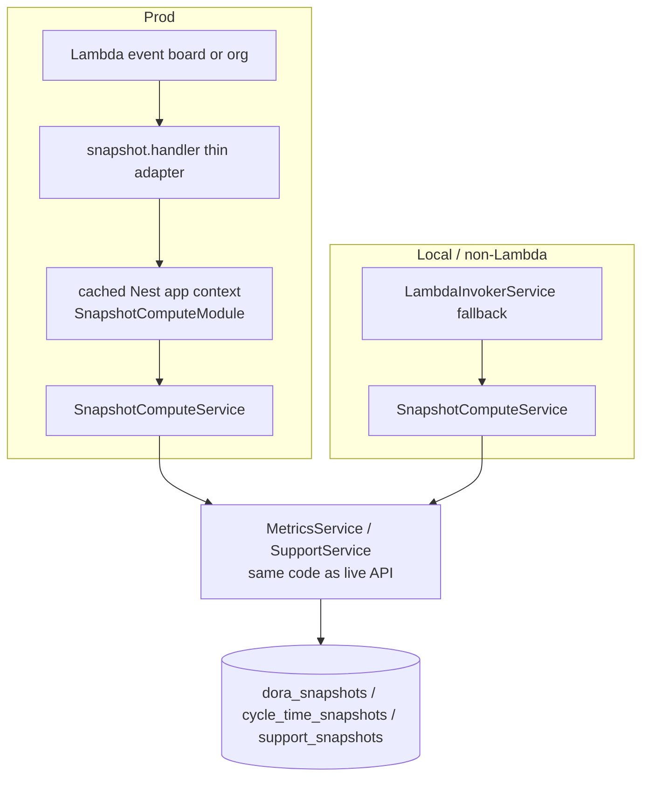
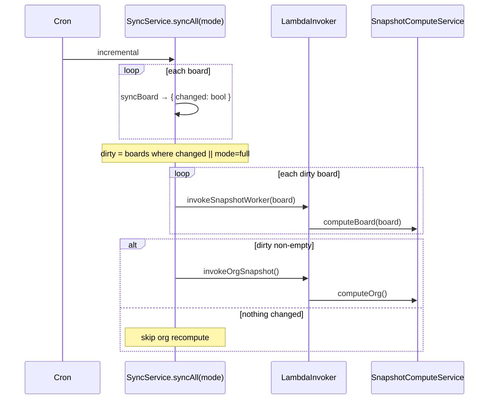

# 0084 — Snapshot compute re-architecture: one shared writer + change-scoped recompute

**Date:** 2026-08-12
**Status:** Accepted
**Author:** Architect Agent
**Related ADRs:** 0036, 0040, 0041, 0078, 0081, 0084, 0087; **supersedes proposal 0083**
**Related feature:** docs/features/0024-snapshot-compute-rearchitecture.md

## Problem Statement

DORA / Cycle Time / Support snapshots are produced by **two independent implementations**
that drift: `InProcessSnapshotService` (local — delegates to `MetricsService`/`SupportService`)
and `snapshot.handler.ts` (prod Lambda, ~1000 lines — re-implements the aggregation, trend,
window, and quarter logic as standalone `build*Rows` functions, hand-wires every service via
manual `new`, and maintains its own 17-entity `DataSource`). This duplication has caused a
prod DORA divergence incident and, most recently, the cycle-time per-board quarter drift
(`payload: [aggregate]` in the Lambda vs `payload: aggregate` in-process →
`results.flatMap is not a function` in prod). Every metric or snapshot-type change must be
made and verified in two places; adding a report type touches ~10 sites. Separately,
`syncAll` runs the **full** per-board + org recompute (~150 upserts) for every sync including
the hourly incremental one, regardless of how little changed.

## Proposed Solution

### 1. One shared compute module; Lambda becomes a thin entrypoint

Consolidate all snapshot computation into a single NestJS provider — `SnapshotComputeService`
(the promoted, renamed `InProcessSnapshotService`) inside a self-contained
`SnapshotComputeModule` that imports `MetricsModule` and `SupportModule` and the three
snapshot repos. This is the *only* implementation.

The Lambda `snapshot.handler.ts` is reduced to a thin adapter: on invocation it lazily boots a
**NestJS standalone application context** (`NestFactory.createApplicationContext(SnapshotComputeModule)`)
— reused across warm invocations (module-scoped, like today's cached `DataSource`) — resolves
`SnapshotComputeService`, and calls `computeBoard(boardId)` or `computeOrg()`. All
`build*Rows` / `buildAggregatePayload` / `enumerateQuarters` / `quartersToCompute`
re-implementations, the manual service `new`s, the hardcoded entity list, and the
`configServiceStub` are **deleted**. The Lambda zip already bundles the full `backend/dist` +
prod `node_modules` (see `Makefile lambda-build`), so booting the module adds **no new bundle**
— it runs code already shipped.

Because prod and local now execute the identical `SnapshotComputeService`, byte-for-byte
payload parity is guaranteed by construction — the array/object class of drift becomes
impossible.

**Org-path strategy (revised during implementation — see note):** The single writer's
`computeOrg()` reloads via `MetricsService`/`SupportService` (the existing in-process
approach), rather than porting the Lambda's bespoke merge-from-per-board-trend-rows
algorithm. **Rationale:** the Lambda's merge exists as legacy defensiveness against a
*pre-`TrendDataLoader`* org implementation that timed out. The current `MetricsService`
loads each board via a bounded `TrendDataLoader` (~6 scoped `In(issueKeys)` queries per
board); an org reload across 6 boards is ~36 scoped queries — not a timeout risk. Choosing
the reload path gives one obvious code path and removes the risk of subtly mis-porting the
merge (the exact class of drift this proposal exists to eliminate). This **supersedes** the
original "no raw reload in `computeOrg`" acceptance criterion below; the criterion is
replaced by an explicit check that org compute completes well within the Lambda timeout.

### 2. Board-level change-scoped recompute

Today `syncAll` recomputes every board + org on every sync. Change the sync flow so it tracks
a **dirty board set** and only recomputes those:

- `syncBoard` already returns a per-board `SyncResult`. Extend it to report whether the board
  had any changes (issues/changelogs/versions written, or `issueCount > 0` for the window). A
  **full** sync marks every board dirty (backstop, ADR 0078). An **incremental** sync marks a
  board dirty only if that board's watermarked fetch wrote anything.
- The post-sync loop iterates the **dirty set** instead of all boards:
  `for (const boardId of dirtyBoards) invokeSnapshotWorker(boardId)`. The org snapshot is
  invoked **iff** the dirty set is non-empty (org is a rollup of per-board rows; if no board
  changed, org is unchanged).
- Full/daily sync behaviour is unchanged (all boards dirty). This directly removes the
  incremental sync's full-recompute cost.

### 3. Reconcile code/ADR/Terraform drift

- Correct the Lambda Terraform + ADR 0040 record so documented values match reality:
  `memory_size` and `timeout` (currently 3008 MB / 300 s vs ADR's stale 512 MB / 120 s) and
  the invocation type (`RequestResponse` in code vs ADR's `Event`). Keep `RequestResponse`
  (the sync flow relies on per-board completion ordering before org) and document *why*.
- Align the snapshot staleness default: code fallback is 60 min, CLAUDE.md says 2880 min.
  Pick one (recommend 2880 to match docs / ADR 0040) and set the fallback + `.env.example`
  accordingly.
- Fix `BoardsService` board-config-change to also invoke `invokeOrgSnapshot()` after the
  per-board refresh (currently the org snapshot goes stale after a single-board config edit).

### 4. New files / structure

- `backend/src/snapshot/snapshot-compute.module.ts` — new module (imports MetricsModule,
  SupportModule, TypeOrm for the 3 snapshot entities + BoardConfig + JiraSprint).
- `backend/src/snapshot/snapshot-compute.service.ts` — the single writer (promoted from
  `InProcessSnapshotService`, gains the org-merge strategy).
- `backend/src/lambda/snapshot.handler.ts` — reduced to the thin adapter (boot context →
  resolve service → call → return).
- `LambdaInvokerService` unchanged in contract; its in-process fallback now calls
  `SnapshotComputeService`.
- `sync.service.ts` — dirty-set tracking + scoped invocation loop.

## Alternatives Considered

### Alternative A — Manual-DI unification (proposal 0083 Option A)
Have the Lambda keep hand-wiring the low-level services and construct `InProcessSnapshotService`
manually. Kills the `build*Rows` duplication but **leaves** the manual-`new` graph and hardcoded
entity list (PP-2) — a service constructor change still breaks the Lambda at runtime. Ruled out
in favour of booting the real module, which removes that fragility for the same effort (the
bundle already ships the module).

### Alternative B — Framework-free shared compute function
Extract a plain function both paths call, taking explicit repo deps instead of DI. Avoids
booting Nest in the Lambda (marginally faster cold start) but reintroduces a bespoke
dependency-passing convention that diverges from the rest of the codebase and still has to be
kept in sync with service constructors. Ruled out; the standalone-context approach reuses
existing DI wiring and is the smaller conceptual surface.

### Alternative C — Queue / EventBridge / Step Functions
Decouple sync from snapshotting via an event bus with worker consumers. More scalable long-term
but ADR 0040 explicitly deferred this until sync is the bottleneck, and it does not address the
core duplication (workers would still need one shared compute path). Out of scope; the shared
module is a prerequisite for any future eventing anyway.

### Alternative D — Period-level change scoping
Also skip recompute of windows/quarters that changed issues cannot affect. More precise but
requires reasoning about which periods an updated issue touches (risky — an issue's
`completedAt`/changelog can retroactively affect a past window). Board-level is the safe,
high-value first cut; period-level deferred.

## Impact Assessment

| Area | Impact | Notes |
|---|---|---|
| Database | None | No schema change. Same 3 snapshot tables, same rows; fewer writes on incremental sync. |
| API contract | None | Snapshot read contract (202-pending, `X-Snapshot-Age`, staleness) unchanged. |
| Frontend | None | No frontend change. |
| Tests | New + updated | Parity test (in-process vs Lambda-adapter produce identical rows); org-path "no raw reload" test; dirty-set scoping tests; delete tests for removed `build*Rows`. |
| External API | No new calls | No new Jira calls; incremental sync makes *fewer* downstream recomputes. |
| Infrastructure | Lambda config corrected | No new resources. `memory_size`/`timeout` documented to match; handler entry unchanged (`lambda/index.handler`). Packaging unchanged (zip already bundles full app). |
| Observability | Minor | Log the dirty set + which boards were recomputed per sync; reuse existing logger. |
| Security / Compliance | None | No new data class, IAM, network, or secret. `process.env` use stays confined to the sanctioned Lambda entrypoint + `data-source.ts`. |

## Open Questions

- **Cold start of the Nest standalone context in Lambda.** Booting the context has a one-time
  cost per cold container. Mitigation: create it once, cache module-scoped, reuse across warm
  invocations (mirrors today's cached `DataSource`). To be validated in implementation; if the
  cold-start proves material, the module can be trimmed (import only MetricsModule/SupportModule,
  not the full AppModule). **Not** a blocker — resolved by module-scoped reuse.

## Acceptance Criteria

- `snapshot.handler.ts` contains no `buildAggregatePayload` / `build*Rows` /
  `enumerateQuarters` / `quartersToCompute` and no hardcoded entity array; it boots
  `SnapshotComputeModule` and delegates to `SnapshotComputeService`.
- A parity test computes snapshots for a fixture board through `SnapshotComputeService` and
  asserts the rows equal what the Lambda adapter produces (same code path → identical) for
  DORA aggregate/trend/windows/quarters, cycle-time windows+quarters, support windows+quarters.
- `SnapshotComputeService.computeOrg()` reloads via `MetricsService`/`SupportService` (single
  obvious path); an org compute of all boards completes well within the Lambda timeout
  (bounded `TrendDataLoader` query budget) — asserted by a timing/query-count sanity check.
- Given an incremental sync where only board X wrote changes, `invokeSnapshotWorker` is called
  for X only, and `invokeOrgSnapshot` is called once; boards Y/Z are not recomputed —
  asserted by a `SyncService` test with mocked board results.
- Given an incremental sync where no board changed, neither `invokeSnapshotWorker` nor
  `invokeOrgSnapshot` is called.
- Given a full/daily sync, all boards are marked dirty and recomputed (backstop) — asserted.
- Given a board-config change, both the per-board and org snapshots are refreshed.
- The Lambda Terraform `memory_size`/`timeout`/invocation type match the values documented in
  the updated ADR; the staleness default is consistent between code and CLAUDE.md.
- Full backend + frontend + MCP suites pass; the cycle-time array/object drift is structurally
  impossible (single code path) — the previously-added per-path regression tests collapse into
  one.

## Infrastructure Addendum

### Resources
- Modified: `aws_lambda_function.dora_snapshot` — only the `memory_size`/`timeout` values are
  brought in line with the documented figures (no functional change to sizing already in prod;
  this is a doc/record reconciliation, values stay as currently deployed unless the ADR update
  chooses to change them). No new resources, roles, or network changes.

### Cost Estimate
No material change. Incremental sync recomputes fewer snapshots → *lower* Lambda invocation
count/duration on the hourly path (minor cost reduction). <$5/mo delta, downward.

### Failure Modes & Blast Radius
- If the Nest context fails to boot in the Lambda, that invocation fails and the affected
  board's snapshot stays stale until the next sync (same failure semantics as today; errors
  logged, sync not failed — ADR 0040). Blast radius: one board's snapshot freshness, isolated
  to prod. No cascade.
- Org rollup still tolerates a missing per-board row (builds from whatever per-board rows exist,
  warns) — unchanged.

### Identity & Access
No IAM change. The Lambda execution role and the backend's `lambda:InvokeFunction` grant are
unchanged. No `*`/`*` policy introduced.

### State & Locking
Prod state in S3 + DynamoDB lock (unchanged). No state migration.

### Rollback Plan
Pure code + Terraform-value change. Rollback = redeploy the previous image/zip and
`terraform apply` the prior Lambda config. No stateful resource is created or destroyed; the
snapshot tables are untouched (same schema, same rows), so no data-preservation concern.

## Decision

On acceptance, hand off to `decision-log` to create ADR(s) for:
1. Single shared `SnapshotComputeService` + Lambda-as-thin-Nest-entrypoint; supersedes the
   dual-implementation model (ADR 0040's in-process/Lambda split-implementation) and fulfils
   the unification anticipated by ADR 0087. Mark proposal 0083 superseded.
2. Board-level change-scoped snapshot recompute on incremental sync (full sync unchanged).
3. Reconciliation of the Lambda invocation-type/sizing record and the snapshot staleness
   default (corrections to the ADR 0040 record).
